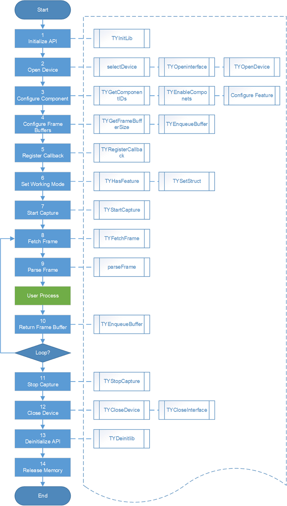

API 指南
=============

基础概念
---------

组件
++++++

每个 Percipio 深度相机包含多个器件，如包括左红外图像传感器、右红外图像传感器、激光投射器、彩色图像传感器、IMU 等器件，我们把这些器件统称为组件（Component）。

组件也可能是虚拟器件，例如深度图像传感器、直方图设备等，尽管并不存在这些实体器件，从数据访问的角度并没有什么区别，用户可以同操作真实存在的器件一样操作这些虚拟器件，完成相应的功能设置。

Percipio 深度相机作为一个设备，拥有工作模式相关配置、连接状态保持、网络配置与数据重传配置、光学外参等属性，为实现对这些属性的访问，我们把相机做为一个抽象组件，即设备 (Device) 组件。

相机包含的全体组件定义如下：

::

    typedef enum TY_DEVICE_COMPONENT_LIST
    {
        TY_COMPONENT_DEVICE         = 0x80000000, ///< Abstract component stands for whole device, always enabled
        TY_COMPONENT_DEPTH_CAM      = 0x00010000, ///< Depth camera
        TY_COMPONENT_IR_CAM_LEFT    = 0x00040000, ///< Left IR camera
        TY_COMPONENT_IR_CAM_RIGHT   = 0x00080000, ///< Right IR camera
        TY_COMPONENT_RGB_CAM_LEFT   = 0x00100000, ///< Left RGB camera
        TY_COMPONENT_RGB_CAM_RIGHT  = 0x00200000, ///< Right RGB camera
        TY_COMPONENT_LASER          = 0x00400000, ///< Laser
        TY_COMPONENT_IMU            = 0x00800000, ///< Inertial Measurement Unit
        TY_COMPONENT_BRIGHT_HISTO   = 0x01000000, ///< virtual component for brightness histogram of ir
        TY_COMPONENT_STORAGE        = 0x02000000, ///< virtual component for device storage
    
        TY_COMPONENT_RGB_CAM        = TY_COMPONENT_RGB_CAM_LEFT ///< Some device has only one RGB camera, map it to left
    }TY_DEVICE_COMPONENT_LIST;

其中，

* TY_COMPONENT_DEVICE 代表独立深度相机实体，以下简称 **深度相机**。通过该组件可以控制相机的工作模式、内部 Sensor 曝光同步模式、光学外参等属性。
* TY_COMPONENT_DEPTH_CAM 代表深度图像传感器组件。
* TY_COMPONENT_IR_CAM_LEFT 代表左红外图像传感器组件。
* TY_COMPONENT_IR_CAM_RIGHT 代表右红外图像传感器组件。
* TY_COMPONENT_RGB_CAM_LEFT 代表左彩色图像传感器组件。若深度相机仅有一个彩色图像传感器组件，TY_COMPONENT_RGB_CAM 默认代表 TY_COMPONENT_RGB_CAM_LEFT。
* TY_COMPONENT_RGB_CAM_RIGHT 代表右彩色图像传感器组件。

属性
+++++

深度相机或者各个组件有多种不同的功能参数，SDK 软件工程中称之为属性 (feature)。依据各个属性的特点，SDK 分别为这些属性定义 int、bool、struct、enum 等类型的数据结构。用户可以通过 TYGetInt / TYSetInt / TYGetStruct / TYSetStruct 等类似风格的 API 函数，读取或者写入某个组件的某个属性。

不同组件的属性之间也可以存在联动关系。修改组件的一个属性时，深度相机会同步修改另一个组件的同一属性，这种关系称为绑定 (binding)。绑定关系可以通过查询属性信息得知。

**不同型号、不同版本的深度相机支持不同的组件和属性。**

.. note::

   通过以下方式，可查询深度相机支持的组件和和属性：

   #. 通过 API 可查询深度相机支持的组件和属性。
   #. 通过 SDK 示例程序 DumpAllFeatures 可列出当前操作相机的所有组件和支持的属性信息。
   #. 通过 SDK 示例程序 DumpAllFeatures -d，可以生成 fetch_config.xml 文件，在该文件中可以查看深度相机支持的组件和和属性。

以 FM851-E1 为例，该相机包含的组件、支持的属性以及属性与组件的隶属关系，请参考下方 fetch_config.xml 文件内的配置描述：
::

    <?xml version="1.0" ?>
    <config version="1">
    	<comprotocol>1.0</comprotocol>
    	<component addr="0x01000000" id="0x80000000" name="device">
    		<feature hide="0" id="0x5f00" name="SN" rw="1">207000129217</feature>
    		<feature hide="0" id="0x5f01" name="vendor" rw="1">Percipio</feature>
    		<feature hide="0" id="0x5f02" name="model" rw="1">FM851-E1</feature>
    		<feature hide="0" id="0x5f08" name="user defined name" rw="1">Percipio</feature>
    		<feature addr="0x204" hide="0" id="0x1202" name="frame per trigger" rw="3">1</feature>
    		<feature addr="0x208" hide="0" id="0x7523" name="struct trigger mode" rw="3"/>
    		<feature addr="0x218" hide="0" id="0x7525" name="struct trigger mode ex" rw="3"/>
    		<feature absaddr="0x64c" hide="0" id="0x1010" name="persistent IP" rw="3"/>
    		<feature absaddr="0x65c" hide="0" id="0x1011" name="persistent netmask" rw="3"/>
    		<feature absaddr="0x66c" hide="0" id="0x1012" name="persistent gateway" rw="3"/>
    		<feature addr="0x400020" hide="0" id="0x1014" inc="1" max="10000" min="0" name="packet delay" rw="3"/>
    		<feature addr="0x40002c" hide="0" id="0x1017" inc="1" max="1500" min="100" name="packet size" rw="3"/>
    		<feature addr="0x400024" hide="0" id="0x1016" name="ntp server ip" rw="3"/>
    		<feature addr="0x214" hide="0" id="0x4207" name="trigger out io" rw="2" writableAtRun="1"/>
    		<feature addr="0x20c" hide="0" id="0x4205" name="cmos sync" rw="3"/>
    		<feature hide="0" id="0x4203" name="keep alive onoff" rw="3"/>
    		<feature hide="0" id="0x1204" inc="1" max="30000" min="2000" name="keep alive timeout" rw="3"/>
    		<feature addr="0x210" hide="0" id="0x1206" inc="1" max="1300000" min="0" name="trigger delay us" rw="3"/>
    		<feature addr="0x21C" hide="0" id="0x1208" inc="1" max="1300000" min="1" name="trigger duration us" rw="3"/>
    		<feature addr="0x220" hide="0" id="0x3209" name="stream async" rw="3">
    			<entry name="async off" value="0"/>
    			<entry name="async depth" value="1"/>
    			<entry name="async rgb" value="2"/>
    			<entry name="async depth rgb" value="3"/>
    			<entry name="async all" value="255"/>
    		</feature>
    		<feature addr="0x200" hide="0" id="0x3201" name="trig pol" rw="3">
    			<entry name="falling edge" value="0"/>
    			<entry name="rising edge" value="1"/>
    		</feature>
    		<feature addr="0x228" hide="0" id="0x1210" name="capture time us" rw="1" volatile="1"/>
    		<feature addr="0x22c" hide="0" id="0x3211" name="sync type" rw="3" volatile="1">
    			<entry name="sync type none" value="0"/>
    			<entry name="sync type host" value="1"/>
    			<entry name="sync type ntp" value="2"/>
    			<entry name="sync type ptp slave" value="3"/>
    			<entry name="sync type can" value="4"/>
    			<entry name="sync type ptp master" value="5"/>
    		</feature>
    		<feature addr="0x230" hide="0" id="0x4212" name="sync ready" rw="1" volatile="1"/>
    		<feature addr="0x234" hide="0" id="0x7526" name="trigger timer list" rw="3" volatile="1" writableAtRun="1"/>
    		<feature addr="0x238" hide="0" id="0x7527" name="trigger timer period" rw="3" volatile="1" writableAtRun="1"/>
    		<feature id="0x5f03" name="hardware version" rw="1" hide="0">1.3.0</feature>
    		<feature id="0x5f04" name="firmware version" rw="1" hide="0">3.13.16</feature>
    		<build>
    			<hash>model:AP03B04AM81X_X_X7_F121_DVP;rtl:R1.1.13_0_gcf0ff384e3;kernel:R3.13.16-0-g98f7c91b8d;tycam:R3.5.18-6b7b483c;gevcam:R3.13.16-0-g9ac78d34</hash>
    		</build>
    		<config_version>pre_release</config_version>
    		<tech_model>AM830-GTIS8-47-CBO</tech_model>
    		<generated_time>2021-10-09T135051</generated_time>
    		<calibration_time>2021-09-18T033241</calibration_time>
    	</component>
    	<component addr="0x02000000" id="0x00010000" name="depth">
    		<feature hide="0" id="0x210a" name="scale unit" rw="1">1.0</feature>
    		<feature hide="1" id="0x1003" name="intrinsic width" rw="1">1280</feature>
    		<feature hide="1" id="0x1004" name="intrinsic height" rw="1">960</feature>
    		<feature hide="0" id="0x7000" name="depth intrinsic" rw="1"> 1057.0913560361116 0.0 628.5735321044922 0.0 1057.0913560361116 490.0430450439453 0.0 0.0 1.0</feature>
    		<feature addr="0x10" hide="0" id="0x1104" name="image width" rw="1"/>
    		<feature addr="0x14" hide="0" id="0x1105" name="image height" rw="1"/>
    		<feature addr="0x18" hide="0" id="0x3109" name="image mode" rw="3">
    			<entry name="DEPTH16_640x480" value="0x202801e0"/>
    			<entry name="DEPTH16_1280x960" value="0x205003c0"/>
    			<entry name="DEPTH16_320x240" value="0x201400f0"/>
    		</feature>
    	</component>
    	<component addr="0x03000000" id="0x00040000" name="leftir">
    		<feature addr="0x18" hide="0" id="0x3109" name="image mode" rw="1">
    			<entry name="mono8 1280x960" value="0x105003c0"/>
    		</feature>
    		<feature addr="0x10" hide="0" id="0x1104" name="image width" rw="1">1280</feature>
    		<feature addr="0x14" hide="0" id="0x1105" name="image height" rw="1">960</feature>
    		<feature hide="1" id="0x1003" name="intrinsic width" rw="1">1280</feature>
    		<feature hide="1" id="0x1004" name="intrinsic height" rw="1">960</feature>
    		<feature hide="0" id="0x7000" name="intrinsic" rw="1"> 1101.9569754361974 0.0 632.6048087423237 0.0 1102.146112084317 476.4526537628572 0.0 0.0 1.0</feature>
    		<feature hide="0" id="0x7006" name="distortion" rw="1"> -0.4205079032648662 -0.24291850706937249 0.0032100257861444777 0.001990176887732496 0.10267820146085133 -0.1716891282414848 -0.44131454807106735 0.11949232513267484 -0.003917085741072632 0.0008741779334892755 -0.0070731359600290965 0.001578093155976139</feature>
    		<feature addr="0x324" hide="0" id="0x4510" name="undistort" rw="3"/>
    		<feature addr="0x304" hide="0" id="0x1301" inc="1" max="1088" min="3" name="exposure time" rw="3" writableAtRun="1"/>
    		<feature addr="0x310" hide="0" id="0x1303" inc="1" max="255" min="0" name="gain" rw="3" writableAtRun="1"/>
    		<feature addr="0x328" hide="0" id="0x1524" inc="1" max="3" min="0" name="analog gain" rw="3" writableAtRun="1"/>
    	</component>
    	<component addr="0x04000000" id="0x00080000" name="rightir">
    		<feature addr="0x18" hide="0" id="0x3109" name="image mode" rw="1">
    			<entry name="mono8 1280x960" value="0x105003c0"/>
    		</feature>
    		<feature addr="0x10" hide="0" id="0x1104" name="image width" rw="1">1280</feature>
    		<feature addr="0x14" hide="0" id="0x1105" name="image height" rw="1">960</feature>
    		<feature hide="1" id="0x1003" name="intrinsic width" rw="1">1280</feature>
    		<feature hide="1" id="0x1004" name="intrinsic height" rw="1">960</feature>
    		<feature hide="0" id="0x7000" name="intrinsic" rw="1"> 1103.249499342999 0.0 630.7622752161499 0.0 1103.2889923805135 509.1805648068269 0.0 0.0 1.0</feature>
    		<feature hide="0" id="0x7006" name="distortion" rw="1"> 0.1607226089625935 0.04310528484860882 0.004990395649432428 0.0008160696949675246 0.4613061089900877 0.4151237879065313 -0.030265818405065734 0.5510116415135468 -0.0011233127606329815 0.00022496932265199835 -0.010514656609723044 0.0024125513606033243</feature>
    		<feature hide="0" id="0x7001" name="rightIR to leftIR extrinsic" rw="1"> 0.9999855582465992 -0.0024780726921431236 0.004768904902616075 -78.91377474894921 0.002521488192062276 0.9999552374414395 -0.009119496188449452 0.24564214899255385 -0.0047460926597604315 0.009131389224335365 0.9999470447655208 -0.12529605489830792 0 0 0 1</feature>
    		<feature bind="0x00044510"/>
    		<feature addr="0x304" hide="0" id="0x1301" inc="1" max="1088" min="3" name="exposure time" rw="3" writableAtRun="1"/>
    		<feature addr="0x310" hide="0" id="0x1303" inc="1" max="255" min="0" name="gain" rw="3" writableAtRun="1"/>
    		<feature addr="0x328" hide="0" id="0x1524" inc="1" max="3" min="0" name="analog gain" rw="3" writableAtRun="1"/>
    	</component>
    	<component addr="0x05000000" id="0x00100000" name="rgb">
    		<feature addr="0x10" hide="0" id="0x1104" name="image width" rw="1" volatile="1"/>
    		<feature addr="0x14" hide="0" id="0x1105" name="image height" rw="1" volatile="1"/>
    		<feature addr="0x18" hide="0" id="0x3109" name="image mode" rw="3">
    			<entry name="yuyv 1280x960" value="0x225003c0"/>
    			<entry name="yuyv 640x480" value="0x222801e0"/>
    			<entry name="yuyv 320x240" value="0x221400f0"/>
    		</feature>
    		<feature addr="0x224" hide="0" id="0x7305" name="struct aec roi" rw="3" writableAtRun="1"/>
    		<feature addr="0x300" hide="0" id="0x4300" name="auto exp ctrl" rw="3" writableAtRun="1"/>
    		<feature addr="0x304" hide="0" id="0x1301" inc="1" max="1088" min="3" name="exposure time" rw="3" writableAtRun="1"/>
    		<feature addr="0x314" hide="0" id="0x4304" name="auto white balance" rw="3" writableAtRun="1"/>
    		<feature addr="0x318" hide="0" id="0x1520" inc="1" max="4095" min="1" name="r gain" rw="3" writableAtRun="1"/>
    		<feature addr="0x31c" hide="0" id="0x1521" inc="1" max="4095" min="1" name="g gain" rw="3" writableAtRun="1"/>
    		<feature addr="0x320" hide="0" id="0x1522" inc="1" max="4095" min="1" name="b gain" rw="3" writableAtRun="1"/>
    		<feature addr="0x328" hide="0" id="0x1524" inc="1" max="63" min="1" name="analog gain" rw="3" writableAtRun="1"/>
    		<feature addr="0x30c" hide="0" id="0x4302" name="auto gain ctrl" rw="3" writableAtRun="1"/>
    		<feature hide="1" id="0x1003" name="intrinsic width" rw="1">1280</feature>
    		<feature hide="1" id="0x1004" name="intrinsic height" rw="1">960</feature>
    		<feature hide="0" id="0x7000" name="rgb intrinsic" rw="1"> 1091.57297791 0.0 639.331289979 0.0 1091.44752035 503.323233757 0.0 0.0 1.0</feature>
    		<feature hide="0" id="0x7001" name="rgb to leftIR extrinsic" rw="1"> 0.999986864606 -0.00117676964364 0.00498856976817 24.0101958417 0.00117657829273 0.999999306979 4.12924369618e-05 -0.20405264306 -0.00498861490267 -3.54224516683e-05 0.999987556156 -0.534259434997 0.0 0.0 0.0 1.0</feature>
    		<feature hide="0" id="0x7006" name="distortion" rw="1">0.168248655694 0.0613630693992 0.00541864468694 0.0015374141221 0.514789735342 0.414091440597 0.000124699681652 0.590942851883 -0.00271625606685 0.000477951236185 -0.010361247278 0.00262128322074</feature>
    	</component>
    	<component addr="0x07000000" id="0x00400000" name="laser">
    		<feature addr="0x500" hide="0" id="0x1500" inc="1" max="100" min="0" name="power" rw="3" writableAtRun="1"/>
    		<feature addr="0x504" hide="0" id="0x4501" name="auto ctrl" rw="3"/>
    	</component>
    	<component addr="0x08000000" id="0x01000000" name="histogram">    </component>
    	<component addr="0x09000000" id="0x02000000" name="storage">
    		<feature addr="0x100000" hide="0" id="0x600a" name="custom block" rw="3" size="4096" volatile="1"/>
    		<feature addr="0x200000" hide="0" id="0x600b" name="isp block" rw="3" size="65536" volatile="1"/>
    	</component>
    </config>

根据上述的 fetch_config.xml 文件，可获得该相机包括的组件及各个组件支持的部分属性：

.. list-table:: 
   :header-rows: 1

   * - 组件
     - 部分属性
   * - device
     - SN、model、packet delay、packet size、trigger out io、cmos sync、keep alive onoff、stream async、trig pol、capture time us、sync type
   * - depth
     - image width、image height、image mode
   * - leftir / rightir
     - image mode、image width、image height、undistort、exposure time、gain、analog gain 
   * - rgb
     - image width、image height、image mode、exposure time、auto white balance、r gain、g gain、b gain、analog gain、auto gain ctrl
   * - laser
     - power、 auto ctrl
   * - histogram
     - 无属性，该组件专门提供 histogram 数据。
   * - storage
     - custom block、isp block

.. note::

     1. <component></component>一对组件标签内介绍了该组件支持的属性。
     2. <feature></feature>一对属性标签内介绍了该属性的名称、最大值、最小值、读写权限、设置方式，部分属性枚举了可设置值。
   
        - 读写权限：rw=1 表示只读，rw=3 表示可读写。
        - 设置方式：writableAtRun=1 表示该属性可在相机采图过程中设置，没有此说明的属性则需在相机开始采图前设置。

不同的属性的数据值分为整型（INT）、布尔型（BOOL）、浮点型（FLOAT）、枚举型（ENUM）和结构体型（STRUCT），具体内容请参考属性定义：

::

    typedef enum TY_FEATURE_ID_LIST
    {
        TY_STRUCT_CAM_INTRINSIC         = 0x0000 | TY_FEATURE_STRUCT, ///< see TY_CAMERA_INTRINSIC
        TY_STRUCT_EXTRINSIC_TO_DEPTH    = 0x0001 | TY_FEATURE_STRUCT, ///< extrinsic between  depth cam and current component , see TY_CAMERA_EXTRINSIC
        TY_STRUCT_EXTRINSIC_TO_IR_LEFT  = 0x0002 | TY_FEATURE_STRUCT, ///< extrinsic between  left IR and current compoent, see TY_CAMERA_EXTRINSIC
        TY_STRUCT_CAM_DISTORTION        = 0x0006 | TY_FEATURE_STRUCT, ///< see TY_CAMERA_DISTORTION
        TY_STRUCT_CAM_CALIB_DATA        = 0x0007 | TY_FEATURE_STRUCT, ///< see TY_CAMERA_CALIB_INFO
        TY_BYTEARRAY_CUSTOM_BLOCK       = 0x000A | TY_FEATURE_BYTEARRAY, ///< used for reading/writing custom block
        TY_BYTEARRAY_ISP_BLOCK          = 0x000B | TY_FEATURE_BYTEARRAY, ///< used for reading/writing fpn block
    
        TY_INT_PERSISTENT_IP            = 0x0010 | TY_FEATURE_INT,
        TY_INT_PERSISTENT_SUBMASK       = 0x0011 | TY_FEATURE_INT,
        TY_INT_PERSISTENT_GATEWAY       = 0x0012 | TY_FEATURE_INT,
        TY_BOOL_GVSP_RESEND             = 0x0013 | TY_FEATURE_BOOL,
        TY_INT_PACKET_DELAY             = 0x0014 | TY_FEATURE_INT,    ///< microseconds
        TY_INT_ACCEPTABLE_PERCENT       = 0x0015 | TY_FEATURE_INT,
        TY_INT_NTP_SERVER_IP            = 0x0016 | TY_FEATURE_INT,    ///< Ntp server IP
        TY_INT_PACKET_SIZE              = 0x0017 | TY_FEATURE_INT,
        TY_STRUCT_CAM_STATISTICS        = 0x00ff | TY_FEATURE_STRUCT, ///< statistical information, see TY_CAMERA_STATISTICS
    
        TY_INT_WIDTH_MAX                = 0x0100 | TY_FEATURE_INT,
        TY_INT_HEIGHT_MAX               = 0x0101 | TY_FEATURE_INT,
        TY_INT_OFFSET_X                 = 0x0102 | TY_FEATURE_INT,
        TY_INT_OFFSET_Y                 = 0x0103 | TY_FEATURE_INT,
        TY_INT_WIDTH                    = 0x0104 | TY_FEATURE_INT,  ///< Image width
        TY_INT_HEIGHT                   = 0x0105 | TY_FEATURE_INT,  ///< Image height
        TY_ENUM_IMAGE_MODE              = 0x0109 | TY_FEATURE_ENUM, ///< Resolution-PixelFromat mode, see TY_IMAGE_MODE_LIST
    
        //@brief scale unit
        //depth image is uint16 pixel format with default millimeter unit ,for some device  can output Sub-millimeter accuracy data
        //the acutal depth (mm)= PixelValue * ScaleUnit 
        TY_FLOAT_SCALE_UNIT             = 0x010a | TY_FEATURE_FLOAT, 
    
        TY_ENUM_TRIGGER_POL             = 0x0201 | TY_FEATURE_ENUM,  ///< Trigger POL, see TY_TRIGGER_POL_LIST
        TY_INT_FRAME_PER_TRIGGER        = 0x0202 | TY_FEATURE_INT,  ///< Number of frames captured per trigger
        TY_STRUCT_TRIGGER_PARAM         = 0x0523 | TY_FEATURE_STRUCT,  ///< param of trigger, see TY_TRIGGER_PARAM
        TY_STRUCT_TRIGGER_PARAM_EX      = 0x0525 | TY_FEATURE_STRUCT,  ///< param of trigger, see TY_TRIGGER_PARAM_EX
        TY_STRUCT_TRIGGER_TIMER_LIST    = 0x0526 | TY_FEATURE_STRUCT,  ///< param of trigger mode 20, see TY_TRIGGER_TIMER_LIST
        TY_STRUCT_TRIGGER_TIMER_PERIOD  = 0x0527 | TY_FEATURE_STRUCT,  ///< param of trigger mode 21, see TY_TRIGGER_TIMER_PERIOD
        TY_BOOL_KEEP_ALIVE_ONOFF        = 0x0203 | TY_FEATURE_BOOL, ///< Keep Alive switch
        TY_INT_KEEP_ALIVE_TIMEOUT       = 0x0204 | TY_FEATURE_INT,  ///< Keep Alive timeout
        TY_BOOL_CMOS_SYNC               = 0x0205 | TY_FEATURE_BOOL, ///< Cmos sync switch
        TY_INT_TRIGGER_DELAY_US         = 0x0206 | TY_FEATURE_INT,  ///< Trigger delay time, in microseconds
        TY_BOOL_TRIGGER_OUT_IO          = 0x0207 | TY_FEATURE_BOOL, ///< Trigger out IO
        TY_INT_TRIGGER_DURATION_US      = 0x0208 | TY_FEATURE_INT,  ///< Trigger duration time, in microseconds
        TY_ENUM_STREAM_ASYNC            = 0x0209 | TY_FEATURE_ENUM,  ///< stream async switch, see TY_STREAM_ASYNC_MODE
        TY_INT_CAPTURE_TIME_US          = 0x0210 | TY_FEATURE_INT,  ///< capture time in multi-ir 
        TY_ENUM_TIME_SYNC_TYPE          = 0x0211 | TY_FEATURE_ENUM, ///< see TY_TIME_SYNC_TYPE
        TY_BOOL_TIME_SYNC_READY         = 0x0212 | TY_FEATURE_BOOL,
        TY_BOOL_FLASHLIGHT              = 0x0213 | TY_FEATURE_BOOL,
        TY_INT_FLASHLIGHT_INTENSITY     = 0x0214 | TY_FEATURE_INT,
    
        TY_BOOL_AUTO_EXPOSURE           = 0x0300 | TY_FEATURE_BOOL, ///< Auto exposure switch
        TY_INT_EXPOSURE_TIME            = 0x0301 | TY_FEATURE_INT,  ///< Exposure time in percentage
        TY_BOOL_AUTO_GAIN               = 0x0302 | TY_FEATURE_BOOL, ///< Auto gain switch
        TY_INT_GAIN                     = 0x0303 | TY_FEATURE_INT,  ///< Sensor Gain
        TY_BOOL_AUTO_AWB                = 0x0304 | TY_FEATURE_BOOL, ///< Auto white balance
        TY_STRUCT_AEC_ROI               = 0x0305 | TY_FEATURE_STRUCT,  ///< region of aec statistics, see TY_AEC_ROI_PARAM
    
        TY_INT_LASER_POWER              = 0x0500 | TY_FEATURE_INT,  ///< Laser power level
        TY_BOOL_LASER_AUTO_CTRL         = 0x0501 | TY_FEATURE_BOOL, ///< Laser auto ctrl
    
        TY_BOOL_UNDISTORTION            = 0x0510 | TY_FEATURE_BOOL, ///< Output undistorted image
        TY_BOOL_BRIGHTNESS_HISTOGRAM    = 0x0511 | TY_FEATURE_BOOL, ///< Output bright histogram
        TY_BOOL_DEPTH_POSTPROC          = 0x0512 | TY_FEATURE_BOOL, ///< Do depth image postproc
    
        TY_INT_R_GAIN                   = 0x0520 | TY_FEATURE_INT,  ///< Gain of R channel
        TY_INT_G_GAIN                   = 0x0521 | TY_FEATURE_INT,  ///< Gain of G channel
        TY_INT_B_GAIN                   = 0x0522 | TY_FEATURE_INT,  ///< Gain of B channel
    
        TY_INT_ANALOG_GAIN              = 0x0524 | TY_FEATURE_INT,  ///< Analog gain
        TY_BOOL_HDR                     = 0x0525 | TY_FEATURE_BOOL,
        TY_BYTEARRAY_HDR_PARAMETER      = 0x0526 | TY_FEATURE_BYTEARRAY,
    
        TY_BOOL_IMU_DATA_ONOFF          = 0x0600 | TY_FEATURE_BOOL, ///< IMU Data Onoff
        TY_STRUCT_IMU_ACC_BIAS          = 0x0601 | TY_FEATURE_STRUCT, ///< IMU acc bias matrix, see TY_ACC_BIAS
        TY_STRUCT_IMU_ACC_MISALIGNMENT  = 0x0602 | TY_FEATURE_STRUCT, ///< IMU acc misalignment matrix, see TY_ACC_MISALIGNMENT
        TY_STRUCT_IMU_ACC_SCALE         = 0x0603 | TY_FEATURE_STRUCT, ///< IMU acc scale matrix, see TY_ACC_SCALE
        TY_STRUCT_IMU_GYRO_BIAS         = 0x0604 | TY_FEATURE_STRUCT, ///< IMU gyro bias matrix, see TY_GYRO_BIAS
        TY_STRUCT_IMU_GYRO_MISALIGNMENT = 0x0605 | TY_FEATURE_STRUCT, ///< IMU gyro misalignment matrix, see TY_GYRO_MISALIGNMENT
        TY_STRUCT_IMU_GYRO_SCALE        = 0x0606 | TY_FEATURE_STRUCT, ///< IMU gyro scale matrix, see TY_GYRO_SCALE
        TY_STRUCT_IMU_CAM_TO_IMU        = 0x0607 | TY_FEATURE_STRUCT, ///< IMU camera to imu matrix, see TY_CAMERA_TO_IMU
        TY_ENUM_IMU_FPS                 = 0x0608 | TY_FEATURE_ENUM, ///< IMU fps, see TY_IMU_FPS_LIST
    
        TY_ENUM_DEPTH_QUALITY           = 0x0900 | TY_FEATURE_ENUM,  ///< the quality of generated depth, see TY_DEPTH_QUALITY
        TY_INT_FILTER_THRESHOLD         = 0x0901 | TY_FEATURE_INT,   ///< the threshold of the noise filter, 0 for disabled
        TY_INT_TOF_CHANNEL              = 0x0902 | TY_FEATURE_INT,   ///< the frequency channel of tof
    }TY_FEATURE_ID_LIST;

属性的数据结构示例：

1. depth、leftir / rightir、rgb 组件支持的分辨率如下：
   ::

      typedef enum TY_RESOLUTION_MODE_LIST
      {
          TY_RESOLUTION_MODE_160x100      = (160<<12)+100,    ///< 0x000a0078 
          TY_RESOLUTION_MODE_160x120      = (160<<12)+120,    ///< 0x000a0078 
          TY_RESOLUTION_MODE_240x320      = (240<<12)+320,    ///< 0x000f0140 
          TY_RESOLUTION_MODE_320x180      = (320<<12)+180,    ///< 0x001400b4
          TY_RESOLUTION_MODE_320x200      = (320<<12)+200,    ///< 0x001400c8
          TY_RESOLUTION_MODE_320x240      = (320<<12)+240,    ///< 0x001400f0
          TY_RESOLUTION_MODE_480x640      = (480<<12)+640,    ///< 0x001e0280
          TY_RESOLUTION_MODE_640x360      = (640<<12)+360,    ///< 0x00280168
          TY_RESOLUTION_MODE_640x400      = (640<<12)+400,    ///< 0x00280190
          TY_RESOLUTION_MODE_640x480      = (640<<12)+480,    ///< 0x002801e0
          TY_RESOLUTION_MODE_960x1280     = (960<<12)+1280,    ///< 0x003c0500
          TY_RESOLUTION_MODE_1280x720     = (1280<<12)+720,   ///< 0x005002d0
          TY_RESOLUTION_MODE_1280x800     = (1280<<12)+800,   ///< 0x00500320
          TY_RESOLUTION_MODE_1280x960     = (1280<<12)+960,   ///< 0x005003c0
          TY_RESOLUTION_MODE_1920x1080    = (1920<<12)+1080,   ///< 0x00780438
          TY_RESOLUTION_MODE_2592x1944    = (2592<<12)+1944,  ///< 0x00a20798
      }TY_RESOLUTION_MODE_LIST;

2. depth、leftir / rightir、rgb 组件支持的图像格式如下：
   ::

       typedef enum TY_PIXEL_FORMAT_LIST{
           TY_PIXEL_FORMAT_UNDEFINED   = 0,
           TY_PIXEL_FORMAT_MONO        = (TY_PIXEL_8BIT  | (0x0 << 24)), ///< 0x10000000
           TY_PIXEL_FORMAT_BAYER8GB    = (TY_PIXEL_8BIT  | (0x1 << 24)), ///< 0x11000000
           TY_PIXEL_FORMAT_BAYER8BG    = (TY_PIXEL_8BIT  | (0x2 << 24)), ///< 0x12000000
           TY_PIXEL_FORMAT_BAYER8GR    = (TY_PIXEL_8BIT  | (0x3 << 24)), ///< 0x13000000
           TY_PIXEL_FORMAT_BAYER8RG    = (TY_PIXEL_8BIT  | (0x4 << 24)), ///< 0x14000000
           TY_PIXEL_FORMAT_DEPTH16     = (TY_PIXEL_16BIT | (0x0 << 24)), ///< 0x20000000
           TY_PIXEL_FORMAT_YVYU        = (TY_PIXEL_16BIT | (0x1 << 24)), ///< 0x21000000, yvyu422
           TY_PIXEL_FORMAT_YUYV        = (TY_PIXEL_16BIT | (0x2 << 24)), ///< 0x22000000, yuyv422
           TY_PIXEL_FORMAT_MONO16      = (TY_PIXEL_16BIT | (0x3 << 24)), ///< 0x23000000, 
           TY_PIXEL_FORMAT_RGB         = (TY_PIXEL_24BIT | (0x0 << 24)), ///< 0x30000000
           TY_PIXEL_FORMAT_BGR         = (TY_PIXEL_24BIT | (0x1 << 24)), ///< 0x31000000
           TY_PIXEL_FORMAT_JPEG        = (TY_PIXEL_24BIT | (0x2 << 24)), ///< 0x32000000
           TY_PIXEL_FORMAT_MJPG        = (TY_PIXEL_24BIT | (0x3 << 24)), ///< 0x33000000
       }TY_PIXEL_FORMAT_LIST;

   .. note::
  
       #. 使用 TYSetEnum() 接口函数，通过设置图像传感器的 TY_ENUM_IMAGE_MODE 为 TY_IMAGE_MODE_格式_分辨率，即可同时设置图像的输出格式和分辨率。
       #. SDK 示例程序 DumpAllFeatures 可列出当前相机组件所支持的全部图像格式和分辨率。

3. 常用光学参数数据结构如下，可使用 TYGetStruct() 接口函数读取：
   ::

     typedef struct TY_VECT_3F
     {
         float   x;
         float   y;
         float   z;
     }TY_VECT_3F;
     
     ///  a 3x3 matrix  
     /// |.|.|.|
     /// | --|---|---|
     /// | fx|  0| cx|
     /// |  0| fy| cy|
     /// |  0|  0|  1|
     typedef struct TY_CAMERA_INTRINSIC
     {
         float data[3*3];
     }TY_CAMERA_INTRINSIC;
     
     /// a 4x4 matrix
     ///  |.|.|.|.|
     ///  |---|----|----|---|
     ///  |r11| r12| r13| t1|
     ///  |r21| r22| r23| t2|
     ///  |r31| r32| r33| t3|
     ///  | 0 |   0|   0|  1|
     typedef struct TY_CAMERA_EXTRINSIC
     {
         float data[4*4];
     }TY_CAMERA_EXTRINSIC;
     
     ///camera distortion parameters
     typedef struct TY_CAMERA_DISTORTION
     {
         float data[12];///<Definition is compatible with opencv3.0+ :k1,k2,p1,p2,k3,k4,k5,k6,s1,s2,s3,s4
     }TY_CAMERA_DISTORTION;
     
     
     ///camera 's cailbration data
     ///@see TYGetStruct
     typedef struct TY_CAMERA_CALIB_INFO
     {
       int32_t intrinsicWidth;
       int32_t intrinsicHeight;
       TY_CAMERA_INTRINSIC   intrinsic;  // TY_STRUCT_CAM_INTRINSIC
       TY_CAMERA_EXTRINSIC   extrinsic;  // TY_STRUCT_EXTRINSIC_TO_LEFT_IR
       TY_CAMERA_DISTORTION  distortion; // TY_STRUCT_CAM_DISTORTION
     }TY_CAMERA_CALIB_INFO;

图像获取流程
-------------

深度相机的配置和图像获取流程如下图所示：
    

    图像获取流程图

下面以 SDK 示例程序 Simpleview_FetchFrame 为例详细说明图像获取流程。

初始化API
++++++++++
TYInitLib 初始化设备对象等数据结构。

打开设备
+++++++++

1. 获取设备列表

|  初次获取设备信息时可以通过 selectDevice() 查询已连接的设备数量，并获得所有已连接的设备列表。
| 

2. 打开接口

|  TYOpenInterface 打开接口。
| 

3. 打开设备

|  TYOpenDevice 打开设备。
|  TYOpenDeviceWithIP 打开网络设备。
| 

配置组件
++++++++++++++++++++

1. 查询设备的组件状态

| TYGetComponentIDs 获取设备支持的组件信息。
| TYGetEnabledComponents 获取已经打开的组件信息。
|

2. 配置组件

| TYEnableComponents 使能组件。
| TYDisableComponents 关闭组件。
|
  设备打开后，默认只有虚拟组件 TY_COMPONENT_DEVICE 是使能状态。多个组件可以通过 **位或** 方式同时使能。
  
  ::
  
      int32_t componentIDs = TY_COMPONENT_DEPTH_CAM | TY_COMPONENT_RGB_CAM;
      TYEnableComponents(hDevice, componentIDs);

1. 配置属性
   
   * 查询指定属性的信息：

     TYGetFeatureInfo() 通过填充结构体 TY_FEATURE_INFO 来获取指定组件的指定属性的信息。如果指定组件不包含所指定的属性，则 TY_FEATURE_INFO 中 isValid 值为 false；如果该组件包含所指定的参数，则 TY_FEATURE_INFO 中 isValid 值为 true。也可以通过 TYGetIntRange 等具体参数类型的 API 接口查询指定功能参数的信息。

   * 常用读写属性函数如下：
     ::
         
         TYGetIntRange
         TYGetInt
         TYSetInt
         TYGetFloatRange
         TYGetFloat
         TYSetFloat
         TYGetEnumEntryCount
         TYGetEnumEntryInfo
         TYGetEnum
         TYSetEnum
         TYGetBool
         TYSetBool
         TYGetStringLength
         TYGetString
         TYSetString
         TYGetStruct
         TYSetStruct
         
     **示例**
     
     调用 TYSetEnum() 设置深度图像传感器输出数据的格式和分辨率：
     ::
        LOGD("=== Configure feature, set resolution to 640x480.");
        ASSERT_OK(TYSetEnum(hDevice, TY_COMPONENT_DEPTH_CAM, TY_ENUM_IMAGE_MODE, TY_IMAGE_MODE_DEPTH16_640x480));

帧缓冲管理
+++++++++++++++

1. 调用 API 查询当前配置下每个帧缓冲的大小。
   ::
       
       uint32_t frameSize;
       ASSERT_OK( TYGetFrameBufferSize(hDevice, &frameSize) );
       LOGD("     - Get size of framebuffer, %d", frameSize);
    
2. 分配深度数据存储空间。
    
   按照实际查询函数返回的帧缓冲的大小分配两组 frameBuffer 空间，并传递给底层驱动缓冲队列，作为数据获取的通道。
       
   驱动内部维护一个缓冲队列（frameBuffer Queue），每帧数据传出时会将填充好的 frameBuffer 作 Dequeue 操作，并完全传出给用户使用。用户完成该帧图像数据处理后，需做 Enqueue 动作以返还该 frameBuffer 给驱动层缓冲队列。用户需要保证新的一帧数据到来时驱动的缓冲队列不为空，否则该帧数据将被丢弃。
   ::
   
       LOGD("     - Allocate & enqueue buffers");
       char* frameBuffer[2];
       frameBuffer[0] = new char[frameSize];
       frameBuffer[1] = new char[frameSize];
       LOGD("     - Enqueue buffer (%p, %d)", frameBuffer[0], frameSize);
       ASSERT_OK( TYEnqueueBuffer(hDevice, frameBuffer[0], frameSize) );
       LOGD("     - Enqueue buffer (%p, %d)", frameBuffer[1], frameSize);
       ASSERT_OK( TYEnqueueBuffer(hDevice, frameBuffer[1], frameSize) );

    
回调函数注册
++++++++++++

TYRegisterEventCallback

使用回调函数的方式获取图像数据时，需要注册该函数，当图像数据到达后，该回调函数会主动被执行。在使用主动获取图像模式时，需要调用该函数注册回调函数为 NULL。
::

   LOGD("Register event callback");
   ASSERT_OK(TYRegisterEventCallback(hDevice, eventCallback, NULL))

配置工作模式
++++++++++++

根据实际需要配置深度相机工作模式，详情请参考 :ref:`工作模式配置 <trigger-config-label>`。
    

启动深度采集
++++++++++++

TYStartCapture

如果深度相机工作在模式 1 下，可以使用软件触发接口函数 TYSendSoftTrigger()，通过 USB 接口或者以太网接口发送指令，控制相机图像采集的时机。

获取帧数据
++++++++++
    
TYFetchFrame

主动获取深度数据模式下，应用可调用该接口获取深度数据。注意回调函数模式下不需要调用。获取数据后，用户程序进行运算处理时，应采用独立线程，避免堵塞图像获取线程的运转。

停止采集
+++++++++

TYStopCapture 停止图像数据采集，相机停止深度数据计算和输出。

关闭设备
++++++++

TYCloseDevice 关闭设备，TYCloseInterface 释放占用的接口。

释放API
++++++++

TYDeinitLib 释放 API 后，需要释放分配的内存资源，避免内存泄露。

API 详解
---------

库加载与卸载
++++++++++++

调用 Camport SDK 控制相机获取图像前，首先应完成 Camport SDK 库的加载动作，退出应用前应完成库文件的卸载操作。
::

    inline TY_STATUS    TYInitLib                 (void);
    TY_CAPI             TYDeinitLib               (void);

获取 Camport SDK 的版本信息。
::

    TY_CAPI             TYLibVersion              (TY_VERSION_INFO* version);

接口控制
+++++++++
Camport SDK 同时支持 USB 深度相机和网络深度相机。发现设备前需要更新主机的 USB 接口、以太网接口、无线网络接口状态，获取接口句柄，退出应用程序前应释放接口句柄。

更新接口状态。
::

    TY_CAPI             TYUpdateInterfaceList     ();

获取接口数量。
::

    TY_CAPI             TYGetInterfaceNumber      (uint32_t* pNumIfaces);

获取接口列表。
::

    TY_CAPI             TYGetInterfaceList        (TY_INTERFACE_INFO* pIfaceInfos, uint32_t bufferCount, uint32_t* filledCount);

查询接口是否有效。
::

    TY_CAPI             TYHasInterface            (const char* ifaceID, bool* value);

打开接口。
::

    TY_CAPI             TYOpenInterface           (const char* ifaceID, TY_INTERFACE_HANDLE* outHandle);

释放接口句柄。
::

    TY_CAPI             TYCloseInterface          (TY_INTERFACE_HANDLE ifaceHandle);

设备控制
+++++++++

TYUpdateDeviceList 更新指定接口上挂载的设备列表。
::

    TY_CAPI             TYUpdateDeviceList        (TY_INTERFACE_HANDLE ifaceHandle);

TYGetDeviceNumber 获取指定接口上挂载的设备数量。
::

    TY_CAPI             TYGetDeviceNumber         (TY_INTERFACE_HANDLE ifaceHandle, uint32_t* deviceNumber);

TYGetDeviceList 获取指定接口上挂载的设备列表，bufferCount 是按照挂载的设备数量设定的 interface infos array size。
::

    TY_CAPI             TYGetDeviceList           (TY_INTERFACE_HANDLE ifaceHandle, TY_DEVICE_BASE_INFO* deviceInfos, uint32_t bufferCount, uint32_t* filledDeviceCount);

TYHasDevice 查询指定接口和设备 ID 的设备状态。每一台 Percipio 相机拥有独立的设备 ID。
::

    TY_CAPI             TYHasDevice               (TY_INTERFACE_HANDLE ifaceHandle, const char* deviceID, bool* value);

TYOpenDevice 打开设备。输入接口句柄和指定的设备 ID，获得打开的相机设备的句柄。
::

    TY_CAPI             TYOpenDevice              (TY_INTERFACE_HANDLE ifaceHandle, const char* deviceID, TY_DEV_HANDLE* outDeviceHandle, TY_FW_ERRORCODE* outFwErrorcode);

TYOpenDeviceWithIP 在已知指定设备的 IP 地址时，可以使用该接口打开指定 IP 地址的网络相机。输入接口句柄和 IP 地址，获得打开网络相机的句柄。
::

    TY_CAPI             TYOpenDeviceWithIP        (TY_INTERFACE_HANDLE ifaceHandle, const char* IP, TY_DEV_HANDLE* deviceHandle);

TYGetDeviceInterface 使用已知设备的句柄，查询该设备挂载的接口的句柄。
::

    TY_CAPI             TYGetDeviceInterface      (TY_DEV_HANDLE hDevice, TY_INTERFACE_HANDLE* pIface);

TYForceDeviceIP 强制设定网络相机的 IP 地址。
已知网络相机的 MAC 地址时，可以通过该接口强制相机临时使用指定的 IP 地址和网关；设备重新启动后，该 IP 配置失效。
::

    TY_CAPI             TYForceDeviceIP           (TY_INTERFACE_HANDLE ifaceHandle, const char* MAC, const char* newIP, const char* newNetMask, const char* newGateway);

TYCloseDevice 关闭指定设备。
::

    TY_CAPI             TYCloseDevice             (TY_DEV_HANDLE hDevice, bool reboot);

TYGetDeviceInfo 输入设备句柄，查询设备信息，如接口、版本、厂商等信息。
::

    TY_CAPI             TYGetDeviceInfo           (TY_DEV_HANDLE hDevice, TY_DEVICE_BASE_INFO* info);

设备信息包含以下数据：
::

    typedef struct TY_DEVICE_BASE_INFO
    {
        TY_INTERFACE_INFO   iface;
        char                id[32];///<device serial number
        char                vendorName[32];
        char                userDefinedName[32];
        char                modelName[32];///<device model name
        TY_VERSION_INFO     hardwareVersion; ///<deprecated
        TY_VERSION_INFO     firmwareVersion;///<deprecated
        union {
          TY_DEVICE_NET_INFO netInfo;
          TY_DEVICE_USB_INFO usbInfo;
        };
        char                buildHash[256];
        char                configVersion[256];
        char                reserved[256];
    }TY_DEVICE_BASE_INFO;

**打开设备的一般操作如下：**
::

    LOGD("Init lib");
    ASSERT_OK( TYInitLib() );
    TY_VERSION_INFO ver;
    ASSERT_OK( TYLibVersion(&ver) );
    LOGD("     - lib version: %d.%d.%d", ver.major, ver.minor, ver.patch);

    std::vector<TY_DEVICE_BASE_INFO> selected;
    ASSERT_OK( selectDevice(TY_INTERFACE_ALL, ID, IP, 1, selected) );
    ASSERT(selected.size() > 0);
    TY_DEVICE_BASE_INFO& selectedDev = selected[0];

    ASSERT_OK( TYOpenInterface(selectedDev.iface.id, &hIface) );
    ASSERT_OK( TYOpenDevice(hIface, selectedDev.id, &handle) );

其中， **select** 函数封装如下：
::

    static inline TY_STATUS selectDevice(TY_INTERFACE_TYPE iface
        , const std::string& ID, const std::string& IP
        , uint32_t deviceNum, std::vector<TY_DEVICE_BASE_INFO>& out)
    {
        LOGD("Update interface list");
        ASSERT_OK( TYUpdateInterfaceList() );

        uint32_t n = 0;
        ASSERT_OK( TYGetInterfaceNumber(&n) );
        LOGD("Got %u interface list", n);
        if(n == 0){
          LOGE("interface number incorrect");
          return TY_STATUS_ERROR;
        }

        std::vector<TY_INTERFACE_INFO> ifaces(n);
        ASSERT_OK( TYGetInterfaceList(&ifaces[0], n, &n) );
        ASSERT( n == ifaces.size() );
        for(uint32_t i = 0; i < n; i++){
          LOGI("Found interface %u:", i);
          LOGI("  name: %s", ifaces[i].name);
          LOGI("  id:   %s", ifaces[i].id);
          LOGI("  type: 0x%x", ifaces[i].type);
          if(TYIsNetworkInterface(ifaces[i].type)){
            LOGI("    MAC: %s", ifaces[i].netInfo.mac);
            LOGI("    ip: %s", ifaces[i].netInfo.ip);
            LOGI("    netmask: %s", ifaces[i].netInfo.netmask);
            LOGI("    gateway: %s", ifaces[i].netInfo.gateway);
            LOGI("    broadcast: %s", ifaces[i].netInfo.broadcast);
          }
        }

        out.clear();
        std::vector<TY_INTERFACE_TYPE> ifaceTypeList;
        ifaceTypeList.push_back(TY_INTERFACE_USB);
        ifaceTypeList.push_back(TY_INTERFACE_ETHERNET);
        ifaceTypeList.push_back(TY_INTERFACE_IEEE80211);
        for(size_t t = 0; t < ifaceTypeList.size(); t++){
          for(uint32_t i = 0; i < ifaces.size(); i++){
            if(ifaces[i].type == ifaceTypeList[t] && (ifaces[i].type & iface) && deviceNum > out.size()){
              TY_INTERFACE_HANDLE hIface;
              ASSERT_OK( TYOpenInterface(ifaces[i].id, &hIface) );
              ASSERT_OK( TYUpdateDeviceList(hIface) );
              uint32_t n = 0;
              TYGetDeviceNumber(hIface, &n);
              if(n > 0){
                std::vector<TY_DEVICE_BASE_INFO> devs(n);
                TYGetDeviceList(hIface, &devs[0], n, &n);
                for(uint32_t j = 0; j < n; j++){
                  if(deviceNum > out.size() && ((ID.empty() && IP.empty())
                      || (!ID.empty() && devs[j].id == ID)
                      || (!IP.empty() && IP == devs[j].netInfo.ip)))
                  {
                    if (devs[j].iface.type == TY_INTERFACE_ETHERNET || devs[j].iface.type == TY_INTERFACE_IEEE80211) {
                      LOGI("*** Select %s on %s, ip %s", devs[j].id, ifaces[i].id, devs[j].netInfo.ip);
                    } else {
                      LOGI("*** Select %s on %s", devs[j].id, ifaces[i].id);
                    }
                    out.push_back(devs[j]);
                  }
                }
              }
              TYCloseInterface(hIface);
            }
          }
        }

        if(out.size() == 0){
          LOGE("not found any device");
          return TY_STATUS_ERROR;
        }

        return TY_STATUS_OK;
    }

**关闭设备的一般操作如下：**
::

    ASSERT_OK( TYCloseDevice(hDevice));
    ASSERT_OK( TYCloseInterface(hIface) );

组件控制
+++++++++

TYGetComponentIDs 查询设备支持的组件。
::

  TY_CAPI             TYGetComponentIDs         (TY_DEV_HANDLE hDevice, int32_t* componentIDs);

TYGetEnabledComponents 查询已使能的组件。
::

    TY_CAPI             TYGetEnabledComponents    (TY_DEV_HANDLE hDevice, int32_t* componentIDs);

TYEnableComponents 使能指定的设备组件。
::

    TY_CAPI             TYEnableComponents        (TY_DEV_HANDLE hDevice, int32_t componentIDs);

TYDisableComponents 关闭指定的设备组件。
::

    TY_CAPI             TYDisableComponents       (TY_DEV_HANDLE hDevice, int32_t componentIDs);

示例：查询并使能左右红外图像传感器和彩色图像传感器。
::

    int32_t allComps;
    ASSERT_OK( TYGetComponentIDs(hDevice, &allComps) );
    if(allComps & TY_COMPONENT_RGB_CAM  && color) {
        LOGD("Has RGB camera, open RGB cam");
        ASSERT_OK( TYEnableComponents(hDevice, TY_COMPONENT_RGB_CAM) );
    }

    if (allComps & TY_COMPONENT_IR_CAM_LEFT && ir) {
        LOGD("Has IR left camera, open IR left cam");
        ASSERT_OK(TYEnableComponents(hDevice, TY_COMPONENT_IR_CAM_LEFT));
    }

    if (allComps & TY_COMPONENT_IR_CAM_RIGHT && ir) {
        LOGD("Has IR right camera, open IR right cam");
	ASSERT_OK(TYEnableComponents(hDevice, TY_COMPONENT_IR_CAM_RIGHT));
    }

帧缓冲管理
+++++++++++

TYGetFrameBufferSize 获取当前设备配置需要的帧缓冲空间大小。同一相机，工作在不同图像数据输出模式下，需要的帧缓冲区大小不同。
::

    TY_CAPI             TYGetFrameBufferSize      (TY_DEV_HANDLE hDevice, uint32_t* bufferSize);

TYEnqueueBuffer 把分配的帧缓冲推入缓冲队列。
::

    TY_CAPI             TYEnqueueBuffer           (TY_DEV_HANDLE hDevice, void* buffer, uint32_t bufferSize);

TYClearBufferQueue 清空帧缓冲区的缓冲队列。在系统运行过程中，动态调整组件个数时，需要清除 SDK 内部的缓冲队列，并重新申请和推入缓冲队列。
::

    TY_CAPI             TYClearBufferQueue        (TY_DEV_HANDLE hDevice);

示例：查询帧缓冲的大小，分配 2 帧缓冲并推入帧缓冲队列。
::

    uint32_t frameSize;
    ASSERT_OK( TYGetFrameBufferSize(hDevice, &frameSize) );

    LOGD("     - Allocate & enqueue buffers");
    char* frameBuffer[2];
    frameBuffer[0] = new char[frameSize];
    frameBuffer[1] = new char[frameSize];
    LOGD("     - Enqueue buffer (%p, %d)", frameBuffer[0], frameSize);
    ASSERT_OK( TYEnqueueBuffer(hDevice, frameBuffer[0], frameSize) );
    LOGD("     - Enqueue buffer (%p, %d)", frameBuffer[1], frameSize);
    ASSERT_OK( TYEnqueueBuffer(hDevice, frameBuffer[1], frameSize) );

.. _time-sync-label:

对时设定
+++++++++++++++

TY_ENUM_TIME_SYNC_TYPE          = 0x0211 | TY_FEATURE_ENUM,

TY_BOOL_TIME_SYNC_READY         = 0x0212 | TY_FEATURE_BOOL,

设置深度相机对时类型，枚举型属性。确认对时设置，布尔型属性。深度相机支持与 HOST、NTP 服务器、 PTP 服务器或 CAN 对时。

默认设置：

  - 若深度相机无 CAN，默认设置为不启用对时功能 TY_TIME_SYNC_TYPE_NONE。
  - 若深度相机有 CAN，默认设置为与 CAN 对时 TY_TIME_SYNC_TYPE_CAN。

定义：

  ::

     typedef enum TY_TIME_SYNC_TYPE_LIST
     {
         TY_TIME_SYNC_TYPE_NONE = 0,
         TY_TIME_SYNC_TYPE_HOST = 1,
         TY_TIME_SYNC_TYPE_NTP = 2,
         TY_TIME_SYNC_TYPE_PTP = 3,
         TY_TIME_SYNC_TYPE_CAN = 4,
         TY_TIME_SYNC_TYPE_PTP_MASTER = 5,
     }TY_TIME_SYNC_TYPE_LIST;
     typedef int32_t TY_TIME_SYNC_TYPE;

    
操作：通过 TYSetEnum() 的接口设置对时类型，再通过读取 TY_BOOL_TIME_SYNC_READY 确认是否完成对时。

示例：设置对时类型为与 HOST 对时。设置该对时类型后，主机自动下发当前时间，随后每隔 6s下发对时一次。

  ::
  
     LOGD("Set type of time sync mechanism");
     ASSERT_OK(TYSetEnum(hDevice, TY_COMPONENT_DEVICE, TY_ENUM_TIME_SYNC_TYPE, TY_TIME_SYNC_TYPE_HOST));
     LOGD("Wait for time sync ready");
     while (1) {
         bool sync_ready;
         ASSERT_OK(TYGetBool(hDevice, TY_COMPONENT_DEVICE, TY_BOOL_TIME_SYNC_READY, &sync_ready));
         if (sync_ready) {
             break;
         }
         MSLEEP(10);
     }

.. _trigger-config-label:

工作模式配置
++++++++++++

TY_STRUCT_TRIGGER_PARAM         = 0x0523 | TY_FEATURE_STRUCT,

深度相机的工作模式配置。结构体属性。定义如下：

::

    typedef enum TY_TRIGGER_MODE_LIST
    {
        TY_TRIGGER_MODE_OFF         = 0,
        TY_TRIGGER_MODE_SLAVE       = 1,
        TY_TRIGGER_MODE_M_SIG       = 2,
        TY_TRIGGER_MODE_M_PER       = 3,
        TY_TRIGGER_MODE_SIG_PASS    = 18,
        TY_TRIGGER_MODE_PER_PASS    = 19,
        TY_TRIGGER_MODE_TIMER_LIST  = 20,
        TY_TRIGGER_MODE_TIMER_PERIOD= 21,
    }TY_TRIGGER_MODE_LIST;

    typedef int16_t TY_TRIGGER_MODE;
    typedef struct TY_TRIGGER_PARAM
    {
        TY_TRIGGER_MODE   mode;
        int8_t    fps;
        int8_t    rsvd;
    }TY_TRIGGER_PARAM;

    //@see sample SimpleView_TriggerMode, only for TY_TRIGGER_MODE_SIG_PASS/TY_TRIGGER_MODE_PER_PASS
    typedef struct TY_TRIGGER_PARAM_EX
    {
        TY_TRIGGER_MODE   mode;
        union
        {
            struct
            {
                int8_t    fps;
                int8_t    duty;
                int32_t   laser_stream;
                int32_t   led_stream;
                int32_t   led_expo;
                int32_t   led_gain;
            };
            struct
            {
                int32_t   ir_gain[2];
            };
            int32_t   rsvd[32];
        };
    }TY_TRIGGER_PARAM_EX;
    
    //@see sample SimpleView_TriggerMode, only for TY_TRIGGER_MODE_TIMER_LIST

* TY_TRIGGER_MODE_OFF 配置深度相机工作在模式 0，相机连续采集图像并以最高帧率输出图像数据。
  ::
  
      LOGD("=== Disable trigger mode");
      TY_TRIGGER_PARAM trigger;
      trigger.mode = TY_TRIGGER_MODE_OFF;
      ASSERT_OK(TYSetStruct(hDevice, TY_COMPONENT_DEVICE, TY_STRUCT_TRIGGER_PARAM, &trigger, sizeof(trigger)));

* TY_TRIGGER_MODE_SLAVE 配置深度相机工作在模式 1，相机收到软触发指令或者硬件触发信号后采集图像并输出图像数据。
  ::
  
      LOGD("=== Set trigger to slave mode");
      TY_TRIGGER_PARAM trigger;
      trigger.mode = TY_TRIGGER_MODE_SLAVE;
      ASSERT_OK(TYSetStruct(hDevice, TY_COMPONENT_DEVICE, TY_STRUCT_TRIGGER_PARAM, &trigger, sizeof(trigger)));
  
* TY_TRIGGER_MODE_M_SIG 配置主设备（相机）工作在模式 2，多台从设备（相机）工作在模式 1，以实现多台深度相机级联触发，同时采集图像。
  
  主设备收到上位机发送的软件触发信号后，通过硬件 TRIGGER OUT 接口输出触发信号，同时触发自身采集并输出深度图；从设备收到主设备的硬件触发信号后，采集并输出深度图。
  ::
  
        LOGD("=== Set trigger mode");
        if (((strcmp(selected[i].id, list[0]) == 0) && (list.size() > 0))
                || ((count == 0) && (list.size() == 0))) {
            LOGD("=== set master device, id: %s", cams[count].sn);
            cams[count].tag = std::string(cams[count].sn) + "_master";
            TY_TRIGGER_PARAM param;
            param.mode = TY_TRIGGER_MODE_M_SIG;
            ASSERT_OK(TYSetStruct(cams[count].hDev, TY_COMPONENT_DEVICE, TY_STRUCT_TRIGGER_PARAM, (void*)&param, sizeof(param)));
        } else {
            cams[count].tag = std::string(cams[count].sn) + "_slave";
            TY_TRIGGER_PARAM param;
            param.mode = TY_TRIGGER_MODE_SLAVE;
            ASSERT_OK(TYSetStruct(cams[count].hDev, TY_COMPONENT_DEVICE, TY_STRUCT_TRIGGER_PARAM, (void*)&param, sizeof(param)));
        }

* TY_TRIGGER_MODE_M_PER 配置主设备（相机）工作在模式 3，多台从设备（相机）工作在模式 1，以实现多台深度相机按照设置的帧率级联触发，同时采集图像。
   
  主设备按照设置的帧率，通过硬件 TRIGGER OUT 接口输出触发信号，同时触发自身采集并输出深度图；从设备收到主设备的硬件触发信号后，采集并输出深度图。

  .. note::
     
     #. 设置的帧率不能超过相机处理能力，即工作模式 0 下相机的出图帧率。
     #. 在工作模式 3 下（不连接从设备），主设备可以按照设置的帧率平滑的输出图像，适用于需要特定帧率接收图像或者图像数据处理能力有限的平台。
  
  ::
  
        LOGD("=== Set trigger mode");

        if (((strcmp(selected[i].id, list[0]) == 0) && (list.size() > 0))
            || ((count == 0) && (list.size() == 0))) {
            LOGD("=== set master device");
            cams[count].tag = std::string(cams[count].sn) + "_master";
            TY_TRIGGER_PARAM param;
            param.mode = TY_TRIGGER_MODE_M_PER;
            param.fps = 5;
            ASSERT_OK(TYSetStruct(cams[count].hDev, TY_COMPONENT_DEVICE, TY_STRUCT_TRIGGER_PARAM, (void*)&param, sizeof(param)));
        }
        else {
            cams[count].tag = std::string(cams[count].sn) + "_slave";
            TY_TRIGGER_PARAM param;
            param.mode = TY_TRIGGER_MODE_SLAVE;
            ASSERT_OK(TYSetStruct(cams[count].hDev, TY_COMPONENT_DEVICE, TY_STRUCT_TRIGGER_PARAM, (void*)&param, sizeof(param)));
        }

* TY_TRIGGER_MODE_SIG_PASS 配置深度相机工作在模式 18，相机每接收到一次软触发指令或硬触发信号后，便按照设置的帧率，以 1+duty 的方式采集一轮图像并输出图像数据（1：出 1 次泛光；duty：出 duty 次激光）。
  
  .. note::

       设置的帧率不能超过相机处理能力，即工作模式 0 下相机的出图帧率。

  ::

     LOGD("=== Set trigger to trig mode 18");
     TY_TRIGGER_PARAM_EX trigger;
     trigger.mode = TY_TRIGGER_MODE_SIG_PASS;
     trigger.fps = 10;           // [1, 15]
     trigger.duty = duty;
     trigger.laser_stream = TY_COMPONENT_DEPTH_CAM | TY_COMPONENT_RGB_CAM;
     trigger.led_stream = TY_COMPONENT_IR_CAM_LEFT | TY_COMPONENT_RGB_CAM;
     trigger.led_expo = 1088;    // [3, 1088]
     trigger.led_gain = 32;      // [0, 255]
     ASSERT_OK(TYSetStruct(hDevice, TY_COMPONENT_DEVICE, TY_STRUCT_TRIGGER_PARAM_EX, &trigger, sizeof(trigger)));

* TY_TRIGGER_MODE_PER_PASS 配置深度相机工作在模式 19，相机接收到一次软触发或者硬触发信号后，便按照设置的帧率，以 1+duty 的方式连续采集图像并输出图像数据（1：出 1 次泛光；duty：出 duty 次激光）。
  
   
  .. note::

       设置的帧率不能超过相机处理能力，即工作模式 0 下相机的出图帧率。

  ::

     LOGD("=== Set trigger to trig mode 19");
     TY_TRIGGER_PARAM_EX trigger;
     trigger.mode = TY_TRIGGER_MODE_PER_PASS;
     trigger.fps = 10;           // [1, 15]
     trigger.duty = duty;
     trigger.laser_stream = TY_COMPONENT_DEPTH_CAM | TY_COMPONENT_RGB_CAM;
     trigger.led_stream = TY_COMPONENT_IR_CAM_LEFT | TY_COMPONENT_RGB_CAM;
     trigger.led_expo = 1088;    // [3,1088]
     trigger.led_gain = 32;      // [0, 255]
     ASSERT_OK(TYSetStruct(hDevice, TY_COMPONENT_DEVICE, TY_STRUCT_TRIGGER_PARAM_EX, &trigger, sizeof(trigger)));

* TY_TRIGGER_MODE_TIMER_LIST 配置深度相机工作在模式 20（列表式定时触发模式），相机根据设置的触发开始时间（start_time_us）、触发次数（offset_us_count）和每两帧的时间间隔数组（offset_us_list[ ]），定时采集（1 + offset_us_count）张图像并输出图像数据。此工作模式要求相机先启动 PTP 对时，详情请参考 :ref:`对时设定 <time-sync-label>`。

   定义：
   ::

       typedef struct TY_TRIGGER_TIMER_LIST
       {
           uint64_t  start_time_us; // 0 for disable
           uint32_t  offset_us_count; // length of offset_us_list
           uint32_t  offset_us_list[50]; // used in TY_TRIGGER_MODE_TIMER_LIST mode
       }TY_TRIGGER_TIMER_LIST;
    
  
   操作:
   
    1. 通过 TY_TRIGGER_MODE_TIMER_LIST 配置深度相机工作在模式 20。
       ::

         LOGD("=== Set trigger to trig mode 20");
         TY_TRIGGER_PARAM trigger;
         trigger.mode = TY_TRIGGER_MODE_TIMER_LIST;
         ASSERT_OK(TYSetStruct(hDevice, TY_COMPONENT_DEVICE, TY_STRUCT_TRIGGER_PARAM, &trigger, sizeof(trigger)));

    2. 通过 TY_TRIGGER_TIMER_LIST 设置一个列表触发定时器，offset_us_count ≤ 50。
       ::

         LOGD("=== Set trigger timer list");
         TY_TRIGGER_TIMER_LIST list_timer;
         list_timer.start_time_us = (getSystemTime() + 3000) * 1000;
         list_timer.offset_us_count = 4;
         list_timer.offset_us_list[0] = 1000000;
         list_timer.offset_us_list[1] = 1000000;
         list_timer.offset_us_list[2] = 1000000;
         list_timer.offset_us_list[3] = 1000000;
         ASSERT_OK(TYSetStruct(hDevice, TY_COMPONENT_DEVICE, TY_STRUCT_TRIGGER_TIMER_LIST, &list_timer, sizeof(list_timer)));

    3. 若需关闭列表触发定时器，则将 start_time_us 设置为 0。
       ::

         TY_TRIGGER_TIMER_LIST list_timer;
         list_timer.start_time_us = 0;
         ASSERT_OK(TYSetStruct(hDevice, TY_COMPONENT_DEVICE, TY_STRUCT_TRIGGER_TIMER_LIST, & list_timer, sizeof(list_timer)));

* TY_TRIGGER_MODE_TIMER_PERIOD 配置深度相机工作在模式 21（周期式定时触发模式），相机根据设置触发开始时间（start_time_us）、触发次数（trigger_count）和触发时间间隔（peroid_us），每间隔 peroid_us 采集⼀帧图像，共采集 trigger_count 张图像并输出图像数据。此工作模式要求相机先启动 PTP 对时，详情请参考 :ref:`对时设定 <time-sync-label>`。

  定义：
  ::

      typedef struct TY_TRIGGER_TIMER_PERIOD
      {
          uint64_t  start_time_us; // 0 for disable
          uint32_t  trigger_count;
          uint32_t  period_us; // used in TY_TRIGGER_MODE_TIMER_PERIOD mode
      }TY_TRIGGER_TIMER_PERIOD;
    
  
  操作:
   
   1. 通过 TY_TRIGGER_MODE_TIMER_PERIOD 配置深度相机工作在模式 21。
      ::

        LOGD("=== Set trigger to trig mode 21");
        TY_TRIGGER_PARAM trigger;
        trigger.mode = TY_TRIGGER_MODE_TIMER_PERIOD;
        ASSERT_OK(TYSetStruct(hDevice, TY_COMPONENT_DEVICE, TY_STRUCT_TRIGGER_PARAM, &trigger, sizeof(trigger)));
  
   2. 通过 TY_TRIGGER_TIMER_PERIOD 设置一个周期触发定时器。
      ::

        TY_TRIGGER_TIMER_PERIOD period_timer;
        period_timer.start_time_us = (getSystemTime() + 3000) * 1000;
        period_timer.trigger_count = 10;
        period_timer.period_us = 1000000;
        ASSERT_OK(TYSetStruct(hDevice, TY_COMPONENT_DEVICE, TY_STRUCT_TRIGGER_TIMER_PERIOD, &period_timer, sizeof(period_timer)));
  
   3. 若需关闭周期触发定时器，则将 start_time_us 设置为 0。
      ::
      
        TY_TRIGGER_TIMER_PERIOD period_timer;
        period_timer.start_time_us = 0;
        ASSERT_OK(TYSetStruct(hDevice, TY_COMPONENT_DEVICE, TY_STRUCT_TRIGGER_TIMER_PERIOD, & period_timer, sizeof(period_timer)));   
     

启停管理
+++++++++

TYStartCapture 设备组件、组件特性功能配置完成后，调用该接口启动设备，开始图像采集和计算输出，运行结束后调用 TYStopCapture 停止图像采集操作。
::

    TY_CAPI             TYStartCapture            (TY_DEV_HANDLE hDevice);
    TY_CAPI             TYStopCapture             (TY_DEV_HANDLE hDevice);

软件触发
+++++++++

TYSendSoftTrigger 相机设备工作于模式 1、模式 2 时（请参考 :ref:`工作模式 <work-mode-label>` ），可以使用软件触发接口函数 TYSendSoftTrigger()，通过 USB 接口或者以太网接口发送触发指令到深度相机，相机接收到该指令后进行一次图像采集和深度计算，并输出相应图像数据。
::

    TY_CAPI             TYSendSoftTrigger         (TY_DEV_HANDLE hDevice);

状态报告
++++++++

设备掉线或者设备 License 状态异常时，该回调函数可以收到 TY_EVENT_DEVICE_OFFLINE 或 TY_EVENT_LICENSE_ERROR 事件通知。
::

    TY_CAPI             TYRegisterEventCallback   (TY_DEV_HANDLE hDevice, TY_EVENT_CALLBACK callback, void* userdata);

数据接收
++++++++++

深度相机通过 USB 接口或者以太网接口输出深度数据， 上位机通过 SDK 的 FetchFrame (主动获取) API 获取深度图像数据。

深度相机的数据输出与上位机之间通过 frameBuffer Queue 进行缓冲。在 Queue 中的 frameBuffer 全部被占用的情况下，深度相机会停止数据发送。为避免相机发送的图像数据流被阻塞，上位机获取图像数据后，应及时调用 TYEnqueueBuffer 归还 frameBuffer。

如果上位机接收或者数据处理能力低于深度相机的图像输出能力，可使用软件触发或者硬件触发的方式限制图像计算和输出的帧率，同时也可以降低相机功耗。SDK 示例程序 SimpleView_Callback 和 SimpleView_FetchFrame 分别提供了在独立应用线程进行图像应用处理和直接在图像收取线程中进行图像应用处理的两种框架示例。

FetchFrame 数据接收函数，输入设备句柄并在指定的时间内等待有效数据帧，指定时间内没有收到数据帧，函数会返回并报告错误状态。
::

    TY_CAPI             TYFetchFrame              (TY_DEV_HANDLE hDevice, TY_FRAME_DATA* frame, int32_t timeout);

属性设置
++++++++++

属性有无查询

TYHasFeature 输入设备句柄、组件 ID，查询是否支持 featureID 对应的属性。
::

    TY_CAPI             TYHasFeature              (TY_DEV_HANDLE hDevice, TY_COMPONENT_ID componentID, TY_FEATURE_ID featureID, bool* value);

属性信息查询

TYGetFeatureInfo 输入设备句柄、组件 ID，查询 featureID 对应属性的信息。
::

    TY_CAPI             TYGetFeatureInfo          (TY_DEV_HANDLE hDevice, TY_COMPONENT_ID componentID, TY_FEATURE_ID featureID, TY_FEATURE_INFO* featureInfo);

属性的信息包括：访问属性（TY_ACCESS_MODE，读、写）、是否支持图像运行时配置以及该属性相关联的组件和其他属性 ID。
::

    typedef struct TY_FEATURE_INFO
    {
        bool            isValid;            ///< true if feature exists, false otherwise
        TY_ACCESS_MODE  accessMode;         ///< feature access privilege
        bool            writableAtRun;      ///< feature can be written while capturing
        char            reserved0[1];
        TY_COMPONENT_ID componentID;        ///< owner of this feature
        TY_FEATURE_ID   featureID;          ///< feature unique id
        char            name[32];           ///< describe string
        int32_t         bindComponentID;    ///< component ID current feature bind to
        int32_t         bindFeatureID;      ///< feature ID current feature bind to
        char            reserved[252];
    }TY_FEATURE_INFO;

**属性分类操作接口**

属性操作 API 通常包含的输入参数有相机句柄 hDevice、属性所属组件的 ID componentID、待操作属性 ID featureID、待接收或者写入的数据参数，
依据不同的属性类型选择不同的操作 API，即遵循相机、组件、属性的隶属关系和属性类型进行操作。

组件属性的数据类型共有 7 种，SDK 使用同一个 API 对同一类型的不同属性进行操作。
::

    typedef enum TY_FEATURE_TYPE_LIST
    {
        TY_FEATURE_INT              = 0x1000,
        TY_FEATURE_FLOAT            = 0X2000,
        TY_FEATURE_ENUM             = 0x3000,
        TY_FEATURE_BOOL             = 0x4000,
        TY_FEATURE_STRING           = 0x5000,
        TY_FEATURE_BYTEARRAY        = 0x6000,
        TY_FEATURE_STRUCT           = 0x7000,
    }TY_FEATURE_TYPE_LIST;

整型属性的操作接口：
::

    TY_CAPI             TYGetIntRange             (TY_DEV_HANDLE hDevice, TY_COMPONENT_ID componentID, TY_FEATURE_ID featureID, TY_INT_RANGE* intRange);
    TY_CAPI             TYGetInt                  (TY_DEV_HANDLE hDevice, TY_COMPONENT_ID componentID, TY_FEATURE_ID featureID, int32_t* value);
    TY_CAPI             TYSetInt                  (TY_DEV_HANDLE hDevice, TY_COMPONENT_ID componentID, TY_FEATURE_ID featureID, int32_t value);

浮点型属性的操作接口：
::

    TY_CAPI             TYGetFloatRange           (TY_DEV_HANDLE hDevice, TY_COMPONENT_ID componentID, TY_FEATURE_ID featureID, TY_FLOAT_RANGE* floatRange);
    TY_CAPI             TYGetFloat                (TY_DEV_HANDLE hDevice, TY_COMPONENT_ID componentID, TY_FEATURE_ID featureID, float* value);
    TY_CAPI             TYSetFloat                (TY_DEV_HANDLE hDevice, TY_COMPONENT_ID componentID, TY_FEATURE_ID featureID, float value);

枚举型属性的操作接口：
::

    TY_CAPI             TYGetEnumEntryCount       (TY_DEV_HANDLE hDevice, TY_COMPONENT_ID componentID, TY_FEATURE_ID featureID, uint32_t* entryCount);
    TY_CAPI             TYGetEnumEntryInfo        (TY_DEV_HANDLE hDevice, TY_COMPONENT_ID componentID, TY_FEATURE_ID featureID, TY_ENUM_ENTRY* entries, uint32_t entryCount, uint32_t* filledEntryCount);
    TY_CAPI             TYGetEnum                 (TY_DEV_HANDLE hDevice, TY_COMPONENT_ID componentID, TY_FEATURE_ID featureID, int32_t* value);
    TY_CAPI             TYSetEnum                 (TY_DEV_HANDLE hDevice, TY_COMPONENT_ID componentID, TY_FEATURE_ID featureID, int32_t value);

布尔型属性的操作接口：
::

    TY_CAPI             TYGetBool                 (TY_DEV_HANDLE hDevice, TY_COMPONENT_ID componentID, TY_FEATURE_ID featureID, bool* value);
    TY_CAPI             TYSetBool                 (TY_DEV_HANDLE hDevice, TY_COMPONENT_ID componentID, TY_FEATURE_ID featureID, bool value);

字符串型属性的操作接口：
::

    TY_CAPI             TYGetStringLength         (TY_DEV_HANDLE hDevice, TY_COMPONENT_ID componentID, TY_FEATURE_ID featureID, uint32_t* length);
    TY_CAPI             TYGetString               (TY_DEV_HANDLE hDevice, TY_COMPONENT_ID componentID, TY_FEATURE_ID featureID, char* buffer, uint32_t bufferSize);
    TY_CAPI             TYSetString               (TY_DEV_HANDLE hDevice, TY_COMPONENT_ID componentID, TY_FEATURE_ID featureID, const char* buffer);

结构体型属性的操作接口：
::

    TY_CAPI             TYGetStruct               (TY_DEV_HANDLE hDevice, TY_COMPONENT_ID componentID, TY_FEATURE_ID featureID, void* pStruct, uint32_t structSize);
    TY_CAPI             TYSetStruct               (TY_DEV_HANDLE hDevice, TY_COMPONENT_ID componentID, TY_FEATURE_ID featureID, void* pStruct, uint32_t structSize);

属性说明
+++++++++

不同型号的 Percipio 深度相机拥有不同的属性配置，通过遍历深度相机的组件和属性列表，可以获取产品准确的配置信息。建议使用 SDK 示例程序 DumpAllFeatures 遍历设备支持的属性。

组件光学参数
**************

* TY_STRUCT_CAM_INTRINSIC         = 0x0000 | TY_FEATURE_STRUCT,

  红外图像传感器组件、彩色图像传感器组件、深度图像传感器组件的内参。结构体型属性，数据结构为 3x3 浮点数组。定义如下：
  ::

      ///  a 3x3 matrix  
      /// |.|.|.|
      /// | --|---|---|
      /// | fx|  0| cx|
      /// |  0| fy| cy|
      /// |  0|  0|  1|
      typedef struct TY_CAMERA_INTRINSIC
      {
          float data[3*3];
      }TY_CAMERA_INTRINSIC;

* TY_STRUCT_EXTRINSIC_TO_LEFT_IR  = 0x0001 | TY_FEATURE_STRUCT,

  组件外参。右侧红外图像传感器组件或者彩色图像传感器组件相对左侧红外图像传感器组件的外参数据。结构体型属性，数据结构为 4x4 浮点数组。定义如下：
  ::
  
      /// a 4x4 matrix
      ///  |.|.|.|.|
      ///  |---|----|----|---|
      ///  |r11| r12| r13| t1|
      ///  |r21| r22| r23| t2|
      ///  |r31| r32| r33| t3|
      ///  | 0 |   0|   0|  1|
      // 该参数用于初始坐标系中的坐标点向新的坐标系转换
      // R11  R12  R13  T1分别为x在新的坐标系中x y z三轴的旋转系数及偏移量
      // R21  R22  R23  T2分别为y在新的坐标系中x y z三轴的旋转系数及偏移量
      // R31  R32  R33  T3分别为z在新的坐标系中x y z三轴的旋转系数及偏移量
      typedef struct TY_CAMERA_EXTRINSIC
      {
          float data[4*4];
      }TY_CAMERA_EXTRINSIC;

      [r11, r12, r13, t1,
       r21, r22, r23, t2,
       r31, r32, r33, t3,
       0,   0,   0,  1]

* TY_STRUCT_CAM_DISTORTION        = 0x0006 | TY_FEATURE_STRUCT,

  红外图像传感器或者彩色图像传感器组件的光学畸变参数。结构体型属性，数据结构为 12 个元素的浮点数组。定义如下：
  ::
  
      // k1 k2 k3 k4 k5 k6是基于理想模型的径向畸变系数
      // p1 p2 为切向畸变系数
      // s1 s2 s3 s4 为薄棱镜畸变系数
      ///camera distortion parameters
      typedef struct TY_CAMERA_DISTORTION
      {
          float data[12];///<Definition is compatible with opencv3.0+ :k1,k2,p1,p2,k3,k4,k5,k6,s1,s2,s3,s4
      }TY_CAMERA_DISTORTION;

* TY_STRUCT_CAM_CALIB_DATA        = 0x0007 | TY_FEATURE_STRUCT,

  红外图像传感器组件、彩色图像传感器组件的标定参数组合，可获取内参数据、外参数据和畸变数据。结构体内包含相机出厂前标定的标定尺寸，内参，外参，畸变参数。该标定参数是在特定分辨率下标定计算出来的，与图像的分辨率存在转换关系。SDK 提供的相关 API 会根据实际图像分辨率自动调整输出的参数。
  ::
  
      typedef struct TY_CAMERA_CALIB_INFO
      {
        int32_t intrinsicWidth;
        int32_t intrinsicHeight;
        TY_CAMERA_INTRINSIC   intrinsic;  // TY_STRUCT_CAM_INTRINSIC
        TY_CAMERA_EXTRINSIC   extrinsic;  // TY_STRUCT_EXTRINSIC_TO_LEFT_IR
        TY_CAMERA_DISTORTION  distortion; // TY_STRUCT_CAM_DISTORTION
      }TY_CAMERA_CALIB_INFO;

  示例：获取标定参数，详情请参考 SDK 示例程序 SimpleView_Registration。
  ::
  
      struct CallbackData {
        int             index;
        TY_ISP_HANDLE   IspHandle;
        TY_DEV_HANDLE   hDevice;
        DepthRender*    render;
        DepthViewer*    depthViewer;
        bool            needUndistort;
      
        float           scale_unit;
      
        TY_CAMERA_CALIB_INFO depth_calib;
        TY_CAMERA_CALIB_INFO color_calib;
      };
  
      CallbackData cb_data;
  
      LOGD("=== Read depth calib info");
      ASSERT_OK( TYGetStruct(hDevice, TY_COMPONENT_DEPTH_CAM, TY_STRUCT_CAM_CALIB_DATA
            , &cb_data.depth_calib, sizeof(cb_data.depth_calib)) );
  
      LOGD("=== Read color calib info");
      ASSERT_OK( TYGetStruct(hDevice, TY_COMPONENT_RGB_CAM, TY_STRUCT_CAM_CALIB_DATA
            , &cb_data.color_calib, sizeof(cb_data.color_calib)) );

网络相关属性
**************

* TY_INT_PERSISTENT_IP            = 0x0010 | TY_FEATURE_INT,

  网络深度相机的静态 IP 地址。

* TY_INT_PERSISTENT_SUBMASK       = 0x0011 | TY_FEATURE_INT,

  网络深度相机的静态 IP 地址掩码。

* TY_INT_PERSISTENT_GATEWAY       = 0x0012 | TY_FEATURE_INT,

  网络深度相机的静态 IP 网关。
  ::

      const char * newIP = "0.0.0.0";
      const char * newNetmask = "0.0.0.0";
      const char * newGateway = "0.0.0.0";
  
      int32_t ip_i[4];
      uint8_t ip_b[4];
      int32_t ip32;
      sscanf(newIP, "%d.%d.%d.%d", &ip_i[0], &ip_i[1], &ip_i[2], &ip_i[3]);
      ip_b[0] = ip_i[0];ip_b[1] = ip_i[1];ip_b[2] = ip_i[2];ip_b[3] = ip_i[3];
      ip32 = TYIPv4ToInt(ip_b);
      LOGI("Set persistent IP 0x%x(%d.%d.%d.%d)", ip32, ip_b[0], ip_b[1], ip_b[2], ip_b[3]);
      ASSERT_OK( TYSetInt(hDevice, TY_COMPONENT_DEVICE, TY_INT_PERSISTENT_IP, ip32) );
      sscanf(newNetmask, "%d.%d.%d.%d", &ip_i[0], &ip_i[1], &ip_i[2], &ip_i[3]);
      ip_b[0] = ip_i[0];ip_b[1] = ip_i[1];ip_b[2] = ip_i[2];ip_b[3] = ip_i[3];
      ip32 = TYIPv4ToInt(ip_b);
      LOGI("Set persistent Netmask 0x%x(%d.%d.%d.%d)", ip32, ip_b[0], ip_b[1], ip_b[2], ip_b[3]);
      ASSERT_OK( TYSetInt(hDevice, TY_COMPONENT_DEVICE, TY_INT_PERSISTENT_SUBMASK, ip32) );
      sscanf(newGateway, "%d.%d.%d.%d", &ip_i[0], &ip_i[1], &ip_i[2], &ip_i[3]);
      ip_b[0] = ip_i[0];ip_b[1] = ip_i[1];ip_b[2] = ip_i[2];ip_b[3] = ip_i[3];
      ip32 = TYIPv4ToInt(ip_b);
      LOGI("Set persistent Gateway 0x%x(%d.%d.%d.%d)", ip32, ip_b[0], ip_b[1], ip_b[2], ip_b[3]);
      ASSERT_OK( TYSetInt(hDevice, TY_COMPONENT_DEVICE, TY_INT_PERSISTENT_GATEWAY, ip32) );

* TY_BOOL_GVSP_RESEND             = 0x0013 | TY_FEATURE_BOOL,

  网络深度相机的图像数据流重传开关。默认图像数据流不做重传。

* TY_INT_PACKET_DELAY             = 0x0014 | TY_FEATURE_INT,    ///< microseconds

  网络深度相机的数据传输的延时等待时间，用于缓冲网络数据发送雍塞。默认为 100 微秒。

* TY_INT_PACKET_SIZE              = 0x0017 | TY_FEATURE_INT,

  网络深度相机数据传输时，分组发送到链路上最大传输单元的大小，范围 100 ~ 1500，默认为 1500。

* TY_INT_ACCEPTABLE_PERCENT       = 0x0015 | TY_FEATURE_INT,

  网络深度相机的丢包率门槛，超过该门槛开启重传。

* TY_INT_NTP_SERVER_IP            = 0x0016 | TY_FEATURE_INT,

  网络深度相机的 NTP 服务器 IP 地址，默认使用时间服务器为 cn.ntp.org.cn。

* TY_STRUCT_CAM_STATISTICS        = 0x00ff | TY_FEATURE_STRUCT,

  网络深度相机统计数据信息。结构体型属性，定义如下：
  ::
  
      typedef struct TY_CAMERA_STATISTICS
      {
          uint64_t   packetReceived;
          uint64_t   packetLost;
          uint64_t   imageOutputed;
          uint64_t   imageDropped;
          uint8_t   rsvd[1024];
      }TY_CAMERA_STATISTICS;

触发设置
************

* TY_ENUM_TRIGGER_POL             = 0x0201 | TY_FEATURE_ENUM,

  深度相机的触发信号设定。枚举型属性。深度相机支持下降沿触发和上升沿触发，默认设置是下降沿触发。定义如下：
  ::
  
      typedef enum TY_TRIGGER_POL_LIST
      {
          TY_TRIGGER_POL_FALLINGEDGE = 0,
          TY_TRIGGER_POL_RISINGEDGE  = 1,
      }TY_TRIGGER_POL_LIST;

* TY_INT_FRAME_PER_TRIGGER        = 0x0202 | TY_FEATURE_INT,

  深度相机接收到一次软触发指令或者硬件触发信号后，输出的图像的帧数量。默认输出 1 帧。

* TY_INT_TRIGGER_DELAY_US         = 0x0206 | TY_FEATURE_INT,

  延迟触发。深度相机收到硬件触发信号后，延时设置的延迟时间后进行图像采集，单位是微秒。最大延迟时间 1300000 微秒。
  ::
  
      LOGD("=== Set trigger to slave mode");
      TY_TRIGGER_PARAM trigger;
      trigger.mode = TY_TRIGGER_MODE_SLAVE;
      ASSERT_OK(TYSetStruct(hDevice, TY_COMPONENT_DEVICE, TY_STRUCT_TRIGGER_PARAM, &trigger, sizeof(trigger)));
  
      //notice: trigger delay only be enabled in trigger salve mode and only work for hardware trigger.
      //        delay time unit is microsecond, the maximum value is 1.3s
      int32_t time = 1000; 
      ASSERT_OK(TYSetInt(hDevice, TY_COMPONENT_DEVICE, TY_INT_TRIGGER_DELAY_US, time));

* TY_BOOL_TRIGGER_OUT_IO          = 0x0207 | TY_FEATURE_BOOL,

  触发 IO 输出控制。在深度相机工作在模式 0 或者模式 1 时，可以通过该属性控制触发输出接口工作在普通 IO 模式。设置该值为 false 时，进入无效触发的状态；设置该值为 true 时，输出有效的触发信号（参考 TY_ENUM_TRIGGER_POL 属性设置）。深度相机工作在模式 2 或者模式 3 时，该属性不能使用。

.. note::

    #. 各种触发模式的硬件连接方式请参考 :ref:`外部触发 <external-trigger-label>` 和 :ref:`工作模式 <work-mode-label>` 。
    #. 软件实现请参考 SDK 示例程序 SimpleView_TriggerMode1。

链路监测
**********

* TY_BOOL_KEEP_ALIVE_ONOFF        = 0x0203 | TY_FEATURE_BOOL,

  深度相机状态保持。SDK 与相机维持通信状态保持机制。默认为 true。一旦发生连接异常，将激活 TYRegisterEventCallback 注册的回调函数。用户可在回调函数中进行重连等异常处理操作。

* TY_INT_KEEP_ALIVE_TIMEOUT       = 0x0204 | TY_FEATURE_INT,  ///< Keep Alive timeout

  深度相机状态保持时间设置。在该时间内未收到状态保持数据包，则判定系统与设备的连接出现异常。单位是毫秒。USB 相机默认是 15 秒，网络相机默认 3 秒。

.. _exposure-config-label:

曝光设置
**********

* TY_BOOL_AUTO_AWB                = 0x0304 | TY_FEATURE_BOOL,

  自动白平衡控制。自动白平衡功能适用于彩色图像传感器，通过调整 R、G、B 三个通道的数字增益值实现色彩空间的平衡。若要手动设置 R、G、B 三个通道的数字增益，需先关闭自动白平衡功能，否则自动白平衡功能会与手动设置的 R、G、B 通道数字增益冲突，影响图像效果。

* TY_BOOL_AUTO_EXPOSURE           = 0x0300 | TY_FEATURE_BOOL,

  自动曝光时间控制。彩色图像传感器组件的自动曝光开关。部分深度相机的光学组件支持图像自动曝光。

* TY_INT_EXPOSURE_TIME            = 0x0301 | TY_FEATURE_INT,

  曝光时间。红外或者彩色图像传感器组件的曝光时间设置。不同光学传感器、不同帧率配置下的行曝光时间可配置范围不同，最大行数和最小行数可使用 TYGetIntRange 接口查询。通过 API 设置曝光时间前，如果图像传感器支持自动曝光时间设置，需要关闭自动曝光时间设置功能。
  ::
  
        //shutdown the Auto Exposure time function of the rgb image
        ASSERT_OK(TYSetBool(hDevice, TY_COMPONENT_RGB_CAM, TY_BOOL_AUTO_EXPOSURE, false));
        
        //Adjust the Exposure time of the rgb image
        TY_INT_RANGE range;
        ASSERT_OK(TYGetIntRange(hDevice, TY_COMPONENT_RGB_CAM, TY_INT_EXPOSURE_TIME, &range));
        int32_t tmp;
        ASSERT_OK(TYSetInt(hDevice, TY_COMPONENT_RGB_CAM, TY_INT_EXPOSURE_TIME, (range.min + range.max) / 2));
        ASSERT_OK(TYGetInt(hDevice, TY_COMPONENT_RGB_CAM, TY_INT_EXPOSURE_TIME, &tmp));
        if (tmp != (range.min + range.max) / 2)
        {
            LOGD("set rgb image exposure time failed");
        }

* TY_BOOL_AUTO_GAIN               = 0x0302 | TY_FEATURE_BOOL,

  自动增益控制。彩色图像传感器组件的自动增益调整开关。部分深度相机的光学组件允许自动调整增益。

* TY_INT_ANALOG_GAIN              = 0x0524 | TY_FEATURE_INT,  

  模拟曝光增益。红外或者彩色图像传感器组件的模拟曝光增益设置。不同光学传感器、不同帧率配置下的增益可调范围不同。通过 API 设置彩色图像传感器组件的模拟曝光增益时，需要先关闭自动增益调整功能。
  ::
  
      ASSERT_OK(TYSetInt(hDevice, TY_COMPONENT_IR_CAM_LEFT, TY_INT_ANALOG_GAIN, 4));

      //shutdown the Auto Gain function of the RGB image
      ASSERT_OK(TYSetBool(hDevice, TY_COMPONENT_RGB_CAM, TY_BOOL_AUTO_GAIN, false));
      ASSERT_OK(TYSetInt(hDevice, TY_COMPONENT_RGB_CAM, TY_INT_ANALOG_GAIN, 4));

* TY_INT_GAIN                     = 0x0303 | TY_FEATURE_INT,

  红外传感器数字曝光增益。红外图像传感器组件的数字曝光增益设置。不同光学传感器、不同帧率配置下的增益可调范围不同。
  ::
  
      int32_t value;
      TY_INT_RANGE range;
      // get the range of digital gain
      ASSERT_OK(TYGetIntRange(hDevice, TY_COMPONENT_IR_CAM_LEFT, TY_INT_GAIN, &range));
      // set the max digital gain
      ASSERT_OK(TYSetInt(hDevice, TY_COMPONENT_IR_CAM_LEFT, TY_INT_GAIN, range.max));

* TY_INT_R_GAIN                   = 0x0520 | TY_FEATURE_INT, 
* TY_INT_G_GAIN                   = 0x0521 | TY_FEATURE_INT, 
* TY_INT_B_GAIN                   = 0x0522 | TY_FEATURE_INT, 

  彩色传感器数字曝光增益。彩色图像传感器模组的数字曝光增益需要通过 R、G、B 三通道独立设置。通过 API 设置增益时，如果传感器支持 AWB 设置，需要先关闭 AWB 功能。
  ::
  
      //shutdown the AWB function of the RGB image
      ASSERT_OK(TYSetBool(hDevice, TY_COMPONENT_RGB_CAM, TY_BOOL_AUTO_AWB, false));

      ASSERT_OK(TYSetInt(hDevice, TY_COMPONENT_RGB_CAM, TY_INT_R_GAIN, 2));
      ASSERT_OK(TYSetInt(hDevice, TY_COMPONENT_RGB_CAM, TY_INT_G_GAIN, 2));
      ASSERT_OK(TYSetInt(hDevice, TY_COMPONENT_RGB_CAM, TY_INT_B_GAIN, 2));

自动曝光ROI
**************

TY_STRUCT_AEC_ROI

设置图像传感器的 AEC/AGC 配置的统计范围，图像传感器将依据该范围内的图像数据特征自动调整曝光时间和增益，实现更好的图像效果。

下面代码将图像左上角 100*100 的区域设置为 ROI 区域，AEC 仅统计该区域：
::

    TY_AEC_ROI_PARAM aec_roi_param;
    aec_roi_param.x = 0;
    aec_roi_param.y = 0;
    aec_roi_param.w = 100;
    aec_roi_param.h = 100;
    TYSetStruct(hDevice, TY_COMPONENT_RGB_CAM, TY_STRUCT_AEC_ROI, &aec_roi_param, sizeof(TY_AEC_ROI_PARAM));

图像集成时间
**************

TY_INT_CAPTURE_TIME_US

部分相机图像采集时间较长（超过图像传感器的曝光时间），如 -IX 系列及 PS 系列产品，可以通过 API 读取实际的集成时间，单位为微秒。

读取 Capture Time 功能示例：
::

    int32_t capture_time;
    TYGetInt(hDevice, TY_COMPONENT_DEVICE, TY_INT_CAPTURE_TIME_US, &capture_time);
    printf("get capture time %d\n", capture_time);

图像同步
************

TY_BOOL_CMOS_SYNC               = 0x0205 | TY_FEATURE_BOOL,

双目深度计算使用的左、右两幅图像曝光完全同步时，可以获得最好的深度图数据；当左、右两幅红外图像曝光不完全同步，时间相差较小时，也可以输出深度图像数据，数据精度稍差。左右图像完全同步时，图像输出帧率低于不完全同步时图像输出帧率。依据实际使用场景对深度图质量和帧率的需要，可以通过该布尔型属性对相机的工作配置进行修改。深度相机默认采用完全同步的设置。
::

    bool tmp;
    ASSERT_OK(TYSetBool(hDevice, TY_COMPONENT_DEVICE, TY_BOOL_CMOS_SYNC, false));
    ASSERT_OK(TYGetBool(hDevice, TY_COMPONENT_DEVICE, TY_BOOL_CMOS_SYNC, &tmp));
    if (tmp != false) {
       LOGD("==set TY_BOOL_CMOS_SYNC failed !");
    }

数据流同步
************

TY_ENUM_STREAM_ASYNC

深度相机的红外图像、彩色图像和深度图像数据输出时，支持立即输出已获取到的图像数据。如 -IX 系列及 PS 系列产品，红外和彩色图像获取时间较早，深度数据计算时间较长，可以先输出红外和彩色数据，供上位机进行必要的计算。
::

    typedef enum TY_STREAM_ASYNC_MODE_LIST
    {
        TY_STREAM_ASYNC_OFF         = 0,
        TY_STREAM_ASYNC_DEPTH       = 1,
        TY_STREAM_ASYNC_RGB         = 2,
        TY_STREAM_ASYNC_DEPTH_RGB   = 3,
        TY_STREAM_ASYNC_ALL         = 0xff,
    }TY_STREAM_ASYNC_MODE_LIST;

    ASSERT_OK(TYSetEnum(hDevice, TY_COMPONENT_DEVICE, TY_ENUM_STREAM_ASYNC, TY_STREAM_ASYNC_ALL));

图像格式设置与处理
******************

图像的格式和分辨率是 ENUM 类型。SDK 头文件中枚举了相机支持的各种图像格式和分辨率。不同相机支持的具体格式不同，可以通过 API 进行查询和设置。

* TY_ENUM_IMAGE_MODE              = 0x0109 | TY_FEATURE_ENUM,

  示例：获取彩色图像支持的图像格式。
  ::
  
      uint32_t n;
      ASSERT_OK(TYGetEnumEntryCount(hDevice, TY_COMPONENT_RGB_CAM, TY_ENUM_IMAGE_MODE, &n));
      LOGD("===         %14s: entry count %d", "", n);
      if (n > 0) {
          std::vector<TY_ENUM_ENTRY> entry(n);
          ASSERT_OK(TYGetEnumEntryInfo(hDevice, TY_COMPONENT_RGB_CAM, TY_ENUM_IMAGE_MODE, &entry[0], n, &n));
          for (uint32_t i = 0; i < n; i++) {
              LOGD("===         %14s:     value(%d), desc(%s)", "", entry[i].value, entry[i].description);
          }
      }

  示例：设置彩色图格式为 BAYER8GB，分辨率为 1280*960。
  
  ::
  
      LOGD("=== Configure feature, set resolution to 1280x960.");
      ASSERT_OK(TYSetEnum(hDevice, TY_COMPONENT_RGB_CAM, TY_ENUM_IMAGE_MODE, TY_PIXEL_FORMAT_BAYER8GB|TY_RESOLUTION_MODE_1280x960));

  或者使用图像格式的组合定义 **TY_IMAGE_MODE_pixel_resolution** 来配置彩色图像传感器的输出图像格式：
  ::
  
      LOGD("=== Configure feature, set resolution to 1280x960.");
      ASSERT_OK(TYSetEnum(hDevice, TY_COMPONENT_RGB_CAM, TY_ENUM_IMAGE_MODE, TY_IMAGE_MODE_BAYER8GB_1280x960));

  示例：设置深度图为 640x480 格式。
  ::
  
      std::vector<TY_ENUM_ENTRY> image_mode_list;
      uint32_t n = 0;
      ASSERT_OK(TYGetEnumEntryCount(hDevice, TY_COMPONENT_DEPTH_CAM, TY_ENUM_IMAGE_MODE, &n));
      LOGD("===         %14s: entry count %d", "", n);
      if (n == 0){
          return TY_STATUS_ERROR;
      }
      std::vector<TY_ENUM_ENTRY> entry(n);
      ASSERT_OK(TYGetEnumEntryInfo(hDevice, TY_COMPONENT_DEPTH_CAM, TY_ENUM_IMAGE_MODE, &entry[0], n, &n));
      for (int idx = 0; idx < image_mode_list.size(); idx++)
      {
          TY_ENUM_ENTRY &entry = image_mode_list[idx];
          //try to select a VGA resolution
          if (TYImageWidth(entry.value) == 640 || TYImageHeight(entry.value) == 640)
          {
              LOGD("Select Depth Image Mode: %s", entry.description);
              int err = TYSetEnum(hDevice, TY_COMPONENT_DEPTH_CAM, TY_ENUM_IMAGE_MODE, entry.value);
              ASSERT(err == TY_STATUS_OK || err == TY_STATUS_NOT_PERMITTED);
              break;
          }
      }

* TY_FLOAT_SCALE_UNIT             = 0x010a | TY_FEATURE_FLOAT,

  深度测量值的计算系数。该值默认为 1.0，深度图中每个 Pixel 的数据值是实际测得的距离(单位是毫米)；当该值不为 1.0 时，深度图中每个 Pixel 的数据值与该系数的乘积可得到实际测得的距离(单位是毫米)。
  ::
  
      float value;
      ASSERT_OK(TYGetFloat(hDevice, TY_COMPONENT_DEPTH_CAM, TY_FLOAT_SCALE_UNIT, &value));

* TY_BOOL_UNDISTORTION            = 0x0510 | TY_FEATURE_BOOL, ///< Output undistorted image

  畸变矫正开关。默认为 false，即红外图像传感器组件默认输出未做畸变矫正的图像数据。
  ::
  
      bool hasUndistortSwitch;
      ASSERT_OK( TYHasFeature(hDevice, TY_COMPONENT_IR_CAM_LEFT, TY_BOOL_UNDISTORTION, &hasUndistortSwitch) );
      if (hasUndistortSwitch) {
          ASSERT_OK( TYSetBool(hDevice, TY_COMPONENT_IR_CAM_LEFT, TY_BOOL_UNDISTORTION, true) );
      }

* TY_BOOL_BRIGHTNESS_HISTOGRAM    = 0x0511 | TY_FEATURE_BOOL,

  红外亮度直方图组件使能开关。默认为 false，即不打开红外亮度直方图组件。使能红外亮度直方图组件（TY_COMPONENT_BRIGHT_HISTO），设备会统计并输出左、右红外图像的亮度直方图。
  
  示例，详情请参考 SDK 示例程序 SimpleView_FetchHisto：
  ::
  
      int32_t allComps, componentIDs = 0;
      ASSERT_OK( TYGetComponentIDs(hDevice, &allComps) );
      if(allComps & TY_COMPONENT_BRIGHT_HISTO) {
          LOGD("=== Has bright histo component");
          componentIDs |= TY_COMPONENT_BRIGHT_HISTO;
      }
  
      LOGD("=== Configure components, open ir cam");
      componentIDs |= TY_COMPONENT_IR_CAM_RIGHT| TY_COMPONENT_IR_CAM_LEFT;
      ASSERT_OK( TYEnableComponents(hDevice, componentIDs) );

* TY_BOOL_DEPTH_POSTPROC          = 0x0512 | TY_FEATURE_BOOL,

  深度图像后处理开关。部分深度相机支持深度图的平滑滤波功能。

激光器设置
****************

* TY_BOOL_LASER_AUTO_CTRL         = 0x0501 | TY_FEATURE_BOOL,

  激光器自动调整功能开关，布尔型属性，默认为true，即深度相机依据深度计算需要，自动开关红外激光器。具体规则如下：

  - TY_BOOL_LASER_AUTO_CTRL= true

    - 有深度图输出，激光器便开启，激光亮度通过TY_INT_LASER_POWER设置；
    - 无深度图输出，激光器便关闭。

  - TY_BOOL_LASER_AUTO_CTRL= false
     
    - 有任何图像输出，激光器都开启，激光亮度通过TY_INT_LASER_POWER设置。

* TY_INT_LASER_POWER              = 0x0500 | TY_FEATURE_INT,

  激光强度设置。整型属性，设置范围 0~100，默认为 100。通过该属性可设置激光强度，从而调节红外图像传感器成像的亮度。
  该属性设置为 0 时，激光器关闭。

  示例：关闭激光发射器自动调整功能并将激光强度设置为 90。
  ::
  
      ASSERT_OK(TYSetBool(hDevice, TY_COMPONENT_LASER, TY_BOOL_LASER_AUTO_CTRL, false));
      ASSERT_OK(TYSetInt(hDevice, TY_COMPONENT_LASER, TY_INT_LASER_POWER, 90));

泛光设置
**********

* TY_BOOL_FLASHLIGHT              = 0x0213 | TY_FEATURE_BOOL,
 
  泛光功能开关，布尔型属性，默认为 false。通过该属性可开启泛光功能，利用红外泛光进行相机标定。目前只有 PS801-E1 支持泛光功能。具体规则如下：
  
  - TY_BOOL_FLASHLIGHT= true
    
    - 有深度图输出，泛光灯便关闭；
    - 无深度图输出，泛光灯便开启，泛光亮度通过 TY_INT_FLASHLIGHT_INTENSITY 设置。
  
  - TY_BOOL_FLASHLIGHT= false
    
    - 泛光灯关闭。

* TY_INT_FLASHLIGHT_INTENSITY     = 0x0214 | TY_FEATURE_INT,
  
  泛光强度设置。整型属性，设置范围 0~63，默认为 19。开启泛光功能后，依据实际标定场景，通过该属性设置泛光强度。

示例：开启泛光功能并将泛光强度设置为 63。

::

   ASSERT_OK(TYSetBool(hDevice, TY_COMPONENT_DEVICE, TY_BOOL_FLASHLIGHT, true));
   ASSERT_OK(TYSetInt(hDevice, TY_COMPONENT_DEVICE, TY_INT_FLASHLIGHT_INTENSITY, 63));

图像质量设置
**************

TY_ENUM_DEPTH_QUALITY           = 0x0900 | TY_FEATURE_ENUM,

设置 TM460-E2 网络相机输出的深度图质量。枚举型属性，定义如下：

::
    
   typedef enum TY_DEPTH_QUALITY_LIST
   {
   TY_DEPTH_QUALITY_BASIC = 1,
   TY_DEPTH_QUALITY_MEDIUM = 2,
   TY_DEPTH_QUALITY_HIGH = 4,
   }TY_DEPTH_QUALITY_LIST;

- 深度图质量设置为 BASIC 时，深度值抖动幅度大，输出帧率高。

- 深度图质量设置为 MEDIUM 时，深度值抖动幅度中等，输出帧率中等。

- 深度图质量设置为 HIGH 时，深度值抖动幅度小，输出帧率低。

坐标变换
++++++++++

点云数据结构：
::

    typedef struct TY_VECT_3F
    {
        float   x;
        float   y;
        float   z;
    }TY_VECT_3F;

深度图上点的数据结构：
::

    typedef struct TY_PIXEL_DESC
    {
      int16_t x;      // x coordinate in pixels
      int16_t y;      // y coordinate in pixels
      uint16_t depth; // depth value
      uint16_t rsvd;
    }TY_PIXEL_DESC;

TYInvertExtrinsic 逆阵转换，输入 4x4 外参矩阵，输出其逆矩阵。
::

    TY_CAPI   TYInvertExtrinsic      (const TY_CAMERA_EXTRINSIC* orgExtrinsic,
                                     TY_CAMERA_EXTRINSIC* invExtrinsic);

TYMapDepthToPoint3d 指定深度图上点转换为点云数据，输入深度相机标定数据、深度图宽高和深度数据点、点数量，输出点云数据。
::

    TY_CAPI   TYMapDepthToPoint3d    (const TY_CAMERA_CALIB_INFO* src_calib,
                                     uint32_t depthW, uint32_t depthH,
                                     const TY_PIXEL_DESC* depthPixels, uint32_t count,
                                     TY_VECT_3F* point3d);

TYMapPoint3dToDepth 转换点云数据为深度图数据，输入深度相机标定数据，点云数据、点数和目标深度图的宽高，输出深度图上点数据。
TYMapDepthToPoint3d 的逆操作。
::

    TY_CAPI   TYMapPoint3dToDepth    (const TY_CAMERA_CALIB_INFO* dst_calib,
                                     const TY_VECT_3F* point3d, uint32_t count,
                                     uint32_t depthW, uint32_t depthH,
                                     TY_PIXEL_DESC* depth);

TYMapDepthImageToPoint3d 转换深度数据图为点云，输入深度相机的标定数据，深度图宽、高、和深度图，输出点云。数值为 0 的无效深度点映射为 (NAN, NAN, NAN)。
::

    TY_CAPI   TYMapDepthImageToPoint3d  (const TY_CAMERA_CALIB_INFO* src_calib,
                                         int32_t imageW, int32_t imageH,
                                         const uint16_t* depth,
                                         TY_VECT_3F* point3d, 
    	                                 float f_scale_unit = 1.0f);

示例：获取点云数据，详请请参考 SDK 示例程序 SimpleView_Point3D。
::

    struct CallbackData {
        int             index;
        TY_DEV_HANDLE   hDevice;
        TY_ISP_HANDLE   isp_handle;
        TY_CAMERA_CALIB_INFO depth_calib; 
        TY_CAMERA_CALIB_INFO color_calib;
    
    };
    
    static void handleFrame(TY_FRAME_DATA* frame, void* userdata) {
        //we only using Opencv Mat as data container.
        //you can allocate memory by yourself.
        CallbackData* pData = (CallbackData*) userdata;
        LOGD("=== Get frame %d", ++pData->index);
    
        cv::Mat depth, color;
        parseFrame(*frame, &depth, NULL, NULL, &color, isp_handle);
        if(!depth.empty()){
            std::vector<TY_VECT_3F> p3d;
            p3d.resize(depth.size().area());
            
            ASSERT_OK(TYMapDepthImageToPoint3d(&pData->depth_calib, depth.cols, depth.rows
                , (uint16_t*)depth.data, &p3d[0]));
    }

TYMapPoint3dToDepthImage 转换点云为深度图，输入深度相机的标定数据，点云和点数、深度图宽、高，输出转化后的深度图。无效点云 (NAN, NAN, NAN) 映射为无效深度0。
::

    TY_CAPI   TYMapPoint3dToDepthImage  (const TY_CAMERA_CALIB_INFO* dst_calib,
                                     const TY_VECT_3F* point3d, uint32_t count,
                                     uint32_t depthW, uint32_t depthH, uint16_t* depth);

TYMapPoint3dToPoint3d 点云坐标转换。输入外参矩阵、点云数据和点数，输出转换后的点云数据。
::

    TY_CAPI   TYMapPoint3dToPoint3d     (const TY_CAMERA_EXTRINSIC* extrinsic,
                                     const TY_VECT_3F* point3d, int32_t count,
                                     TY_VECT_3F* point3dTo);

TYMapDepthToColorCoordinate  映射深度数据点到彩色图像坐标。输入深度图标定数据、深度图宽和高、深度数据点、深度图点数、彩色图标定数据、彩色图宽、高，输出映射后的深度点。
::

    static inline TY_STATUS TYMapDepthToColorCoordinate(
                  const TY_CAMERA_CALIB_INFO* depth_calib,
                  uint32_t depthW, uint32_t depthH,
                  const TY_PIXEL_DESC* depth, uint32_t count,
                  const TY_CAMERA_CALIB_INFO* color_calib,
                  uint32_t mappedW, uint32_t mappedH,
                  TY_PIXEL_DESC* mappedDepth,
	              float f_scale_unit = 1.0f);

TYCreateDepthToColorCoordinateLookupTable 创建深度图到彩色图的坐标查找表。输入深度图标定数据、深度图宽和高、深度图、彩色图标定数据、映射后的深度图宽和高，输出映射后的深度点数据表。
::

    static inline TY_STATUS TYCreateDepthToColorCoordinateLookupTable(
                  const TY_CAMERA_CALIB_INFO* depth_calib,
                  uint32_t depthW, uint32_t depthH, const uint16_t* depth,
                  const TY_CAMERA_CALIB_INFO* color_calib,
                  uint32_t mappedW, uint32_t mappedH,
                  TY_PIXEL_DESC* lut,
	              float f_scale_unit = 1.0f);

TYMapDepthImageToColorCoordinate 映射深度图到彩色图坐标。输入深度图标定数据、深度图宽和高，深度图、彩色图标定数据、彩色图宽和高，输出映射后的深度图。
::

    static inline TY_STATUS TYMapDepthImageToColorCoordinate(
                  const TY_CAMERA_CALIB_INFO* depth_calib,
                  uint32_t depthW, uint32_t depthH, const uint16_t* depth,
                  const TY_CAMERA_CALIB_INFO* color_calib,
                  uint32_t mappedW, uint32_t mappedH, uint16_t* mappedDepth, 
	              float f_scale_unit = 1.0f);

TYMapRGBImageToDepthCoordinate 映射彩色图到深度图坐标。输入深度图标定数据、深度图宽和高、深度图、彩色图标定数据、彩色图宽和高、彩色图，输出映射后的彩色图像数据。
::

    static inline TY_STATUS TYMapRGBImageToDepthCoordinate(
                  const TY_CAMERA_CALIB_INFO* depth_calib,
                  uint32_t depthW, uint32_t depthH, const uint16_t* depth,
                  const TY_CAMERA_CALIB_INFO* color_calib,
                  uint32_t rgbW, uint32_t rgbH, const uint8_t* inRgb,
                  uint8_t* mappedRgb,
	              float f_scale_unit = 1.0f);

示例：深度图和彩色图之间的坐标映射，详请请参考 SDK 示例程序 SimpleView_Registration。
::

    static void doRegister(const TY_CAMERA_CALIB_INFO& depth_calib
                          , const TY_CAMERA_CALIB_INFO& color_calib
                          , const cv::Mat& depth
    	                  , const float f_scale_unit
                          , const cv::Mat& color
                          , bool needUndistort
                          , cv::Mat& undistort_color
                          , cv::Mat& out
                          , bool map_depth_to_color
                          )
    {
      // do undistortion
      if (needUndistort) {
        TY_IMAGE_DATA src;
        src.width = color.cols;
        src.height = color.rows;
        src.size = color.size().area() * 3;
        src.pixelFormat = TY_PIXEL_FORMAT_RGB;
        src.buffer = color.data;
    
        undistort_color = cv::Mat(color.size(), CV_8UC3);
        TY_IMAGE_DATA dst;
        dst.width = color.cols;
        dst.height = color.rows;
        dst.size = undistort_color.size().area() * 3;
        dst.buffer = undistort_color.data;
        dst.pixelFormat = TY_PIXEL_FORMAT_RGB;
        ASSERT_OK(TYUndistortImage(&color_calib, &src, NULL, &dst));
      }
      else {
        undistort_color = color;
      }
    
      // do register
      if (map_depth_to_color) {
        out = cv::Mat::zeros(undistort_color.size(), CV_16U);
        ASSERT_OK(
          TYMapDepthImageToColorCoordinate(
            &depth_calib,
            depth.cols, depth.rows, depth.ptr<uint16_t>(),
            &color_calib,
            out.cols, out.rows, out.ptr<uint16_t>(), f_scale_unit
          )
        );
        cv::Mat temp;
        //you may want to use median filter to fill holes in projected depth image
        //or do something else here
        cv::medianBlur(out, temp, 5);
        out = temp;
      }
      else {
        out = cv::Mat::zeros(depth.size(), CV_8UC3);
        ASSERT_OK(
          TYMapRGBImageToDepthCoordinate(
            &depth_calib,
            depth.cols, depth.rows, depth.ptr<uint16_t>(),
            &color_calib,
            undistort_color.cols, undistort_color.rows, undistort_color.ptr<uint8_t>(),
            out.ptr<uint8_t>(), f_scale_unit
          )
        );
      }
    }

TYMapMono8ImageToDepthCoordinate 映射 MONO8 彩色图到深度图坐标。输入深度图标定数据、深度图宽和高、深度图、MONO8 彩色图标定数据、MONO8 彩色图宽和高、MONO8 彩色图，输出映射后的 MONO8 彩色图像数据。
::

    static inline TY_STATUS TYMapMono8ImageToDepthCoordinate(
                  const TY_CAMERA_CALIB_INFO* depth_calib,
                  uint32_t depthW, uint32_t depthH, const uint16_t* depth,
                  const TY_CAMERA_CALIB_INFO* color_calib,
                  uint32_t monoW, uint32_t monoH, const uint8_t* inMono,
                  uint8_t* mappedMono,
	              float f_scale_unit = 1.0f);

图像处理
++++++++++

TYUndistortImage 畸变校正，可对传感器组件输出的图像做畸变处理，支持的数据格式包括：TY_PIXEL_FORMAT_MONO、TY_PIXEL_FORMAT_RGB、TY_PIXEL_FORMAT_BGR。输入参数为传感器标定数据、未矫正原始图像和期望的图像内参（输入为 NULL 则使用传感器原有内参），输出校正后的图像数据。
::

    TY_CAPI TYUndistortImage (const TY_CAMERA_CALIB_INFO *srcCalibInfo
        , const TY_IMAGE_DATA *srcImage
        , const TY_CAMERA_INTRINSIC *cameraNewIntrinsic
        , TY_IMAGE_DATA *dstImage
        );

TYDepthSpeckleFilter 深度图中无效点填充和离散点降噪处理，输入深度图和滤波参数，输出处理后的深度图。
::

    struct DepthSpeckleFilterParameters {
        int max_speckle_size; // blob size smaller than this will be removed
        int max_speckle_diff; // Maximum difference between neighbor disparity pixels
    };
    #define DepthSpeckleFilterParameters_Initializer {150, 64}

    TY_CAPI TYDepthSpeckleFilter (TY_IMAGE_DATA* depthImage
            , const DepthSpeckleFilterParameters* param
            );

TYDepthEnhenceFilter 图像滤波，输入深度图，图像数量，参照图和滤波系数，输出滤波后的深度数据。
::

    TY_CAPI TYDepthEnhenceFilter (const TY_IMAGE_DATA* depthImages
            , int imageNum
            , TY_IMAGE_DATA *guide
            , TY_IMAGE_DATA *output
            , const DepthEnhenceParameters* param
            );

    struct DepthEnhenceParameters{
        float sigma_s;          // filter param on space
        float sigma_r;          // filter param on range
        int   outlier_win_sz;   // outlier filter windows size
        float outlier_rate;
    };
    #define DepthEnhenceParameters_Initializer {10, 20, 10, 0.1f}

sigma_s 是空间滤波系数，sigma_r 是深度滤波系数，outlier_win_sz 是以像素为单位的滤波窗口，outlier_rate 噪音过滤系数。

API 参考
----------

The camport3 libraries provide support for configuring PERCIPIO depth camera, data receiving and post-processing functionality.

API for Percipio depth camera
++++++++++++++++++++++++++++++++++++

.. doxygenfile:: TYApi.h

API for coodinate mapping functions
++++++++++++++++++++++++++++++++++++

.. doxygenfile:: TYCoordinateMapper.h

API for Depth and IR image post processing
+++++++++++++++++++++++++++++++++++++++++++++

.. doxygenfile:: TYImageProc.h

API for Color image post processing
++++++++++++++++++++++++++++++++++++

.. doxygenfile:: TyIsp.h
