快速入门
=========

该部分旨在指导用户搭建 Percipio 深度相机应用开发的软硬件环境以及应用 Percipio 深度相机的软件开发包 PercipioDC Camport SDK（以下简称 Camport SDK）。

Camport SDK 适用于 Windows、Linux(OpenNI2)、Android 和 ROS 平台，并为开发者提供了一系列友好的 API 和简单的示例程序。用户可以基于 Camport SDK，获取 :ref:`深度图 <depth-image-label>`、:ref:`红外图 <ir-image-label>`、:ref:`彩色图 <color-image-label>` 和 :ref:`点云图 <point3D-image-label>`，用于导航、避障、三维建模、手势识别等应用。

该部分包括以下步骤：

1.  :ref:`软件准备 <software-preparation-label>`：

       根据 Camport SDK 应用及开发的方式，配置对应软件环境，完成软件准备工作：
       
        - 若需在上位机运行图像应用软件或开发上位机图像应用软件，请先 :ref:`配置上位机环境 <build-pc-environment-label>`。
        - 若需运行或开发相机内的嵌入式图像应用软件（针对开放内部嵌入式计算资源的 Percipio 深度相机），请先 :ref:`配置相机交叉编译开发环境 <build-camera-environment-label>`。

2.  :ref:`硬件连接 <hardware-connection-label>`：
   
      根据相机接口类型，选择硬件连接方式：

       - :ref:`USB 深度相机<usb-connection-label>`：两种连接方式。
       - :ref:`网络深度相机<net-connection-label>`：三种连接方式。

3.  :ref:`应用参考 <application-reference-label>`：基于 Camport SDK 的常见应用。

.. _software-preparation-label:

软件准备
----------

软件准备主要包括配置 Camport SDK 应用及开发的软件环境。

.. _build-pc-environment-label:

配置上位机环境
~~~~~~~~~~~~~~

若需在上位机运行图像应用软件或开发上位机图像应用软件，请先配置上位机环境，包括下载 Camport SDK、配置、编译和运行。

Camport SDK 应用开发环境配置如下图所示：

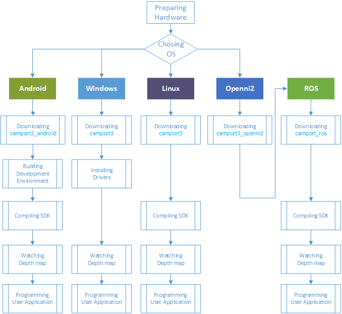

    Camport SDK 应用开发环境配置

Linux平台
+++++++++++++

Linux SDK 支持 AArch64、ARMv7hf、RaspberryPi、i686 和 x86-64 硬件平台，并为开发者编译程序提供相应平台的库文件。Linux SDK 未提供可执行的应用程序，用户可通过编译示例代码来生成可执行的应用。

下面以 Ubuntu14.04 为例介绍在 Linux 平台为 Percipio 深度相机搭建开发环境的过程：

1. :ref:`下载 Camport3 SDK <download-sdk-linux-label>`

2. :ref:`安装 USB 驱动 <usb-driver-linux-label>`

3. :ref:`安装依赖 <install-dependence-linux-label>`

4. :ref:`设置权限 <acesspermission-label>`

5. :ref:`编译 <code-linux-label>`

.. _download-sdk-linux-label:

下载 Camport3 SDK
*******************

选择以下任意方式，下载 Camport3 SDK：

* 使用浏览器访问 http://github.com/percipioxyz/ 并下载 Camport3 SDK。

* 使用 git 指令获取本地副本：打开终端，切换到需存放 SDK 的工作目录下，输入 git clone 命令克隆远程仓库：git clone https://github.com/percipioxyz/camport3.git 

Camport3 SDK 目录结构如下图所示：

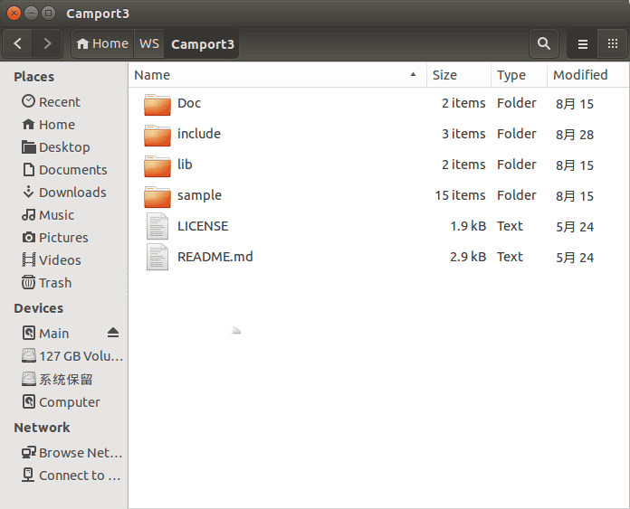

    Camport3 SDK目录结构

**Doc 目录**

存放了 SDK API 参考文档。该文档是通过 Doxygen 生成的 PDF 文件，包括了类、结构和接口的描述信息。

**include 目录**

存放了用于调用动态库的头文件：

* TYImageProc.h：图像后处理函数接口的头文件。

* TYCoordinateMapper.h：图像空间转换的映射。

* TYApi.h 文件：提供了用于配置深度相机、获取图像数据的全部 API。用户可以基于这些 API 开发自己的应用。

**lib/linux 目录**

存放了支持 Linux 操作系统的库文件，兼容 AArch64、ARMv7hf、RaspberryPi、i686 和 x86-64 硬件平台。

**lib/win 目录**

存放了支持 Windows 操作系统的库文件，兼容 x64 和 x86 硬件平台。

**sample 目录**

存放了可供用户编程参考的示例程序。关于示例程序，详情请参见 :ref:`示例程序说明 <sample-exe-label>`。

.. _usb-driver-linux-label:

安装 USB 驱动
*******************

Camport SDK 默认使用 LibUSB 作为 USB 深度相机的用户态驱动库。使用 Percipio USB 深度相机前需要安装 LibUSB 软件。 ::

   sudo apt-get install libusb-1.0-0-dev

.. _install-dependence-linux-label:

安装依赖
*******************

**CMake**

CMake 是一个跨平台的安装（编译）工具，可以用简单的语句来描述所有平台的安装（编译过程）。它能够输出各种各样的 makefile 或者 project 文件，能测试编译器所支持的 C++ 特性，类似 UNIX 下的 automake。只是 CMake 的组态档取名为 CMakeLists.txt。CMake 并不直接建构出最终的软件，而是产生标准的建构档（如 UNIX 的 Makefile 或 Windows Visual C++ 的 projects / workspaces），然后再以一般的建构方式使用。

Camport SDK 使用 CMake 来构建标准的工程，利用各平台的原生建构系统的能力，可适配不同的平台环境。 ::

   sudo apt-get install cmake

.. note::
   
   Camport SDK 要求用户安装 CMake 2.8.0 及更高的版本。

**OpenCV**

Camport SDK 可通过 USB 接口或者以太网接口接收 Percipio 深度相机输出的深度数据。取得深度数据后，Camport SDK 中提供的示例程序使用 OpenCV 图像处理软件库进行深度数据的渲染。编译示例程序前，需要安装 OpenCV 图形处理软件库。 ::

   sudo apt-get install libopencv-dev

.. note::

   1. Camport SDK 要求用户安装 OpenCV 2.4.8 及更高版本。
   
   2. 如果目标应用程序不使用 OpenCV 进行图像显示或者其他图像处理计算，则无需安装 OpenCV。

.. _acesspermission-label:

设置权限
*******************

根据 Linux 系统的权限管理机制，默认情况下需要 root 权限才能访问 Percipio **USB 深度相机**，非 root 用户可以创建 udev rule 来修改设备权限。

在 etc/udev/rules.d 文件所在目录下，新建一个扩展名为 .rules 的规则文件（如 88-tyusb.rules），并把用户加入该文件中指定的组（如:tofu），重启 PC 后获得 USB 深度相机的访问权限。规则文件内容如下： ::

  SUBSYSTEM== "usb",ATTRS{idProduct}=="1003",ATTRS{idVendor}=="04b4",GROUP="tofu",MODE="0666" 

.. note::

    规则文件名的开头须为数字 (0 ~ 99)，数字越大，优先级越高。访问 Percipio **网络深度相机** 不需要 root 权限。

.. _code-linux-label:

编译
*******************

进入 camport3 目录，执行以下命令编译示例代码。 ::

  sudo cp lib/linux/lib_x64/libtycam.so* /usr/lib/
  cd sample
  mkdir build
  cd build
  cmake ..
  make

在 camport3/sample/build/bin 目录下生成若干编译生成的可执行文件。

深度相机连接电脑后开始系统初始化，直到相机背面 Power 灯以 1Hz 的频率闪烁。相机初始化后，以 root 权限运行以下命令，即可接收并显示深度图像。 ::

  sudo ./SimpleView_FetchFrame

.. note::

    运行应用程序后，如果提示 "Couldn't open device, some information will be missing, ret: -3"，请检查系统的访问权限配置是否正确。

Windows 平台
++++++++++++++++++

Windows SDK 支持 X86（32位）和 X64（64位）硬件平台，并提供支持 Window7 及以上版本操作系统的驱动文件。Windows SDK 包括一些直接可以执行的应用程序（例如查看深度图）和一些应用程序的示例代码。

下面以 Windows10 X64 位系统为例介绍在 Windows 平台为 Percipio 深度相机搭建开发环境的过程：

1. :ref:`下载 Camport3 SDK <download-sdk-windows-label>`

2. :ref:`安装 USB 驱动 <install-usb-drive-label>`

3. :ref:`安装依赖 <install-dependence-windows-label>`

4. :ref:`编译 <code-windows-label>`

.. _download-sdk-windows-label:

下载 Camport3 SDK
*******************

选择以下任意方式，下载 Camport3 SDK：

* 使用浏览器访问 http://github.com/percipioxyz/ 并下载 Camport3 SDK。

* 使用 git 指令获取本地副本：打开终端，切换到需存放 SDK 的工作目录下，输入 git clone 命令克隆远程仓库：git clone https://github.com/percipioxyz/camport3.git

Camport3 SDK 目录结构如下图所示：

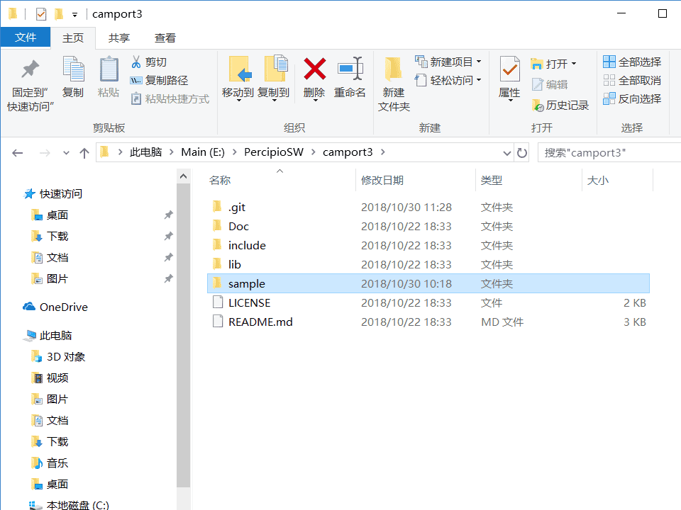

    Camport3 SDK 目录结构

**Doc 目录**

存放了 SDK API 参考文档。该文档是通过 Doxygen 生成的 PDF 文件，包括了类、结构和接口的描述信息。

**include 目录**

存放了用于调用动态库的头文件：

* TYImageProc.h：图像后处理函数接口的头文件。

* TYCoordinateMapper.h：图像空间转换的映射。

* TY_API.h 文件：提供了用于配置深度相机、获取图像数据的全部 API，用户可以基于这些 API 开发自己的应用。

**lib/linux 目录**

存放了支持 Linux 操作系统的库文件，兼容 AArch64、ARMv7hf、RaspberryPi、i686 和 x86-64 硬件平台。

**lib/win 目录**

存放了支持 Windows 操作系统的库文件，兼容 x64 和 x86 硬件平台。

**sample 目录**

存放了可供用户编程参考的示例程序。关于示例程序，详情请参见 :ref:`示例程序说明 <sample-exe-label>`。

.. _install-usb-drive-label:

安装 USB 驱动
*******************

1. 使用 USB 线把 Percipio 深度相机与 Windows PC 连接后，右键点击系统桌面左下角的 “开始”，并在开始菜单中点击 “设备管理器”，设备管理器中可发现未识别的 USB 设备 PERCIPIO DEVICEEE，如下图所示：

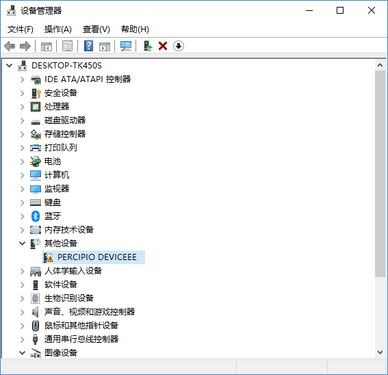

    未识别 USB 设备

2. 右击该设备并选择 “更新驱动程序”。根据 PC 的 Windows 版本，选择 Camport3 软件开发包中 lib/win/driver 目录下的驱动，按照系统提示完成驱动安装。

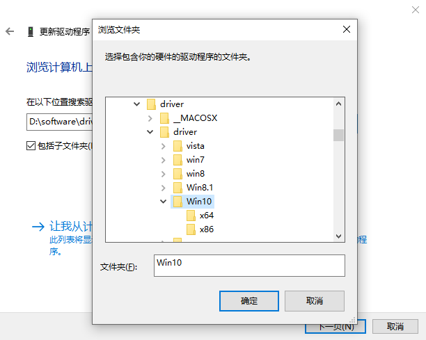

    Camport3设备驱动

驱动安装成功后，可以在设备管理器中发现 Percipio Device 设备。

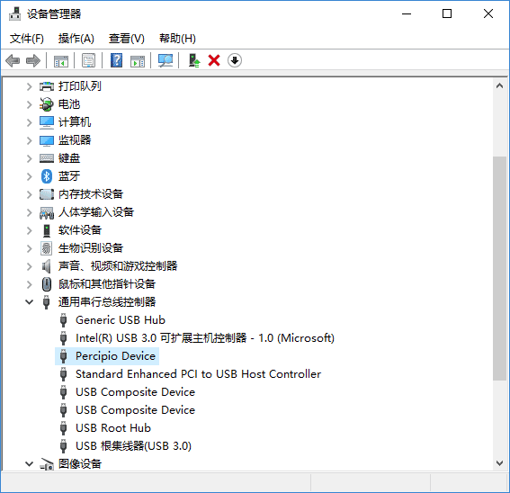

    Percipio Device 设备

.. _install-dependence-windows-label:

安装依赖
*******************

**CMake**

CMake 是一个跨平台的安装（编译）工具，可以用简单的语句来描述所有平台的安装（编译过程）。它能够输出各种各样的 makefile 或者 project 文件，能测试编译器所支持的 C++ 特性，类似 UNIX 下的 automake。只是 CMake 的组态档取名为 CMakeLists.txt。CMake 并不直接建构出最终的软件，而是产生标准的建构档（如 UNIX 的 Makefile 或 Windows Visual C++ 的 projects / workspaces），然后再以一般的建构方式使用。

Camport SDK 使用 CMake 来构建标准的工程，利用各平台的原生建构系统的能力，可适配不同的平台环境。

.. note::
   
   Camport SDK 要求用户安装 CMake 2.8.0 及更高的版本。

**OpenCV**

Camport SDK 可通过 USB 接口或者以太网接口接收 Percipio 深度相机输出的深度数据。取得深度数据后，Camport SDK 中提供的示例程序使用 OpenCV 图像处理软件库进行深度数据的渲染。编译示例程序前，需要安装 OpenCV 图形处理软件库。

.. note::

   1. Camport SDK 要求用户安装 OpenCV 2.4.8 及更高版本。
   
   2. 如果目标应用程序不使用 OpenCV 进行图像显示或者其他图像处理计算，则无需安装 OpenCV。

.. _code-windows-label:

编译
*******************

编译前，请先：

1. 安装 Visual Studio 和 Visual Studio 带有的 Visual C++ 模块。

2. 安装 :ref:`依赖 <install-dependence-windows-label>`。

编译步骤如下：

1. 在 SDK sample 目录下创建 build 目录。

2. 打开 CMAKE GUI。

3. 指定源码目录到 sample，编译输出目录为 sample/build。

   .. figure:: ../image/wincompilestep1.png
       :width: 480px
       :align: center
       :alt: wincompilestep2
       :figclass: align-center

4. 点击 “Configure”，选择对应的 Visual Studio 版本并点击 “Finish”。

   .. figure:: ../image/wincompilestep2.png
       :width: 480px
       :align: center
       :alt: wincompilestep2
       :figclass: align-center

5. 在 OpenCV_DIR 一栏指定到 opencv/build 文件路径。
   
   .. figure:: ../image/wincompilestep3.png
       :width: 480px
       :align: center
       :alt: wincompilestep3
       :figclass: align-center

6. 在系统环境变量中配置 OpenCV 库的路径。
   
   具体步骤：进入 “环境变量” 对话框，选中 “Path” 一栏并点击 “编辑” ，在 “编辑环境变量” 对话框中配置 OpenCV 库的路径。
   
   .. figure:: ../image/wincompilestep5.png
      :width: 480px
      :align: center
      :alt: wincompilestep5
      :figclass: align-center

7. 点击 “Generate”。

    .. figure:: ../image/wincompilestep4.png
       :width: 480px
       :align: center
       :alt: wincompilestep4
       :figclass: align-center

8. 点击 “Open Project”，打开工程。
   
   .. figure:: ../image/wincompilestep6.png
       :width: 480px
       :align: center
       :alt: wincompilestep6
       :figclass: align-center
  
  .. note::
     
     此后可通过 camport3/sample/build 路径下的 Project.sln 或 ALL_BUILD.vcxproj 文件打开工程。

9.  编译工程：在 Visual Studio 菜单栏依次点击 “生成” < “生成解决方法” 。

   .. figure:: ../image/wincompilestep7.png
       :width: 480px
       :align: center
       :alt: wincompilestep7
       :figclass: align-center

深度相机连接 PC 后开始系统初始化，直到相机背面 Power 灯以 1Hz 的频率闪烁。在 Windows10 X64 系统中，运行开发包中 lib/win/hostapp/x64/SimpleView_FetchFrame.exe 可执行文件，或者运行上述步骤编译生成的可执行文件，即可看到渲染了的深度图像。

Android 平台
+++++++++++++++++++++++++++

Android SDK 支持 ARMV7 硬件平台和 Android 4.4系统，并提供相应平台的库文件。Android SDK 为用户提供可执行的应用程序，也为开发者提供了一些应用程序的示例代码。

下载 Camport3 Android SDK
**************************************

选择以下任意方式，下载 Camport3 Android SDK：

* 使用浏览器访问 http://github.com/percipioxyz/ 并下载 Camport3 Android SDK。

* 使用 git 指令获取本地副本：打开终端，切换到需存放 SDK 的工作目录下，输入 git clone 命令克隆远程仓库：git clone https://github.com/percipioxyz/camport3_android.git

Camport3 Android SDK 目录如图所示：

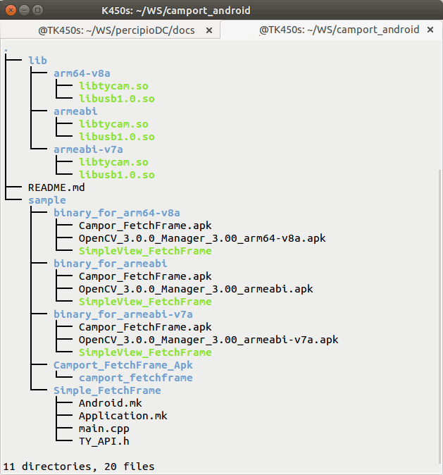

    Camport Android SDK目录

**lib 目录**

存放了 Android 平台的库文件，支持的 ARM 平台有 arm64-v8a、armeabi-v7a、armeabi，共计 3 类。

**sample 目录**

* Simple_FetchFrame：存放了 Camport-FetchFrame 程序的源代码，可以编译 Console 应用程序或者 apk。

* binary_for_arm64-v8a：存放了可执行的 Console 应用程序和 apk。

* binary_for_armeabi-v7a：存放了可执行的 Console 应用程序和 apk。

* binary_for_armeabi：存放了可执行的 Console 应用程序和 apk。

编译
******

#. 搭建 Android 的开发环境。
#. 下载 Android 版本的 OpenCV SDK。
#. 复制相关代码到开发环境。
#. 开始编译 SDK。

.. note::

  Camport_FetchFrame.apk 基于 OpenCV 开发，编译源码需要 OpenCV Android SDK 配合，具体安装步骤请参考 OpenCV 官网。

运行示例
***********

以 USB 相机为例，介绍如何通过 Android 系统运行相机，操作步骤如下：
  
1. 使用 USB 连接线将 PC 与 Android 设备连接。
2. 通过 adb 复制 lib/armeabi/armeabi-v7a/ 目录下的库文件到 /system/lib/ 下。
3. 进入 SDK 的 sample/binary_for_armeabi-v7a 目录。
4. 通过 adb 安装 Campor_FetchFrame.apk 和 OpenCV_2.4.9_Manager_2.18_armeabi.apk。
5. 使用 USB 连接线将深度相机与 Android 设备连接。
6. 如需运行 SimpleView_FetchFrame，复制 sample/binary_for_ARMV7/SimpleView_FetchFrame 到 Android 设备的 /data 目录，并在命令行执行以下命令即可看到相机输出的深度图像：
   ::

     /data/SimpleView_FetchFrame

.. note::

 根据 Linux 系统的权限管理机制，如果没有 root 权限，不能操作 Percipio USB 深度相机。非 root 用户可以创建 udev rule 来修改设备权限，可参考 :ref:`acesspermission-label` 。Android 平台可以使用此方式进行权限设置，也可以使用 Android API 申请设备权限。

OpenNI 套件
+++++++++++++

OpenNI2 SDK 基于 Linux SDK 开发，提供相应平台的库文件。

OpenNI（开放自然交互）是一个多语言，跨平台的框架，它定义了编写应用程序，并利用其自然交互的 API。OpenNI 的主要目的是要形成一个标准的 API，来搭建视觉和音频传感器与视觉和音频感知中间件通信的桥梁。

下载 Camport3 OpenNI2 SDK
***************************

选择以下任意方式，下载 Camport3 OpenNI2 SDK：

* 使用浏览器访问 http://github.com/percipioxyz/ 并下载 Camport3 OpenNI2 SDK。

* 使用 git 指令获取本地副本：打开终端，切换到需存放 SDK 的工作目录下，输入 git clone 命令克隆远程仓库：git clone https://github.com/percipioxyz/camport3_openni2.git

Camport3 OpenNI2 SDK 的目录图所示：

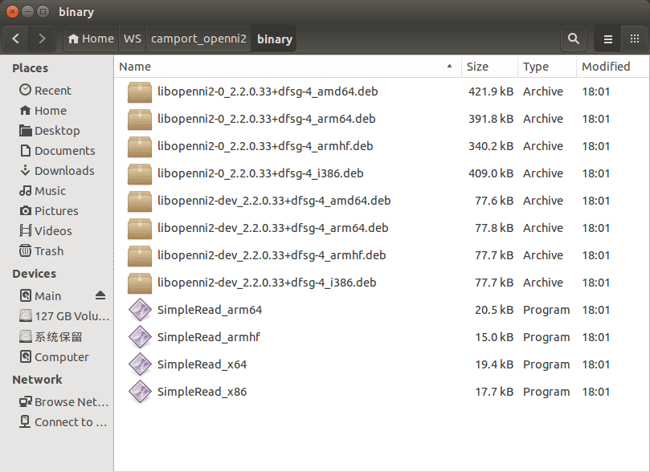

    Camport3 OpenNI2 SDK 目录

Percipio 提供各个平台的二进制安装包，按照平台配置情况安装相应开发包，即可支持 OpenNI2 开发环境。该开发包根目录下的 Percipio.ini 复制到 /etc/openni2 目录，Camport3 OpenNI2 SDK 通过读取该文件的配置来设置 Percipio 深度相机输出的深度和彩色图像数据分辨率，相机默认输出的深度和彩色图像数据分辨率是 640x480。

安装 Camport3 OpenNI2 SDK
***************************

以 X86 平台为例，执行以下命令，安装 Camport3 OpenNI2 SDK：
::

   sudo dpkg -i libopenni2-0_2.2.0.33+dfsg-4_i386.deb
   sudo dpkg -i libopenni2-dev_2.2.0.33+dfsg-4_i386.deb

.. note::

  安装后未能通过 OpenNI 接口接收深度图像数据时，可尝试运行开发包内的 SimpleRead_** 应用，检验 Linux 基础环境下的数据通路是否正常。

ROS 平台
+++++++++++++++++++++

ROS（Robot Operating System，下文简称 **ROS**）是一个适用于机器人的开源的元操作系统。它提供了操作系统应有的服务，包括硬件抽象，底层设备控制，常用函数的实现，进程间消息传递，以及包管理。通过 OpenNI2 框架，Percipio 深度相机可充分接入 ROS 系统。

ROS SDK 支持 ROS Indigo 平台，并提供相应平台的库文件。

下载 Camport ROS SDK
**************************

Camport ROS SDK 依赖于 OpenNI2 SDK，在下载 Camport3 ROS SDK 前，需安装 OpenNI2 支持软件包。

选择以下任意方式，下载 Camport3 ROS SDK：

* 使用浏览器访问 http://github.com/percipioxyz/ 并下载 Camport3 ROS SDK。

* 使用 git 指令获取本地副本：打开终端，切换到需存放 SDK 的工作目录下，输入 git clone 命令克隆远程仓库：git clone https://github.com/percipioxyz/camport_ros.git

Camport ROS SDK 的目录如下图所示：

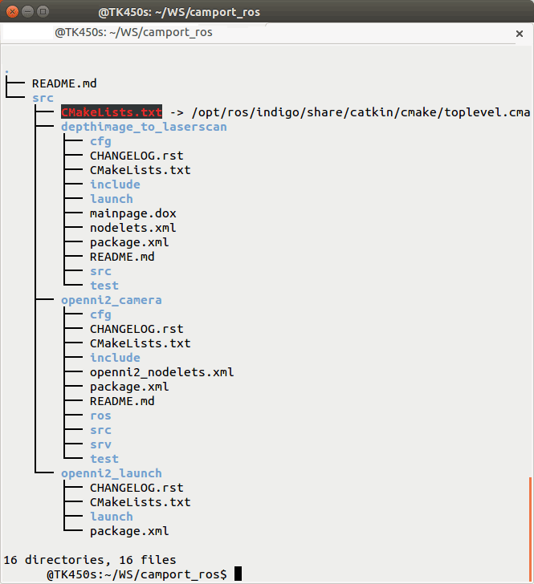

    Camport ROS SDK 目录

* openni2_camera：ROS 调用 OpenNI2 的封装层。
* openni2_launch：打开 OpenNI2 设备并获取深度和颜色数据应用。
* depthimage_to_laserscan：打开 OpenNI2 设备并获取线性深度数据应用。

编译
******

在开发包根目录下执行以下命令：
::

  $catkin_make

配置环境变量
**************
::

  $echo "source ~/camport_ros/devel/setup.bash" >> ~/.bashrc
  $source ~/.bashrc

运行
********

* 执行以下命令，在 RVIZ 中查看 Depth Camera：
  ::

     $roscore
     $roslaunch openni2_launch openni2.launch
     $rosrun rviz rviz

  在 RVIZ 的 /camera/image/depth 目录下添加深度图像视图，可查看三维空间视图。

| 

* 执行如下命令，在 RVIZ 中查看从深度图中仿真出的 Laser Scan 图：
  ::

     $roscore
     $roslaunch depthimage_to_laserscan depthimage_to_laserscan.launch
     $rosrun rviz rviz

  在 RVIZ 的 /scan/LaserScan 目录下添加激光扫描视图，可查看模拟线激光视图。

多设备同时接入方案
**************************

参考 openni2.launch 文件，创建多个 .launch。每个 .launch文件中 “camera” 和 “device_id” 配置成不同值，其中 “device_id” 的值为设备序列号。例如，要同时运行两个设备，创建两个.launch 文件 openni2_camera1.launch 和 openni2_camera2.launch。

openni2_camera1.launch 内容如下：

::

  <arg name="camera" default="camera1">
  ......
  <arg name="device_id" default="207000010443">
  ......

openni2_camera2.launch内容如下：

::

  <arg name="camera" default="camera2">
  ......
  <arg name="device_id" default="207000010113">
  ......

通过运行命令 “roslaunch openni2_launch openni2_camera1.launch” 打开序列号为 207000010443 的设备。

通过运行命令 “roslaunch openni2_launch openni2_camera2.launch” 打开序列号为 207000010113 的设备。

.. _build-camera-environment-label:

配置相机交叉编译开发环境
~~~~~~~~~~~~~~~~~~~~~~~~~~

Percipio 网络深度相机支持用户在相机内部运行自己开发的嵌入式应用，用户可以充分利用相机内部的计算资源进行图像预处理或者应用逻辑处理。支持嵌入式应用的具体相机型号可咨询 Percipio 技术支持。

.. note::
   
   USB 深度相机不支持用户在相机内部运行嵌入式应用。

示例程序编译
+++++++++++++++

1. 下载 Camport SOC SDK，链接：https://github.com/percipioxyz/camport3_soc.git
2. 在 SDK 根目录下执行 ./build.sh，执行完成后，./build/bin 目录下可以看到生成的可执行文件 RawFetchFrame。
3. 通过 scp 或者 sftp 将可执行文件拷贝到相机的用户应用文件夹，请参考  :ref:`应用安装 <binaryinstall-label>`。

用户程序编译
+++++++++++++++

1. 参考 SDK 的 ./Sample/RawFetchFrame，在 Sample 目录下创建用户程序目录后开发应用程序。
2. 修改 ./Sample/CMakeLists.txt，在 ALL_SAMPLES 中增加用户程序目录路径。
3. 执行 ./build.sh，执行完成后，./build/bin 目录下生成可执行文件。
4. 通过 scp 或者 sftp 将可执行文件拷贝到相机的用户应用文件夹，请参考  :ref:`应用安装 <binaryinstall-label>`。

使用 Opencv的程序编译流程
+++++++++++++++++++++++++

1. 参考 SDK 的 ./Sample/RawFetchFrame， 在 Sample 目录下创建使用 OpenCV 的程序目录后开发应用程序。
2. 修改 ./Sample/CMakeLists.txt，在 ALL_SAMPLES 中增加使用 OpenCV 的程序目录路径。
3. 执行 ./build.sh opencv，执行完成后，./build/bin 目录下生成可执行文件。
4. 通过 scp 或者 sftp 将可执行文件拷贝到相机的用户应用文件夹，同时，将需要的 OpenCV 库拷贝到相机，OpenCV 库在 ./ThirdPartyLib/Opencv-3.4/lib 目录下，请参考  :ref:`应用安装 <binaryinstall-label>`。

.. _binaryinstall-label:

程序和库文件的安装
+++++++++++++++++++++

1. 通过 scp 或者 sftp 将需要安装的文件拷贝到相机上的 /mnt/ram 目录下：

   ::

     scp ur_FILES percipio@XXX.XXX.XXX.XXX:/mnt/ram

2. 使用 putty 或者其他终端远程登录相机：

   ::

      ssh percipio@XXX.XXX.XXX.XXX

3. 在相机内将压缩包解压，并将执行文件以及共享库等拷贝到 /usr/local 下相应的目录中：

   ::

     cd /mnt/ram
     cp ur_ELFS_FILENNAME /usr/local/bin
     cp ur_lib*.so /usr/local/lib/
     cp ur*config /usr/local/etc

4. 执行 sync 命令，将修改固化到 flash 中。

.. note::

    1. 拷贝过程分两步，首先务必要复制到 /mnt/ram 目录下，以防应用程序是压缩打包的文件，解压过程中文件系统空间不够而出错。
    2. 文件少的时候可以不使用用压缩文件，文件较多的时候建议要锁打包之后拷贝到相机上解压缩；目前相机支持 tar、tar.gz、tar.bz2、未加密的 zip 文件这几种压缩文件，分别使用 tar -xvf、tar -xzvf、tar -xjvf、unzip 命令解压。
    3. 用户二次开发目录 /usr/local 的最大存储容量为 25MB。
    4. 文件解压缩后，务必复制到用户目录下，否则 /mnt/ram 中内容重启之后会丢失。
    5. 开发中使用的 libtycam.so 库文件，相机文件系统中已经包含，用户不必再次拷贝到 /usr/local/lib 下。
    6. 用户安装的应用程序或者脚本需要添加执行权限 chmod a+x ELFS_FILENNAME。
    7. XXX.XXX.XXX.XXX 为目标相机的 IP 地址。

设置程序开机启动
++++++++++++++++++

1. 登录相机
   ::

     ssh percipio@ XXX.XXX.XXX.XXX

2. 修改启动脚本
   ::

      vi /usr/local/etc/start_app.sh
  
      1 #!/bin/bash
      2 # Created By:      Leon Zhou
      3 # Created Time:    2019-04-26 20:29:12
      4 # Modified Time:   2019-04-26 20:33:22
      5 export LD_LIBRARY_PATH=$LD_LIBRARY_PATH:/usr/local/lib/
      6 export PATH=$PATH:/usr/local/sbin:/usr/sbin:/sbin
      7
      8 #Add your app start command below

   在第８行添加你的 app 的启动命令，例如：
   ::

       1 #!/bin/bash
       2 # Created By:      Leon Zhou
       3 # Created Time:    2019-04-26 20:29:12
       4 # Modified Time:   2019-04-26 20:33:22
       5 export LD_LIBRARY_PATH=$LD_LIBRARY_PATH:/usr/local/lib/
       6 export PATH=$PATH:/usr/local/sbin:/usr/sbin:/sbin
       7
       8 #Add your app start command below
       9 /usr/loca/bin/your_app

3. 在控制台执行 sync 指令写入存储系统，并重启设备。

.. warning::

    1) 调试过程中若需要重启 gevcam，需要运行 killall percipio_gev_disd。
    2) 不要在启动脚本中添加 reboot 等类似的语句！

网络配置
+++++++++

1. IP 设置

   系统默认使用 DHCP 模式动态获取 IP 地址。

   * 静态 IP 设置

     登录相机执行下方指令或者应用程序或者脚本中修改下方配置文件进行 IP 配置，不建议使用 ifconfig 或者其他方式直接修改 IP，避免相机 IP 管理混乱。此方法修改之后配置文件固化在相机中，在重启相机之后生效。

     ::

         echo "your_ip" > /etc/device_ip
         echo "your_gw" > /etc/device_gw
         echo "your_netmask" > /etc/device_netmask

   * 动态IP设置

    ::

       echo "" > /etc/device_ip
       echo "" > /etc/device_gw
       echo "" > /etc/device_netmask

   .. warning::

      1) 请谨慎修改 IP 地址、子网掩码、网关；如果设置不正确的值，会导致无法连接相机。
      2) 务必在控制台执行 sync 指令把修改写入存储系统，并重启设备。

2. ntp server 配置

   相机支持 NTP 时间同步，默认使用的 ntp server 为：'cn.ntp.org.cn' '0.ubuntu.pool.ntp.org' '1.ubuntu.pool.ntp.org'。
   
   如果用户已搭建了 ntp server，可以执行下方指令将搭建 ntp server 的 IP 或者域名添加在 */etc/ntp_server* 中：
   ::

      echo your_ntp_server > /etc/ntp_server

.. _hardware-connection-label:

硬件连接
------------

Camport SDK 需要配合 Percipio 深度相机使用。Camport SDK 支持所有在售型号的 Percipio 深度相机，关于 Percipio 深度相机的型号和参数，详情请参见 :ref:`产品规格 <camera-param-label>`。

该部分主要介绍相机与计算机的连接方式。

关于相机的供电方式，详情请参见 :ref:`产品规格 <camera-param-label>` 一章中每款相机的详情页。

部分相机支持外接外部触发信号，关于外部触发信号说明，详情请参考 :ref:`外部触发 <external-trigger-label>`。

.. important::

    关于硬件连接前需注意的安全事项，详情请参考 :doc:`安全声明 </COPYRIGHTS>`。

.. _usb-connection-label:

USB 深度相机
~~~~~~~~~~~~

**USB 连接方式1**

通过 USB 线缆直接将相机接入到计算机 USB2.0 接口或者 USB3.0 接口。

.. figure:: ../image/usbcon.png
    :width: 480px
    :align: center
    :alt: usb连接方式1
    :figclass: align-center

    USB 连接方式1

**USB 连接方式2**

通过 USB 线缆直接将相机接入到 USB HUB，USB HUB 接入到计算机 USB2.0 接口或者 USB3.0 接口。当连接多个相机时，为确保相机供电，需要使用能够满足供电要求的有源 HUB。

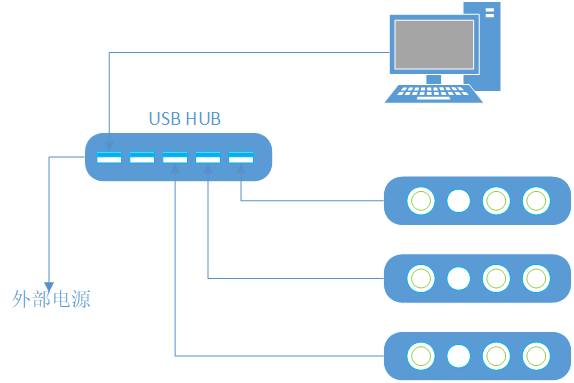

    USB 连接方式2

.. _net-connection-label:

网络深度相机
~~~~~~~~~~~~~~

Percipio 网络深度相机需要采用外部电源供电，部分型号相机同时支持 POE 供电。网络深度相机默认使用 DHCP 方式从服务器动态获取 IP 地址。

网络深度相机接入到计算机前，确保计算机网卡为自动获取 IP 模式（DHCP）。

**网络连接方式1**

通过千兆以太网线缆直接将相机接入到计算机千兆以太网接口。

相机上电启动后约1分钟，计算机和相机可以成功协商获得 169.254.xx.xx 网段的 IP 地址。

通过 SDK 示例程序 ListDevices 确认相机是否已经获得 IP 地址和设备号后，然后运行 SimpleView_FetchFrame.exe -id <设备号> 查看图像。设备号可从设备标签上获得，也可从枚举结果中获得。

    网络连接方式1

**网络连接方式2**

通过千兆以太网线缆将相机和计算机接入同一台千兆以太网交换机。

相机上电启动后约1分钟，计算机和相机可以成功协商获得 169.254.xx.xx 网段的 IP 地址。

通过 SDK 示例程序 ListDevices 确认相机是否已经获得 IP 地址和设备号后，然后运行 SimpleView_FetchFrame.exe -id <设备号> 查看图像。设备号可从设备标签上获得，也可从枚举结果中获得。

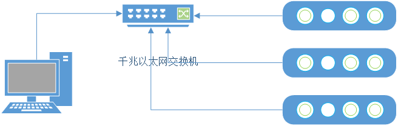

    网络连接方式2

**网络连接方式3**

通过千兆以太网线缆将相机和计算机接入同一台千兆以太网交换机，该交换机接入支持 DHCP 服务功能的路由器，或者在局域网内开通 DHCP 服务器。

相机上电启动后约1分钟，计算机和相机可以从 DHCP 地址服务器获得 192.168.xx.xx 网段的 IP 地址。

通过 SDK 示例程序 ListDevices 确认相机是否已经获得 IP 地址和设备号后，然后运行 SimpleView_FetchFrame.exe -id <设备号> 查看图像。设备号可从设备标签上获得，也可从枚举结果中获得。

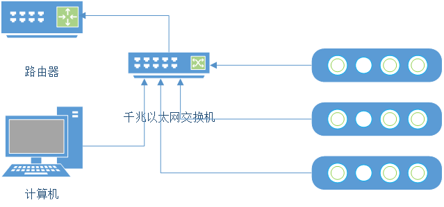

    网络连接方式3

.. note::

   若枚举不到网络深度相机或需修改相机的 IP 地址，请参考 :ref:`应用实例：设置网络深度相机的 IP 地址 <application1-label>`。

.. _application-reference-label:

应用参考
---------

通过 SDK sample/build/bin/Release 目录下的可执行文件，简单应用相机。Percipio 提供了在 SDK 基础上二次开发的看图软件 **Percipio Viewer**，支持用户快速浏览深度图、彩色图、红外图和点云图，以及在线调整相机的曝光参数、激光亮度等。

**Percipio Viewer** 安装包下载链接：https://www.percipio.xyz/support。

.. _sample-exe-label:

示例程序说明
~~~~~~~~~~~~~

ListDevices

  该示例程序用于枚举连接到上位机上的所有深度相机。
  

DumpAllFeatures

  该示例程序用于枚举深度相机支持的各个组件和属性，以及各个属性支持的读写等信息。
  

ForceDeviceIP
   
  该示例程序用于强制设置网络深度相机的 IP 地址。
  

LoopDetect
   
  该示例程序用于处理因环境不稳定等因素造成的数据连接异常。
  
  
SimpleView_FetchFrame
  
  该示例程序用于深度相机工作在自由采集模式下连续采集图像并输出图像数据。

SimpleView_Callback
   
  该示例程序用于深度相机工作在自由采集模式下连续采集图像，在独立的数据处理线程（防止堵塞图像数据获取）中进行 OpenCV 渲染，并输出图像数据。
  
SimpleView_FetchHisto
  
  该示例程序用于获取图像亮度数据直方图。

SimpleView_MultiDevice
  
  该示例程序用于多台深度相机同时连续采集图像并输出图像数据。
  
SimpleView_Point3D
   
  该示例程序用于获取 3D 点云数据。
  
SimpleView_Registration
  
  该示例程序用于获取深度相机的内参、外参、深度图和彩色图，并将深度图和彩色图对齐。
  
SimpleView_TriggerDelay
 
  该示例程序用于设置硬件触发延时时间，深度相机在接收到硬件触发信号并等待特定延时之后采集图像。

SimpleView_TriggerMode0
 
  该示例程序用于设置深度相机工作在模式 0，相机连续采集图像并以最高帧率输出图像数据。

SimpleView_TriggerMode1
 
  该示例程序用于设置深度相机工作在模式 1，相机收到软触发指令或硬触发信号后采集图像并输出图像数据。

SimpleView_TriggerMode_M2S1
 
  该示例程序用于设置主设备（相机）工作在模式 2，多台从设备（相机）工作在模式 1，以实现多台深度相机级联触发，同时采集图像。
  
  主设备收到上位机发送的软件触发信号后，通过硬件 TRIGGER OUT 接口输出触发信号，同时触发自身采集并输出深度图；从设备收到主设备的硬件触发信号后，采集并输出深度图。

SimpleView_TriggerMode_M3S1
 
  该示例程序用于设置主设备（相机）工作在模式 3，多台从设备（相机）工作在模式 1，以实现多台深度相机按照设置的帧率级联触发，同时采集图像。
  
  主设备按照设置的帧率，通过硬件 TRIGGER OUT 接口输出触发信号，同时触发自身采集并输出深度图；从设备收到主设备的硬件触发信号后，采集并输出深度图。

SimpleView_TriggerMode18
 
  该示例程序用于设置深度相机工作在模式 18，相机每接收到一次软触发指令或硬触发信号后，便按照设置的帧率，以 1+duty 的方式采集一轮图像并输出图像数据（1：出 1 次泛光；duty：出 duty 次激光）。

SimpleView_TriggerMode19
 
  该示例程序用于设置深度相机工作在模式 19，相机接收到一次软触发或者硬触发信号后，便按照设置的帧率，以 1+duty 的方式连续采集图像并输出图像数据（1：出 1 次泛光；duty：出 duty 次激光）。

SimpleView_TriggerMode20
 
  该示例程序用于设置深度相机工作在模式 20，根据设置的触发开始时间（start_time_us）、每两帧的时间间隔数组（offset_us_list[ ]）和触发次数（offset_us_count），相机定时采集（1 + offset_us_count）帧图像并输出图像数据。启用此⼯作模式要求相机先启动 PTP 对时，且 offset_us_count ≤ 50。

SimpleView_TriggerMode21
 
  该示例程序用于设置深度相机工作在模式 21，根据设置的触发开始时间（start_time_us）、触发次数（trigger_count）和触发时间间隔（peroid_us），相机每间隔 peroid_us 采集⼀帧图像，共采集 trigger_count 帧图像并输出图像数据。此工作模式要求相机先启动 PTP 对时。

.. _application1-label:

应用实例：设置网络深度相机的 IP 地址
~~~~~~~~~~~~~~~~~~~~~~~~~~~~~~~~~~~~~~~

设置网络深度相机 IP 地址的示例程序：ForceDeviceIP

**说明**

* 设置为临时 IP 地址

  指令：ForceDeviceIP.exe -force <MAC> <newIP> <newNetmask> <newGateway>

  其中，<MAC> 可从设备标签上获得，格式一般为：xx:xx:xx:xx:xx:xx；<newIP> 为指定 IP 地址；<newNetmask> 和 <newGateway> 根据 newIP 设置。该指令执行后，网络深度相机 IP 地址会修改为指令指定的 IP 地址，即时生效；相机断电重启后，恢复原有配置。

  示例：ForceDeviceIP.exe -force 68:f7:56:36:90:a3 192.168.1.160 255.255.255.0 192.168.1.1

* 设置为静态 IP 地址

  指令：ForceDeviceIP.exe -static <MAC> <newIP> <newNetmask> <newGateway>

  其中，<MAC> 可从设备标签上获得，格式一般为：xx:xx:xx:xx:xx:xx；<newIP> 为指定 IP 地址；<newNetmask> 和 <newGateway> 根据 newIP 设置。该指令执行后，网络深度相机 IP 地址会修改为指令指定的 IP 地址，即时生效；相机断电重启后，IP 地址保持为指令配置的地址不变。

  示例：ForceDeviceIP.exe -static 68:f7:56:36:90:a3 192.168.1.160 255.255.255.0 192.168.1.1

* 设置为动态 IP 地址（新版相机支持）
 
  指令：ForceDeviceIP.exe -dynamic <MAC>

  其中，<MAC> 可从设备标签上获得，格式一般为：xx:xx:xx:xx:xx:xx。该指令执行后，会清空网络深度相机 IP 配置，恢复为 DHCP 动态获取方式并立即动态申请 IP 地址；相机断电重启后，设备主动以 DHCP 方式申请 IP。某些旧版本相机不支持该指令。

  示例：ForceDeviceIP.exe -dynamic 68:f7:56:36:90:a3

* 设置为动态 IP 地址（旧/新版相机支持）

  指令：ForceDeviceIP.exe -dynamic <MAC> <newIP> <newNetmask> <newGateway>

  其中，<MAC> 可从设备标签上获得，格式一般为：xx:xx:xx:xx:xx:xx；<newIP> <newNetmask> <newGateway> 为临时使用的 IP 地址、掩码。该指令执行后，会临时使用 newIP 配置相机，然后清空相机 IP 配置，恢复为 DHCP 动态获取方式并立即动态申请 IP 地址。相机断电重启后，设备保持以 DHCP 方式申请 IP 地址。

  示例：ForceDeviceIP.exe -dynamic 68:f7:56:36:90:a3 192.168.1.160 255.255.255.0 192.168.1.1

**应用场景1**

通过 SDK 示例程序 ListDevices 无法枚举到 Percipio 网络深度相机。

以 Windows 10 为例，操作步骤如下：

1. 在 SDK sample/build/bin/Release 目录下执行指令 ForceDeviceIP.exe -force <MAC> <newIP> <Netmask> <Gateway>，新设的 newIP 需与计算机的 IP 地址处于同一网段，子网掩码和网关和计算机一致。

2. 按需执行以下指令，将相机的 IP 地址设为：

   - 动态 IP 地址：ForceDeviceIP.exe -dynamic <MAC> 或 ForceDeviceIP.exe -dynamic <MAC> <newIP> <newNetmask> <newGateway>
   
   - 静态 IP 地址：ForceDeviceIP.exe -static <MAC> <newIP> <newNetmask> <newGateway>

**应用场景2**

将 Percipio 网络深度相机的动态 IP 地址修改成静态 IP 地址。

以 Windows 10 为例，操作步骤如下：

1. 若新修改的静态 IP 地址与计算机的 IP 地址不在同一网段，先修改计算机的 IP 地址。

   例如：若新修改的静态 IP 地址为 192.168.5.XX，打开电脑上的控制面板，选择 “网络和 Internet” > “网络和共享中心” > “更改适配器配置” > “以太网” > “Internet 协议板块4（TCP/IPv4）”，在弹出的 **Internet 协议板块4（TCP/IPv4）属性** 对话框中选中 “使用下面的 IP 地址” 并设置 IP 地址、子网掩码和网关：

   .. figure:: ../image/modify-pc-ip.png
      :width: 500px
      :align: center
      :alt: 修改计算机 IP 地址
      :figclass: align-center

      修改计算机 IP 地址

2. 进入 SDK sample/build/bin/Release 目录下执行命令：ForceDeviceIP.exe -static <MAC> <newIP> <Netmask> <Gateway>，newIP 是需要修改成的静态 IP 地址。

术语库
---------

.. _active-stereo-label:

主动双目
~~~~~~~~

Percipio 采用自主知识产权的主动双目技术研发的深度相机包括双目红外图像传感器、彩色图像传感器和激光投射器。

Percipio 主动双目深度相机支持通过 USB 接口或者以太网接口接收上位机指令，实现软件指令触发采集图像；
带硬件触发接口的相机支持外部硬件信号触发，按照触发信号的频率采集图像。

激光投射器发射结构光到被测物体表面，彩色图像传感器采集 RGB 数据，红外图像传感器接收到两路红外数据后，以嵌入式视觉处理器为计算平台，
根据三角测距原理高速计算出视野范围内各点的深度数据，最后将深度数据、红外数据、RGB 数据经接口上传给上位机。

     .. figure:: ../image/system_arc_stereo.png
         :width: 600px
         :align: center 
         :alt: 主动双目相机结构
         :figclass: align-center
     
         主动双目相机结构

.. _tof-label:

飞行时间
~~~~~~~~

Percipio 采用飞行时间（ToF）技术研发的深度相机包括彩色图像传感器、ToF 传感器和激光投射器。

Percipio ToF 相机通过千兆以太网接口接收上位机指令，激光投射器发射调制光到被测物体表面，彩色图像传感器采集 RGB 数据，ToF 传感器接收被测物体表面返回的调制光后，以嵌入式视觉处理器为计算平台，高速计算出视野范围内各点的深度数据，最后将深度数据、红外数据、RGB 数据经接口上传给上位机。

     .. figure:: ../image/system_arc_tof.png
         :width: 450px
         :align: center 
         :alt: ToF相机结构
         :figclass: align-center
 
         ToF 相机结构

.. _depth-image-label:

深度图
~~~~~~

深度图（Depth 图）是深度相机视野内所有点的深度数据构成的一个 16bit 位深的单通道矩阵。为直观地体现不同距离值，在 SDK 示例程序中，输出的深度图均被映射到了 RGB 色彩空间，所以显示出来的结果为 RGB 三通道 8bit 位深的位图。

深度图中的单个像素值是空间中物体的某个点到垂直于左红外镜头光轴并通过镜头光心（深度相机光学零点）平面的垂直距离。深度数据单位为毫米，没有深度数据的点值为 0。深度数据无外参，无畸变，只提供用于转换点云数据的内参。
     
     .. figure:: ../image/depthdefine.png
         :width: 400px
         :align: center
         :alt: 深度图定义
         :figclass: align-center
     
         深度图定义

**深度图数据格式**
     
     .. figure:: ../image/depthdataformat.png
         :align: center
         :alt: 深度图数据格式
         :figclass: align-center

.. _point3D-image-label:

点云图
~~~~~~

点云图是深度相机视野内所有点的点云信息构成的数据矩阵。每个点的点云信息为三维坐标（x，y，z）。没有三维空间信息的点为（x，y，0）。

**点云图数据格式**
     
     .. figure:: ../image/pcdataformat.png
         :align: center
         :alt: 点云图数据格式
         :figclass: align-center

.. _ir-image-label:

红外图
~~~~~~

红外图（IR 图）是红外图像传感器输出的图像。在输出深度图的时候，部分型号的 Percipio 深度相机输出的红外图是被系统处理过的图像，如果需要看原始的红外图，需要关闭深度图输出。红外图分为左红外图和右红外图，二者均包含内参和畸变参数，但是因为左红外图和深度图是同一个空间坐标系，所以左红外图无外参。

.. _color-image-label:

彩色图
~~~~~~

彩色图（RGB图）是彩色图像传感器输出的图像。彩色图像传感器组件提供了内参，外参，畸变参数。不同型号的 Percipio 深度相机会输出不同数据类型的彩色图。

- 含有硬件 ISP 模块的彩色图像传感器输出为正常的 YUYV422/JPEG 图像，经 OpenCV 处理即可显示为正常色彩空间的彩色图。
- 不含硬件 ISP 模块的彩色图像传感器输出为 RAW BAYER 图像，图像画面可能存在偏色现象，经过 SDK 的软件 ISP 处理（如白平衡），才可以显示为正常色彩空间的彩色图。没有硬件 ISP 模块的彩色图像传感器可以确保输出的图像数据与红外图像数据同步。

