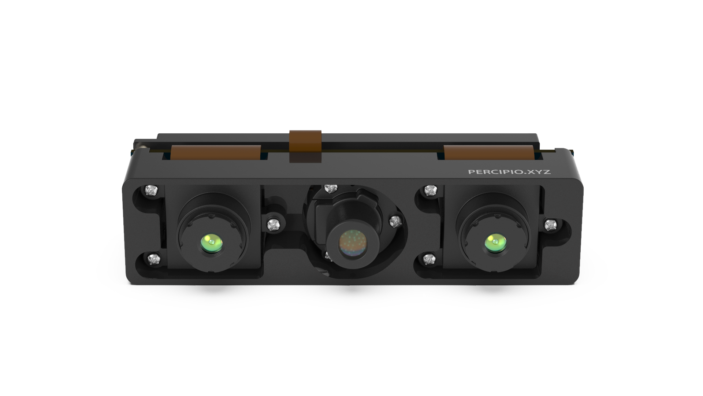
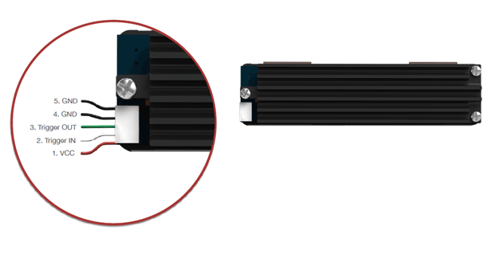
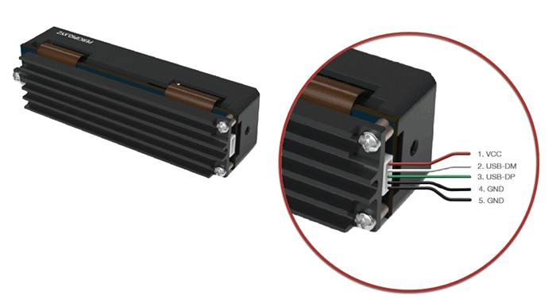
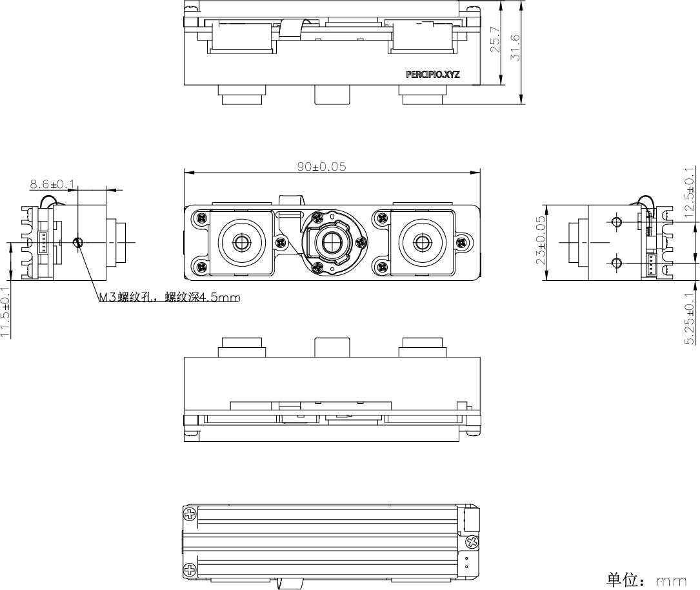
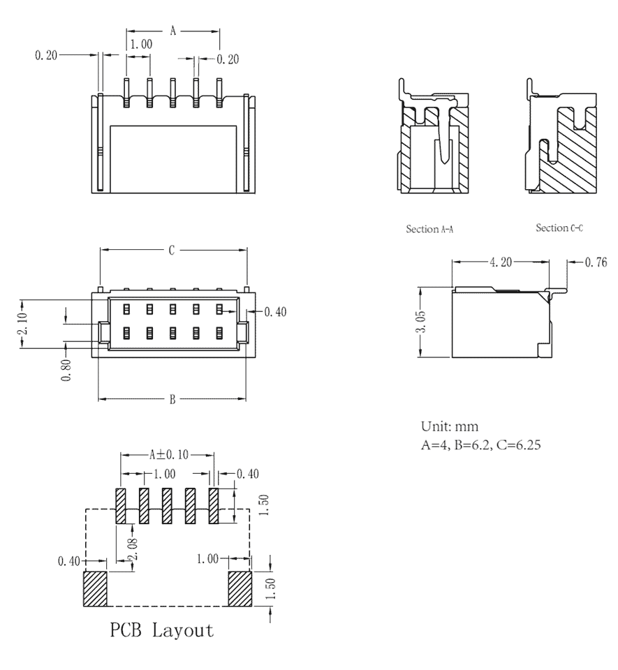

.. _DM460-U2-label:

DM460-U2
==========

    DM460-U2 外观

测量指标
------------

.. list-table:: 
   :header-rows: 1

   * - 项目
     - 单位
     - 范围
     - 备注
   * - 测量距离
     - mm
     - 520 ~ 5500
     - 与补光亮度和环境光相关
   * - 深度视场角（水平/垂直）
     - °
     - 56/46
     - —
   * - 精度误差
     - —
     - 0.2% ~ 2%
     - 与距离呈非线性关系

图像参数
------------

.. list-table:: 
   :header-rows: 1

   * - 项目
     - 分辨率
     - 帧率
     - 室外支持
   * - 深度图
     - 640*480
     - 30fps
     - 不支持

接口说明
--------

**触发接口**

DM460-U2 的触发接口和引脚定义如下图所示。

    触发接口和引脚说明

.. list-table:: 
   :header-rows: 1

   * - 序号
     - 颜色
     - 名称
     - 说明
   * - 1
     - 红色
     - VCC
     - 5V，辅助供电接口
   * - 2
     - 白色
     - Trigger IN
     - 触发输入信号
   * - 3
     - 绿色
     - Trigger OUT
     - 触发输出信号
   * - 4
     - 黑色
     - GND
     - 信号地
   * - 5
     - 黑色
     - GND
     - 信号地

.. list-table:: 触发信号电气指标
   :header-rows: 1

   * - 项目
     - 最小值
     - 典型值
     - 最大值
   * - Trigger OUT 高电压 (V)
     - 3.14
     - 3.3
     - 3.47
   * - Trigger OUT 低电压 (V)
     - -0.3
     - 0
     - 0.4
   * - Trigger IN 高电压 (V)
     - 3.14
     - 3.3
     - 3.47
   * - Trigger IN 低电压 (V)
     - -0.3
     - 0
     - 0.4

.. note::

  #. 系统最多支持同时配置两台串联设备，如需串联更多设备或者长距离输出触发信号，建议增加电压转换模块并用光耦进行隔离，在传输中升压到 12V 或者 24V，接收端转换回 3.3V，并做适当的滤波处理。
  #. 触发信号接口为 3.3V LVCMOS 电路，默认为下降沿触发，接收输入为脉冲方波，方波应保持低电平 **10~30 毫秒**。
  #. 为避免错误触发，下降沿信号下降时间 **不超过 5 微秒** 。触发频率不能超过设备处理能力（即连续模式的帧率），否则相机会丢弃触发信号，不做处理。

**电源和通信接口**

DM460-U2 的电源和通讯接口和引脚定义如下图所示。

    电源和通信接口示意图

.. list-table::
   :header-rows: 1

   * - 序号
     - 颜色
     - 名称
     - 说明
   * - 1
     - 红色
     - VCC
     - 5V,设备供电接口
   * - 2
     - 白色
     - USB DM
     - 数据线 D-
   * - 3
     - 绿色
     - USB DP
     - 数据线 D+
   * - 4
     - 黑色
     - GND
     - 电源地
   * - 5
     - 黑色
     - GND
     - 数字地

.. list-table:: 电源电气指标
   :header-rows: 1

   * - 项目
     - 单位
     - 最小值
     - 典型值
     - 最大值
     - 备注
   * - VCC for Power
     - V
     - 4.0
     - 5
     - 5.25
     - —
   * - P\ :sub:`idle`\
     - W
     - —
     - 1.4
     - —
     - 空闲模式下功耗
   * - P\ :sub:`work`\
     - W
     - —
     - 2.2
     - —
     - 连续工作模式下功耗

物理指标
---------

.. list-table::
   :header-rows: 1

   * - 项目
     - 单位
     - 最小值
     - 典型值
     - 最大值
   * - 尺寸（宽 x 高 x 深）
     - mm
     - —
     - 90.0 x 23.0 x 25.7 （不含镜头）
     - —
   * - 重量
     - g
     - —
     - 78
     - —
   * - 工作温度
     - ℃
     - 0
     - —
     - 45
   * - 存储温度
     - ℃
     - -10
     - —
     - 55

机械尺寸
---------

    机械安装尺寸图

.. figure:: ../image/5pinmaleconnector.png
    :align: center
    :alt: 连接器公头尺寸图
    :figclass: align-center

    连接器公头尺寸图

    连接器母头尺寸图

