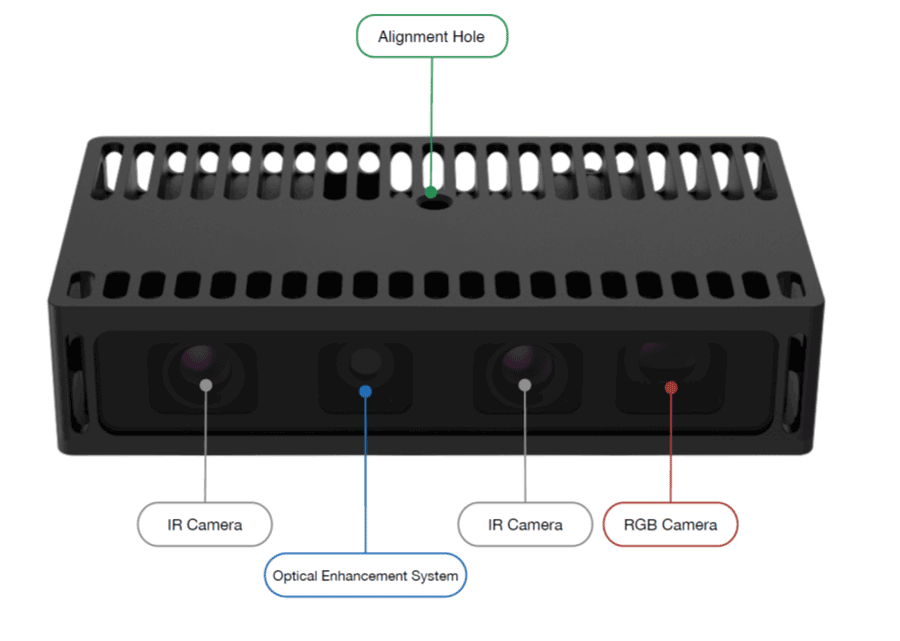
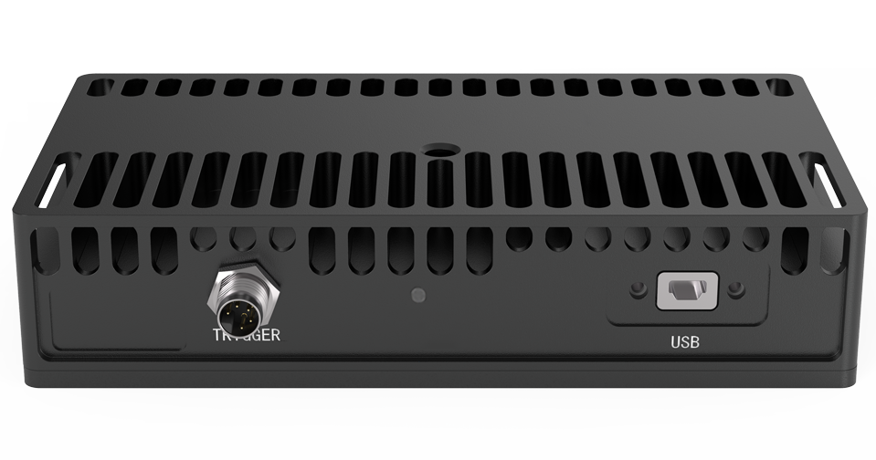
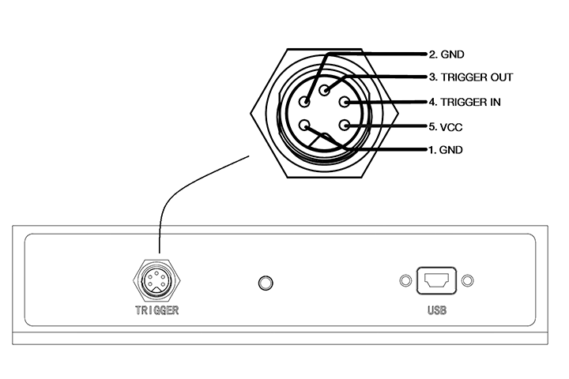
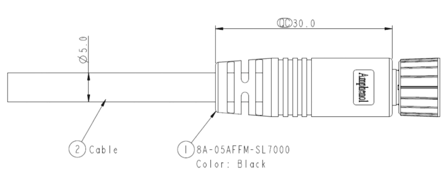

.. _FM830-GI-U2-label:

FM830-GI-U2
============

    FM830-GI-U2前视图

    FM830-GI-U2后视图

测量指标
------------

.. list-table:: 
   :header-rows: 1

   * - 项目
     - 单位
     - 最小值
     - 典型值
     - 最大值
     - 备注
   * - 测量距离
     - 米
     - 0.5
     - —
     - 8
     - 与补光和环境光相关
   * - 深度视场角（水平/垂直）
     - 度
     - —
     - 56/46
     - —
     - —
   * - RGB视场角（水平/垂直）
     - 度
     - —
     - 60/46
     - —
     - —
   * - 精度误差
     - 百分比
     - 0.2
     - 2mm@ 1m
     - 1
     - 与距离程非线性关系

图像参数
------------

+---------------+------------+-----------+-----------+
|  项目         |    分辨率  |    帧率   |  曝光模式 |
+===============+============+===========+===========+
|               |  1280*960  | 15fps     |           |
+               +------------+-----------+           +
|    深度图     |   640*480  | 24fps     |   全局    |
+               +------------+-----------+           +
|               |   320*240  | 24fps     |           |
+---------------+------------+-----------+-----------+
|               |  1280*960  | 15fps     |           |
+               +------------+-----------+           +
|    彩色图     |   640*480  | 24fps     |   全局    |
+               +------------+-----------+           +
|               |     --     |   --      |           |
+---------------+------------+-----------+-----------+

.. important ::

  #. 彩色图像可以与深度图实现点对点对齐，详情请查看API指南或者参考示例程序 SimpleView_Registration 。
  #. 彩色图像与深度图像实现百分百 **同时曝光，严格同步**。

接口说明
--------

**触发接口**

FM830-GI-U2 的触发接口和引脚定义如下图所示。

    机壳航插接口说明

.. list-table::
   :header-rows: 1

   * - 序号
     - 名称
     - 功能描述
     - 补充说明
   * - 1
     - GND
     - 接地端
     - 配套线芯为黑色
   * - 2
     - GND
     - 接地端
     - 配套线芯为棕色
   * - 3
     - Trigger OUT
     - 触发信号输出端
     - 配套线芯为红色
   * - 4
     - Trigger IN
     - 触发信号输入端
     - 配套线芯为橘色
   * - 5
     - VCC
     - 触发电源输入端
     - 配套线芯为黄色

.. list-table:: 触发信号电气指标
   :header-rows: 1

   * - 项目
     - 最小值
     - 典型值
     - 最大值
   * - Trigger OUT 高电平 (V)
     - 12
     - _
     - 24
   * - Trigger OUT 低电平 (V)
     - -0.3
     - 0
     - 0.4
   * - Trigger IN 高电平 (V)
     - 12
     - —
     - 24
   * - Trigger IN 低电平 (V)
     - -0.3
     - 0
     - 0.4
   * - 触发输入电源 (V)
     - 12
     - —
     - 24

.. important ::

  #. 触发信号（OUT）最大支持同时驱动两台同型号相机，如需驱动更多设备，建议增加信号中继设备。
  #. 触发信号（IN/OUT）默认为下降沿触发，接收输入为脉冲方波，方波应保持低电平 **10~30 毫秒**。
  #. 为避免错误触发，下降沿信号下降时间 **不超过 5 微秒**。触发频率不能超过设备处理能力 (即连续模式的帧率)，否则相机会丢弃触发信号，不做处理。

**电源和通信接口**

FM830-GI-U2 使用USB2.0接口进行数据传输并为相机供电。

.. list-table::
   :header-rows: 1

   * - 项目
     - 单位
     - 最小值
     - 典型值
     - 最大值
     - 备注
   * - VCC for Power
     - V
     - 4.75
     - 5
     - 5.25
     - —
   * - P\ :sub:`idle`\
     - W
     - —
     - 1.5
     - —
     - 空闲模式下功耗
   * - P\ :sub:`work`\
     - W
     - —
     - 3.6
     - —
     - 连续工作模式下功耗

物理指标
---------

.. list-table:: 
   :header-rows: 1

   * - 项目
     - 单位
     - 最小值
     - 典型值
     - 最大值
   * - 尺寸(宽 x 高 x 深)
     - 毫米
     - —
     - 130x28.8x76.2
     - —
   * - 重量
     - 克
     - —
     - 340
     - —
   * - 工作温度
     - 摄氏度
     - 0
     - —
     - 45
   * - 存储温度
     - 摄氏度
     - -10
     - —
     - 55
   * - 防水防尘
     - IEC 60529
     - 
     - IP65
     - 

机械尺寸
---------

.. figure:: ../image/FM830-I-U2structure1.png
    :align: center
    :alt: 机械安装尺寸图
    :figclass: align-center

.. figure:: ../image/FM830-I-U2structure2.png
    :width: 480px
    :align: center
    :alt: 机械安装尺寸图
    :figclass: align-center

.. figure:: ../image/FM830-I-U2structure3.png
    :width: 480px
    :align: center
    :alt: 机械安装尺寸图
    :figclass: align-center

.. figure:: ../image/FM830-I-U2structure4.png
    :align: center
    :alt: 机械安装尺寸图
    :figclass: align-center

.. figure:: ../image/FM830-I-U2structure5.png
    :width: 480px
    :align: center
    :alt: 机械安装尺寸图
    :figclass: align-center

    机械安装尺寸图

    触发接口线缆尺寸图

