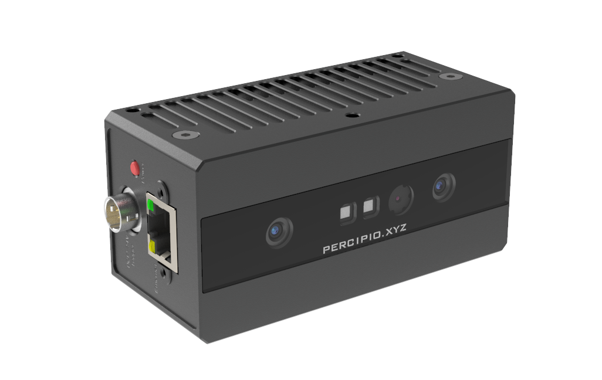
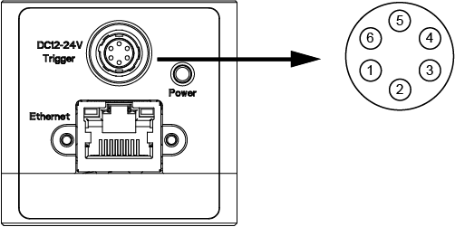
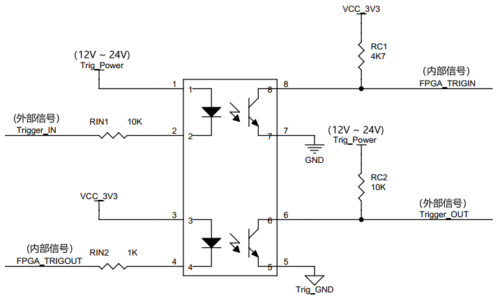
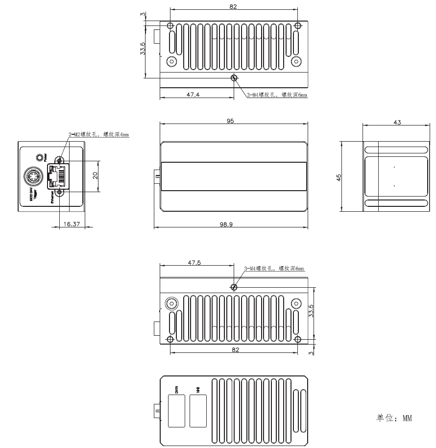

.. _FS820-E1-label:

FS820-E1
=============

    FS820-E1 外观

测量指标
------------

.. list-table::
   :header-rows: 1

   * - 项目
     - 单位
     - 最小值
     - 备注
   * - 测量距离
     - mm
     - 300 ~ 1400
     - 与补光和环境光相关
   * - 深度视场
     - mm
     - 345 x 250 @ 300；  1825 x 1140 @ 1400
     - —
   * - RGB 视场
     - mm
     - 970 x 496 @ 506
     - —
   * - 精度误差 Z
     - mm
     - 0.5 @ 400；  3.0 @ 1000；  5.0 @ 1400
     - 与距离呈非线性关系
   * - 精度误差 X/Y
     - mm
     - 1.5 @ 400；  3.5 @ 1000；  6.0 @ 1400
     - 与距离呈非线性关系

图像参数
------------

+---------------+------------+-----------+-----------+
|  项目         |    分辨率  |    帧率   |  曝光模式 |
+===============+============+===========+===========+
|               |  1280*800  |  7fps     |           |
+               +------------+-----------+           +
|    深度图     |   640*400  |  7fps     |   全局    |
+               +------------+-----------+           +
|               |   320*200  |  7fps     |           |
+---------------+------------+-----------+-----------+
|               |  1920*1080 |  10fps    |           |
+               +------------+-----------+           +
|    彩色图     |   1280*720 |  11fps    |   全局    |
+               +------------+-----------+           +
|               |   640*360  |  11fps    |           |
+---------------+------------+-----------+-----------+

.. important ::

   彩色图可以与深度图实现点对点对齐，详情请参考示例程序 SimpleView_Registration 或者查看 API 指南。

接口说明
--------

**网络接口**

FS820-E1 数据传输采用千兆以太网，接口采用 RJ45 连接器。为确保网络连接稳定，请使用接头带固定螺丝的千兆网线。

**电源及触发接口**

FS820-E1 电源和触发电路接口型号为 HR10A-7R-6P，引脚定义如下图所示。

    电源及触发接口和引脚说明

.. list-table::
   :header-rows: 1

   * - 序号
     - 名称
     - 功能描述
     - 配套线芯颜色
   * - 1
     - P_24V
     - DC 供电电源正
     - 红色
   * - 2
     - Trigger IN
     - 触发输入
     - 黄色
   * - 3
     - Trigger OUT
     - 触发输出
     - 蓝色
   * - 4
     - Trig_Power
     - 触发电路电源
     - 绿色
   * - 5
     - Trig_GND
     - 触发电路电源地
     - 白色
   * - 6
     - P_GND
     - DC 供电电源地
     - 黑色

.. list-table:: 触发信号电气指标
   :header-rows: 1

   * - 项目
     - 最小值
     - 典型值
     - 最大值
   * - Trig_Power电压 (V)
     - 11.4
     - 12/24
     - 25.2
   * - Trigger OUT 高电压 (V)
     - 11.4
     - 12/24
     - 25.2
   * - Trigger OUT 低电压 (V)
     - -0.3
     - 0
     - 0.4
   * - Trigger IN 高电压 (V)
     - 11.4
     - 12/24
     - 25.2
   * - Trigger IN 低电压 (V)
     - -0.3
     - 0
     - 0.4

**触发电路原理**

    触发电路参考图

.. important ::

  #. 触发信号（OUT）最大支持同时驱动两台同型号相机，如需驱动更多设备，建议增加信号中继设备。
  #. 触发信号（IN/OUT）默认为下降沿触发，接收输入为脉冲方波，方波应保持低电平 **10~30 毫秒**。
  #. 为避免错误触发，下降沿信号下降时间 **不超过 5 微秒** 。触发频率不能超过设备处理能力（即连续模式的帧率），否则相机会丢弃触发信号，不做处理。

**指示灯**

.. list-table:: 指示灯说明
   :header-rows: 1

   * - 颜色
     - 名称
     - 功能描述
   * - 红黄交替
     - 相机状态指示灯
     - 1Hz 缓慢闪烁表示工作正常

电源参数
----------

相机采用外部直流供电。将外部直流电源，通过工业航插线缆连接到电源接口，即可为相机供电。推荐线缆型号为 HR10A-7P-6S。相机工作电源电压范围是直流 +12V~+24V。

.. list-table:: 电源电气指标
   :header-rows: 1

   * - 项目
     - 单位
     - 最小值
     - 典型值
     - 最大值
     - 备注
   * - VCC for Power
     - V
     - 11.4
     - 12/24
     - 25.2
     - —
   * - P\ :sub:`idle`\
     - W
     - —
     - 2.8
     - —
     - 空闲模式下功耗
   * - P\ :sub:`work`\
     - W
     - —
     - 3.9
     - —
     - 连续工作模式下功耗
   * - P\ :sub:`trigger`\
     - W
     - —
     - 3.3
     - —
     - 触发工作模式下功耗

物理指标
---------

.. list-table::
   :header-rows: 1

   * - 项目
     - 单位
     - 最小值
     - 典型值
     - 最大值
   * - 尺寸（宽 x 高 x 深）
     - mm
     - —
     - 95 x 45 x 43（不含接口）
     - —
   * - 重量
     - g
     - —
     - 228
     - —
   * - 工作温度
     - ℃
     - 0
     - —
     - 45
   * - 存储温度
     - ℃
     - -10
     - —
     - 55

机械尺寸
---------

    机械安装尺寸图

