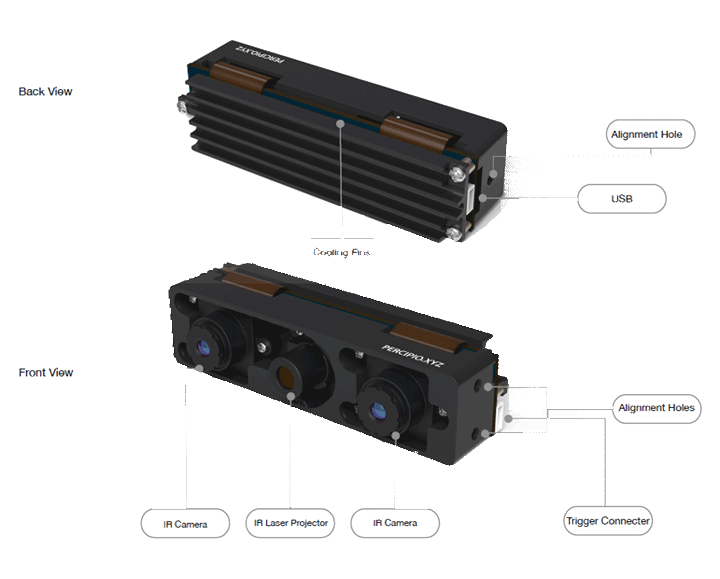
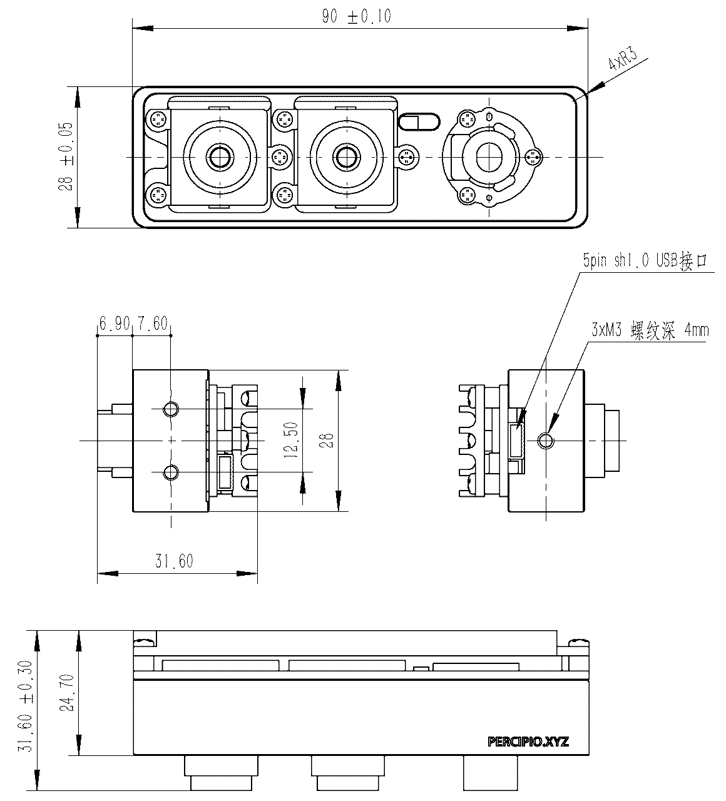
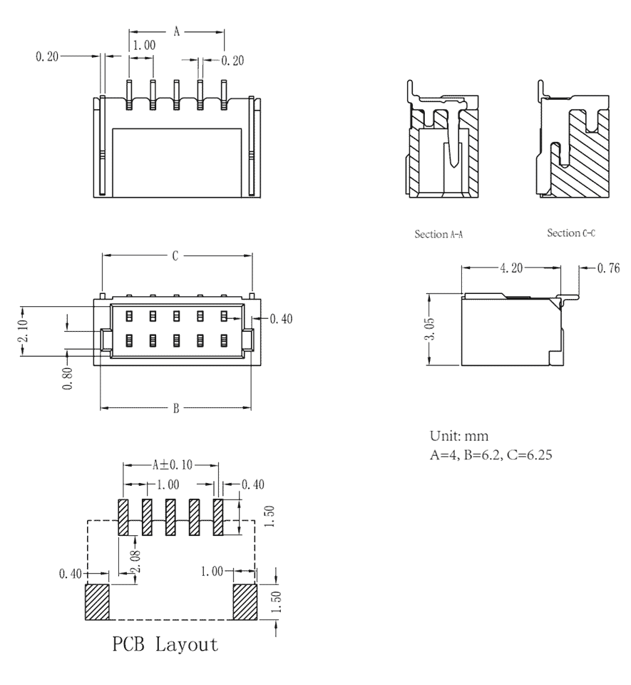

.. _DM830-U2-label:

DM830-U2
==========

    DM830-U2外观

测量指标
------------

.. list-table:: 
   :header-rows: 1

   * - 项目
     - 单位
     - 最小值
     - 典型值
     - 最大值
     - 备注
   * - 测量距离
     - 米
     - 0.5
     - RS
     - 6.0
     - 与补光亮度和环境光相关
   * - 深度视场角（水平/垂直）
     - 度
     - —
     - 56/46
     - —
     - —
   * - 精度误差
     - 百分比
     - 0.2
     - 2mm@ 1m
     - 1
     - 与距离程非线性关系

图像参数
------------

+---------------+------------+-----------+
|  项目         |    分辨率  |    帧率   |
+===============+============+===========+
|               |   1280*960 | 10fps     |
+      深度图   +------------+-----------+
|               |   640*480  | 21fps     |
+               +------------+-----------+
|               |   320*240  | 21fps     |
+---------------+------------+-----------+

接口说明
--------

**电源和通信接口**

DM830-U2 的电源和通讯接口和引脚定义如下图所示。

.. figure:: ../image/DM830usbinterface.png
    :width: 480px
    :align: center
    :alt: 电源和通信接口
    :figclass: align-center

    电源和通信接口示意图

.. list-table::
   :header-rows: 1

   * - 序号
     - 颜色
     - 名称
     - 说明
   * - 1
     - 红色
     - VCC
     - 5V，设备供电接口
   * - 2
     - 白色
     - USB DM
     - 数据线 D-
   * - 3
     - 绿色
     - USB DP
     - 数据线 D+
   * - 4
     - 黑色
     - GND
     - 电源地
   * - 5
     - 黑色
     - GND
     - 数字地

.. list-table:: 电源电气指标
   :header-rows: 1

   * - 项目
     - 单位
     - 最小值
     - 典型值
     - 最大值
     - 备注
   * - VCC for Power
     - V
     - 4.0
     - 5
     - 5.25
     - —
   * - P\ :sub:`idle`\
     - W
     - —
     - 1.4
     - —
     - 空闲模式下功耗
   * - P\ :sub:`work`\
     - W
     - —
     - 2.3
     - —
     - 连续工作模式下功耗

物理指标
---------

.. list-table::
   :header-rows: 1

   * - 项目
     - 单位
     - 最小值
     - 典型值
     - 最大值
   * - 尺寸(宽 x 高 x 深)
     - 毫米
     - —
     - 90x23x33
     - -
   * - 重量
     - 克
     - —
     - 95.9
     - —
   * - 工作温度
     - 摄氏度
     - 0
     - —
     - 45
   * - 存储温度
     - 摄氏度
     - -10
     - —
     - 55

机械尺寸
---------

    机械安装尺寸图

.. figure:: ../image/5pinmaleconnector.png
    :align: center
    :width: 480px
    :alt: 连接器公头尺寸图
    :figclass: align-center

    连接器公头尺寸图

    连接器母头尺寸图

