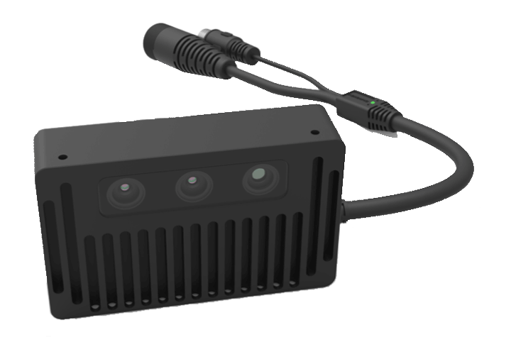
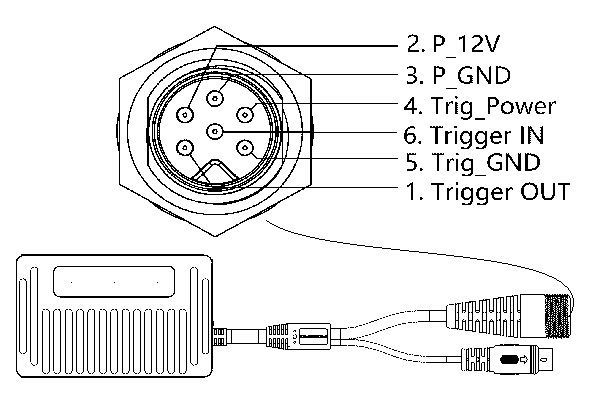
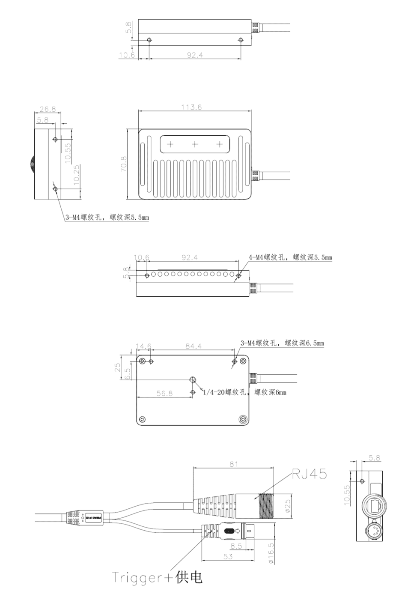

.. _DS460-I-E1-label:

DS460-I-E1
===========

    DS460-I-E1外观

测量指标
------------

.. list-table::
   :header-rows: 1

   * - 项目
     - 单位
     - 最小值
     - 典型值
     - 最大值
     - 备注
   * - 测量距离
     - 米
     - 0.24
     - RS
     - 4.0
     - 与补光亮度和环境光相关
   * - 深度视场角（水平/垂直）
     - 度
     - —
     - 60/48
     - —
     - —
   * - 精度误差
     - 百分比
     - 0.5
     - —
     - 2
     - 与距离程非线性关系

图像参数
------------

+---------------+------------+-----------+-----------+
|  项目         |    分辨率  |    帧率   |  曝光模式 |
+===============+============+===========+===========+
|               |   640*480  | 10fps     |           |
+      深度图   +------------+-----------+   卷帘    +
|               |   320*240  | 30fps     |           |
+               +------------+-----------+           +
|               |   160*120  | 30fps     |           |
+---------------+------------+-----------+-----------+

接口说明
--------

**触发接口**

DS460 相机的触发接口和引脚定义如下图所示。

    触发接口连接器说明

.. list-table::
   :header-rows: 1

   * - 序号
     - 名称
     - 功能描述
     - 补充说明
   * - 1
     - Trigger OUT
     - 触发输出信号
     - 配套线芯为粉色
   * - 2
     - P_12V
     - 电源正
     - 配套线芯为红色
   * - 3
     - P_GND
     - 电源地
     - 配套线芯为黄色
   * - 4
     - Trig_Power
     - 触发电路电源
     - 配套线芯为紫色
   * - 5
     - Trig_GND
     - 触发电路电源地
     - 配套线芯为白色
   * - 6
     - Trigger IN
     - 触发输入信号
     - 配套线芯为灰色

.. list-table:: 触发信号电气指标
   :header-rows: 1

   * - 项目
     - 最小值
     - 典型值
     - 最大值
   * - Trig_Power电压 (V)
     - 11.4
     - --
     - 25.2
   * - Trigger OUT 高电压 (V)
     - 11.4
     - --
     - 25.2
   * - Trigger OUT 低电压 (V)
     - -0.3
     - 0
     - 0.4
   * - Trigger IN 高电压 (V)
     - 11.4
     - --
     - 25.2
   * - Trigger IN 低电压 (V)
     - -0.3
     - 0
     - 0.4

**触发电路原理**

.. figure:: ../image/triggersch.png
    :width: 480px
    :align: center
    :alt: 触发电路参考图
    :figclass: align-center

    触发电路参考图

.. important ::

  #. 触发信号（OUT）最大支持同时驱动两台同型号相机, 如需驱动更多设备, 建议增加信号中继设备。
  #. 触发信号（IN/OUT）默认为下降沿触发, 接收输入为脉冲方波, 方波应保持低电平 **10~30 毫秒**。
  #. 为避免错误触发,触发频率不能超过设备处理能力 (即连续模式的帧率), 否则相机会丢弃触发信号，不做处理。

**电源参数**

.. list-table:: 电源电气指标
   :header-rows: 1

   * - 项目
     - 单位
     - 最小值
     - 典型值
     - 最大值
     - 备注
   * - VCC for Power
     - V
     - 11.4
     - 12
     - 12.6
     - —
   * - P\ :sub:`idle`\
     - W
     - —
     - 2.7
     - —
     - 空闲模式下功耗
   * - P\ :sub:`work`\
     - W
     - —
     - 3.7
     - —
     - 连续工作模式下功耗

**指示灯**

.. list-table:: 指示灯说明
   :header-rows: 1

   * - 颜色
     - 名称
     - 功能描述
   * - 蓝色
     - 相机状态指示灯
     - 1Hz缓慢闪烁表示工作正常，熄灭或者长时间熄灭瞬间闪烁表示工作异常
   * - 绿色
     - 网络状态指示灯
     - 常亮表示已连接，1Hz闪烁表示百兆模式传输中，8Hz闪烁表示千兆模式传输中

物理指标
---------

.. list-table::
   :header-rows: 1

   * - 项目
     - 单位
     - 最小值
     - 典型值
     - 最大值
   * - 尺寸(宽 x 高 x 深)
     - 毫米
     - —
     - 113.6x26.8x70.8
     - -
   * - 重量
     - 克
     - —
     - 236
     - —
   * - 工作温度
     - 摄氏度
     - 0
     - —
     - 45
   * - 存储温度
     - 摄氏度
     - -10
     - —
     - 55
   * - 防水防尘
     - IEC 60529
     - 
     - IP54
     - 

机械尺寸
---------

    机械尺寸图

