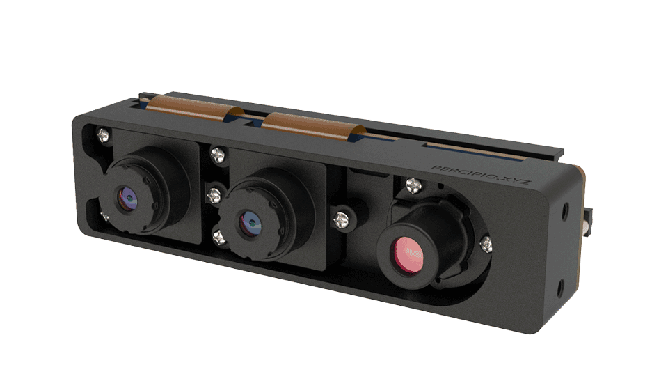
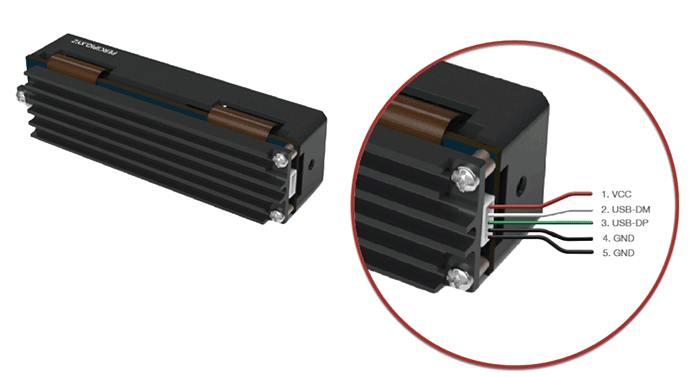
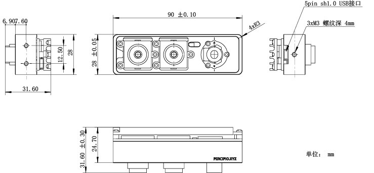
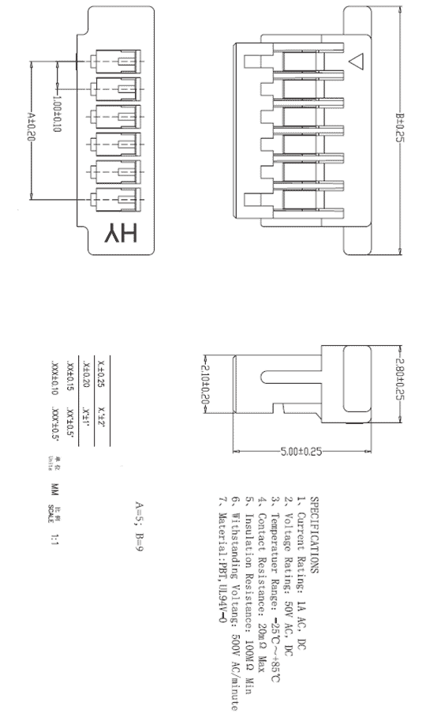

.. _DS462-U2-label:

DS462-U2
==========

    DS462-U2 外观

测量指标
------------

.. list-table:: 
   :header-rows: 1

   * - 项目
     - 单位
     - 范围
     - 备注
   * - 测量距离
     - mm
     - 300 ~ 2800
     - 与补光亮度和环境光相关
   * - 深度视场
     - mm
     - 505 x 385 @ 500；  1030 x 767 @ 1000
     - —
   * - 精度误差 Z
     - mm
     - 1 @ 700；  7 @ 1000；  10 @ 1500
     - 与距离呈非线性关系
   * - 精度误差 X/Y
     - mm
     - 7 @ 700；  10 @ 1000； 14 @ 1500
     - 与距离呈非线性关系

图像参数
------------

+---------------+------------+-----------+
|  项目         |    分辨率  |    帧率   |
+===============+============+===========+
|               |   640*480  | 29fps     |
+      深度图   +------------+-----------+
|               |   320*240  | 29fps     |
+               +------------+-----------+
|               |   160*120  | 29fps     |
+---------------+------------+-----------+

接口说明
--------

**电源和通信接口**

DS462-U2 的电源和通讯接口和引脚定义如下图所示。

    电源和通信接口示意图

.. list-table::
   :header-rows: 1

   * - 序号
     - 颜色
     - 名称
     - 说明
   * - 1
     - 红色
     - VCC
     - 5V，设备供电接口
   * - 2
     - 白色
     - USB DM
     - 数据线 D-
   * - 3
     - 绿色
     - USB DP
     - 数据线 D+
   * - 4
     - 黑色
     - GND
     - 电源地
   * - 5
     - 黑色
     - GND
     - 数字地

.. list-table:: 电源电气指标
   :header-rows: 1

   * - 项目
     - 单位
     - 最小值
     - 典型值
     - 最大值
     - 备注
   * - VCC for Power
     - V
     - 4.0
     - 5
     - 5.25
     - —
   * - P\ :sub:`idle`\
     - W
     - —
     - 1.6
     - —
     - 空闲模式下功耗
   * - P\ :sub:`work`\
     - W
     - —
     - 3.0
     - —
     - 连续工作模式下功耗
   * - P\ :sub:`trigger`\
     - W
     - —
     - 2.4
     - —
     - 触发工作模式下功耗

物理指标
---------

.. list-table::
   :header-rows: 1

   * - 项目
     - 单位
     - 最小值
     - 典型值
     - 最大值
   * - 尺寸（宽 x 高 x 深）
     - mm
     - —
     - 90.0 x 28.0 x 24.7（不含镜头）
     - —
   * - 重量
     - g
     - —
     - 80
     - —
   * - 工作温度
     - ℃
     - 0
     - —
     - 45
   * - 存储温度
     - ℃
     - -10
     - —
     - 55

机械尺寸
---------

    机械安装尺寸图

    连接器公头尺寸图

.. figure:: ../image/5pinfemaleconnector.png
    :align: center
    :width: 580px
    :alt: 连接器母头尺寸图
    :figclass: align-center

    连接器母头尺寸图

