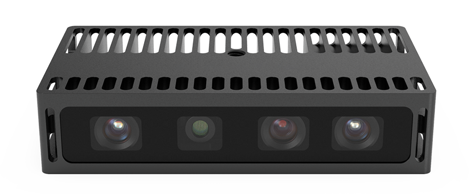
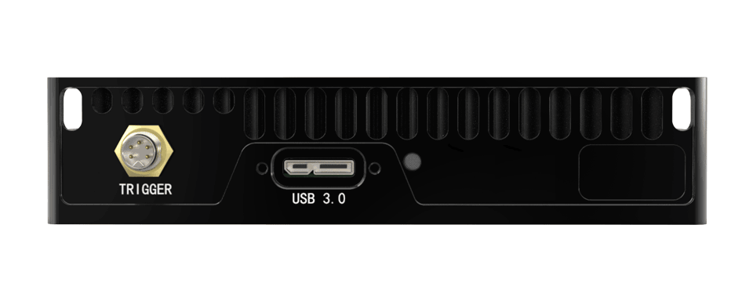
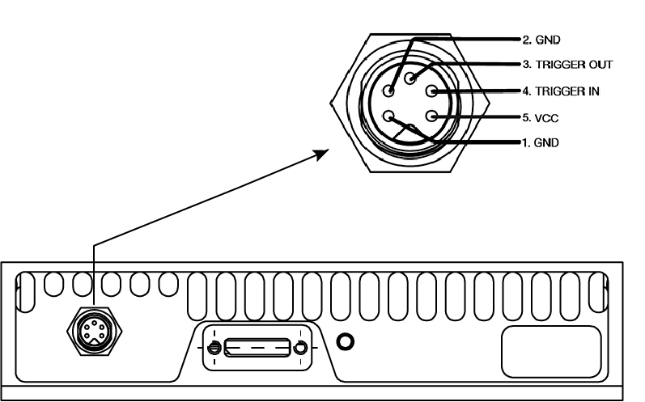
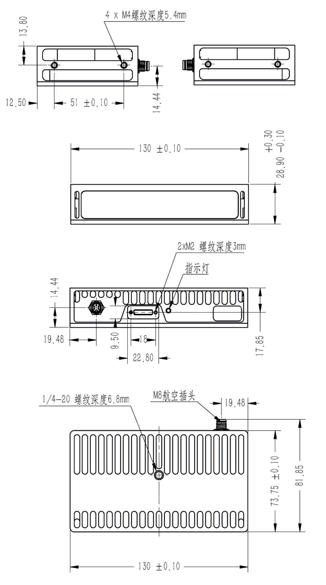
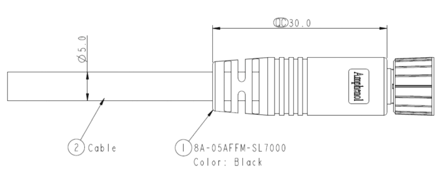

.. _FM860-GI-U3-label:

FM860-GI-U3
============

    FM860-GI-U3 前视

    FM860-GI-U3 后视

测量指标
------------

.. list-table:: 
   :header-rows: 1

   * - 项目
     - 单位
     - 范围
     - 备注
   * - 测量距离
     - mm
     - 500 ~ 8000
     - 与补光和环境光相关
   * - 深度视场角（水平/垂直）
     - °
     - 56/46
     - —
   * - RGB 视场角（水平/垂直）
     - °
     - 63/45
     - —
   * - 精度误差Z
     - mm
     - 2 @ 1000
     - 与距离呈非线性关系

图像参数
------------

+---------------+------------+-----------+-----------+
|  项目         |    分辨率  |    帧率   |  曝光模式 |
+===============+============+===========+===========+
|               |  1280*960  | 29fps     |           |
+               +------------+-----------+           +
|    深度图     |   640*480  | 35fps     |   全局    |
+               +------------+-----------+           +
|               |   320*240  | 36fps     |           |
+---------------+------------+-----------+-----------+
|               |  1280*960  | 26fps     |           |
+               +------------+-----------+           +
|    彩色图     |  640*480   | 26fps     |   全局    |
+---------------+------------+-----------+-----------+

.. important ::

  #. 彩色图可以与深度图实现点对点对齐，详情请参考示例程序 SimpleView_Registration 或者查看 API 指南。
  #. 彩色图与深度图实现百分百 **同时曝光，严格同步**。

接口说明
--------

**触发接口**

FM860-GI-U3 的触发接口和引脚定义如下图所示。

    触发接口和引脚定义

.. list-table::
   :header-rows: 1

   * - 序号
     - 名称
     - 功能描述
     - 补充说明
   * - 1
     - GND
     - 接地端
     - 配套线芯为黑色
   * - 2
     - GND
     - 接地端
     - 配套线芯为棕色
   * - 3
     - Trigger OUT
     - 触发信号输出端
     - 配套线芯为红色
   * - 4
     - Trigger IN
     - 触发信号输入端
     - 配套线芯为橘色
   * - 5
     - VCC
     - 触发电源输入端
     - 配套线芯为黄色

.. list-table:: 触发信号电气指标
   :header-rows: 1

   * - 项目
     - 最小值
     - 典型值
     - 最大值
   * - Trigger OUT 高电平 (V)
     - 12
     - _
     - 24
   * - Trigger OUT 低电平 (V)
     - -0.3
     - 0
     - 0.4
   * - Trigger IN 高电平 (V)
     - 12
     - —
     - 24
   * - Trigger IN 低电平 (V)
     - -0.3
     - 0
     - 0.4
   * - 触发输入电源 (V)
     - 12
     - —
     - 24

.. important ::

  #. 触发信号（OUT）最大支持同时驱动两台同型号相机，如需驱动更多设备，建议增加信号中继设备。
  #. 触发信号（IN/OUT）默认为下降沿触发，接收输入为脉冲方波，方波应保持低电平 **10~30 毫秒**。
  #. 为避免错误触发，下降沿信号下降时间 **不超过 5 微秒** 。触发频率不能超过设备处理能力 (即连续模式的帧率)，否则相机会丢弃触发信号，不做处理。

**电源和通信接口**

FM860-GI-U3 使用 USB3.0 接口进行数据传输并为相机供电。

.. list-table::
   :header-rows: 1

   * - 项目
     - 单位
     - 最小值
     - 典型值
     - 最大值
     - 备注
   * - VCC for Power
     - V
     - 4.75
     - 5
     - 5.25
     - —
   * - P\ :sub:`idle`\
     - W
     - —
     - 1.6
     - —
     - 空闲模式下功耗
   * - P\ :sub:`work`\
     - W
     - —
     - 4.4
     - —
     - 连续工作模式下功耗

物理指标
---------

.. list-table::
   :header-rows: 1

   * - 项目
     - 单位
     - 最小值
     - 典型值
     - 最大值
   * - 尺寸（宽 x 高 x 深）
     - mm
     - —
     - 130.0 x 28.9 x 73.8（不含接口）
     - —
   * - 重量
     - g
     - —
     - 359
     - —
   * - 工作温度
     - ℃
     - 0
     - —
     - 45
   * - 存储温度
     - ℃
     - -10
     - —
     - 55
   * - 防水防尘
     - IEC 60529
     - 
     - IP54
     - 

.. note::

    防溅、抗水、防尘功能并非永久有效，防护性能可能会因日常磨损而下降。因浸入液体而导致的损坏不在保修范围之内。

机械尺寸
---------

    机械安装尺寸图

    触发接口线缆尺寸图

