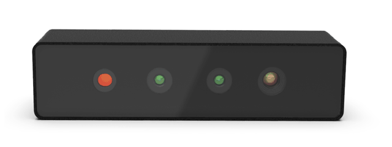
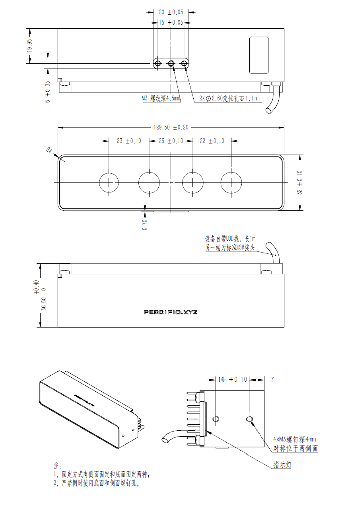

.. _FS830-HD-U2-label:

FS830-HD-U2
============

    FS830-HD-U2前视图

测量指标
------------

.. list-table::
   :header-rows: 1

   * - 项目
     - 单位
     - 最小值
     - 典型值
     - 最大值
     - 备注
   * - 测量距离
     - 米
     - 0.24
     - —
     - 3.5
     - 与补光亮度和环境光相关
   * - 深度视场角（水平/垂直）
     - 度
     - —
     - 56/46
     - —
     - —
   * - RGB视场角（水平/垂直）
     - 度
     - —
     - 66/40
     - —
     - —
   * - 精度误差
     - 百分比
     - 0.4
     - —
     - 2
     - 与距离程非线性关系

图像参数
------------

+------------+------------+-----------+
|    项目    |    分辨率  |    帧率   |
+============+============+===========+
|            |  1280*960  | 15fps     |
+            +------------+-----------+
|   深度图   |   640*480  | 24fps     |
+            +------------+-----------+
|            |   320*240  | 24fps     |
+------------+------------+-----------+
|            |  1280*720  |  15fps    |
+   彩色图   +------------+-----------+
|            |   640*360  |  24fps    |
+------------+------------+-----------+

.. important ::

  #. 彩色图像可以与深度图实现点对点对齐，详情请查看API指南或者参考示例程序 SimpleView_Registration 。
  #. 彩色图像有深度图像未实现百分百同时曝光，曝光时间差最大值为1帧曝光时间。如需曝光时间做到严格同步，建议采用FS830-GI-U2。
  #. 相机默认使用同步的红外图像计算并输出深度图，如需高帧率输出，可配置相机工作在非完全同步模式，详情请查看API参考。

接口说明
--------

**触发接口**

FS830-HD 不支持外部硬件触发，可使用软件触发指令进行图像集成控制。

**电源和通信接口**

FS830-HD 使用USB2.0接口进行数据传输并为相机供电。

.. list-table::
   :header-rows: 1

   * - 项目
     - 单位
     - 最小值
     - 典型值
     - 最大值
     - 备注
   * - VCC for Power
     - V
     - 4.75
     - 5
     - 5.25
     - —
   * - P\ :sub:`idle`\
     - W
     - —
     - 1.7
     - —
     - 空闲模式下功耗
   * - P\ :sub:`work`\
     - W
     - —
     - 3.4
     - —
     - 连续工作模式下功耗

物理指标
---------

.. list-table::
   :header-rows: 1

   * - 项目
     - 单位
     - 最小值
     - 典型值
     - 最大值
   * - 尺寸(宽 x 高 x 深)
     - 毫米
     - —
     - 129.5x32x36.5
     - —
   * - 重量
     - 克
     - —
     - 228
     - —
   * - 工作温度
     - 摄氏度
     - 0
     - —
     - 40
   * - 存储温度
     - 摄氏度
     - -10
     - —
     - 50
   * - 防水防尘
     - IEC 60529
     - 
     - IP54
     - 

机械尺寸
---------

    机械安装尺寸图

