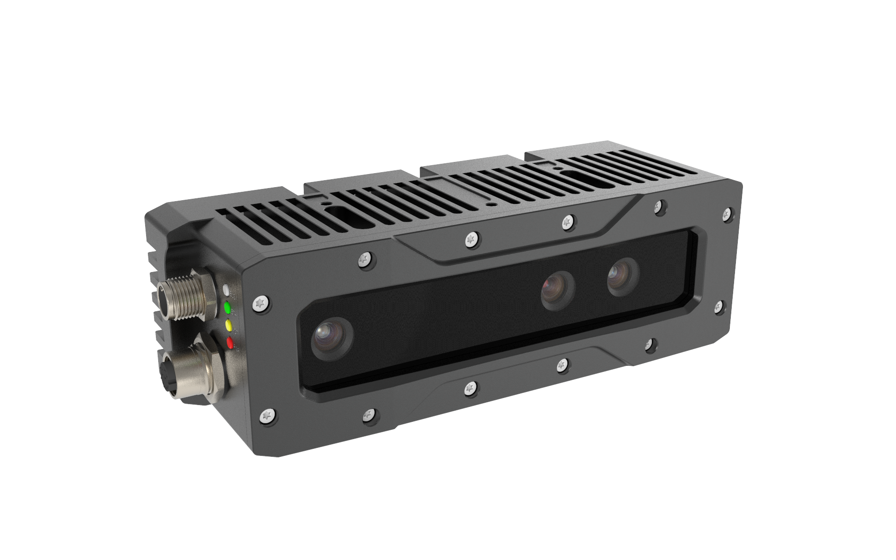
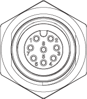
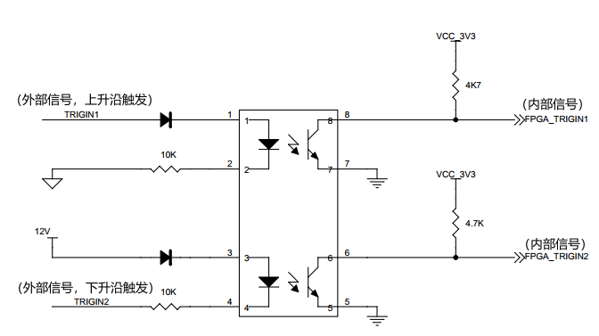
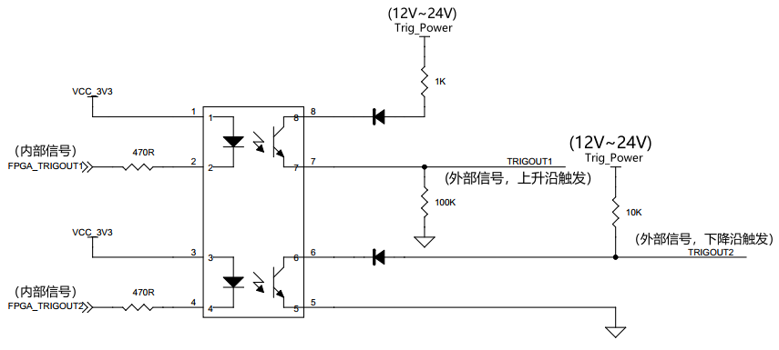
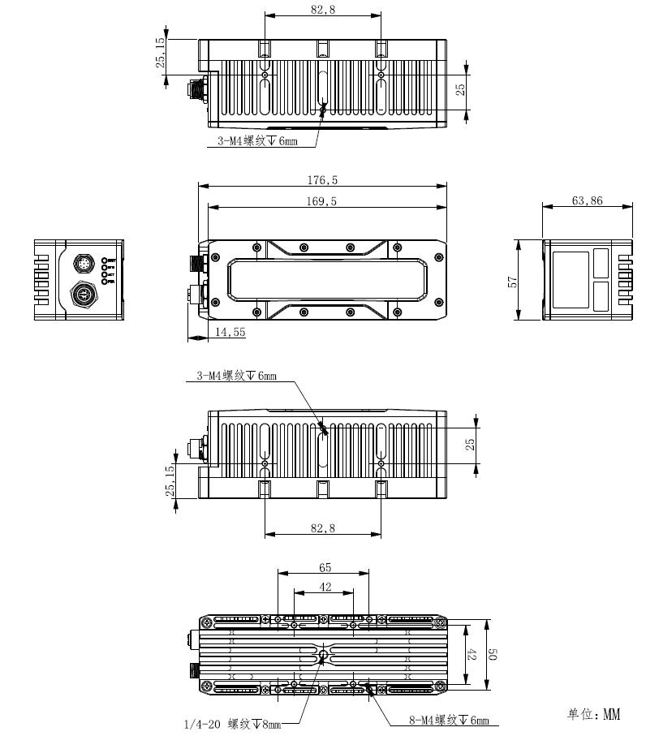
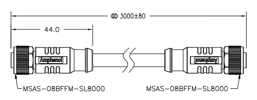
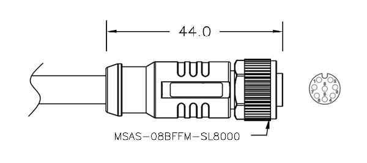

.. _PS801-E1-label:

PS801-E1
============

    PS801-E1 外观

测量指标
------------

.. list-table::
   :header-rows: 1

   * - 项目
     - 单位
     - 范围
     - 备注
   * - 测量距离
     - mm
     - 700 ~ 2000
     - 与补光亮度和环境光相关
   * - 深度视场
     - mm 
     - 420 x 345 @ 700；  1255 x 930 @ 2000
     - —
   * - 精度误差 Z
     - mm
     - 0.3 @ 800；  0.9 @ 1500；  1.1 @ 2000
     - 与距离呈非线性关系
   * - 精度误差 X/Y
     - mm
     - 1.5 @ 800；  2.7 @ 1500；  3.6 @ 2000
     - 与距离呈非线性关系

图像参数
------------

+---------------+------------+-----------+-----------+
|  项目         |    分辨率  |    帧率   |  曝光模式 |
+===============+============+===========+===========+
|               |  1280*960  |  1fps     |           |
+               +------------+-----------+           +
|    深度图     |   640*480  |  1fps     |   全局    |
+               +------------+-----------+           +
|               |  320*240   | 1fps      |           |
+---------------+------------+-----------+-----------+
|               |  2592*1944 |   8fps    |           |
+               +------------+-----------+           +
|    彩色图     |  1280*960  |   19fps   |   全局    |
+---------------+------------+-----------+-----------+

.. important ::

  #. 彩色图可以与深度图实现点对点对齐，详情请参考示例程序 SimpleView_Registration 或者查看 API 指南。
  #. 彩色图与深度图像实现百分百 **同时曝光，严格同步**。

接口说明
--------

**网络接口**

PS801-E1 的网络接口采用 M12 A-Code 连接器，如下图所示。

    网络接口说明

**电源及触发接口**

PS801-E1 的电源及触发接口的网络接口采用 M12 A-Code 连接器，接口和引脚定义如下图所示。

    电源及触发接口和引脚说明

.. list-table::
   :header-rows: 1

   * - 序号
     - 名称
     - 功能描述
     - 配套线芯颜色
   * - 1
     - Trig_OUT 1
     - 触发信号输出 1
     - 白色
   * - 2
     - P_24V
     - 电源正
     - 棕色
   * - 3
     - P_GND
     - 电源地
     - 绿色
   * - 4
     - Trig_Power
     - 触发电路电源正
     - 黄色
   * - 5
     - Trig_GND
     - 触发电路电源地
     - 灰色
   * - 6
     - Trig_IN 2
     - 触发输入信号 2
     - 粉色
   * - 7
     - Trig_IN 1
     - 触发输入信号 1
     - 蓝色
   * - 8
     - Trig_OUT 2
     - 触发信号输出 2
     - 红色

.. note::

   该接口的引脚号与接口信号一一对应，配套线芯的颜色请以实物为准。

.. list-table:: 触发信号电气指标
   :header-rows: 1

   * - 项目
     - 最小值
     - 典型值
     - 最大值
   * - Trig_Power电压 (V)
     - 11.4
     - --
     - 25.2
   * - Trigger OUT 高电压 (V)
     - 11.4
     - --
     - 25.2
   * - Trigger OUT 低电压 (V)
     - -0.3
     - 0
     - 0.4
   * - Trigger IN 高电压 (V)
     - 11.4
     - --
     - 25.2
   * - Trigger IN 低电压 (V)
     - -0.3
     - 0
     - 0.4

**触发电路原理**

    触发电路参考图（输入）

    触发电路参考图（输出）

.. important ::

  #. 触发信号（OUT）最大支持同时驱动两台同型号相机，如需驱动更多设备，建议增加信号中继设备。
  #. PS801 有两路触发输入，一路是上升沿触发，一路是下降沿触发；两路触发输出，一路是上升沿有效，一路是下降沿有效。接收输入为脉冲方波，方波应保持低电平 **10~30 毫秒**。
  #. 为避免错误触发，下降沿信号下降时间 **不超过 5 微秒** 。触发频率不能超过设备处理能力（即连续模式的帧率），否则相机会丢弃触发信号，不做处理。

**指示灯**

.. list-table:: 指示灯说明
   :header-rows: 1

   * - 颜色
     - 名称
     - 功能描述
   * - 红色
     - 相机状态指示灯
     - 1Hz 缓慢闪烁表示工作正常
   * - 绿色
     - 网络连接指示灯
     - 常亮表示网络连接在千兆网模式，不亮表示工作在百兆网模式
   * - 黄色
     - 网络传输指示灯
     - 有数据传输时闪烁
   * - 白色
     - 运算状态指示灯
     - 有数据计算时闪烁

电源参数
----------

相机有两种供电方式: PoE 供电和外部直流供电。

- PoE 供电
   
   使用 Power Over Ethernet(PoE) 供电，将网线插入 RJ45 插座即可。请使用符合 IEEE802.3at/af 标准的 PoE 为相机供电。

- 外部直流供电
 
   将外部直流电源通过工业航插线缆连接到电源接口，即可为相机供电。供电电压为 24 V，建议使用 24 VDC 直流电源供电。外部直流电源和 PoE 供电同时存在时，相机优先选用外部直流电源供电。若此时拔出外部直流电源，相机会切换到 PoE 供电，有可能会重启相机。

.. list-table:: 电源电气指标
   :header-rows: 1

   * - 项目
     - 单位
     - 最小值
     - 典型值
     - 最大值
     - 备注
   * - VCC for Power
     - V
     - 22.8
     - 24
     - 25.2
     - —
   * - P\ :sub:`idle`\
     - W
     - —
     - 4.5
     - —
     - 空闲模式下功耗
   * - P\ :sub:`work`\
     - W
     - —
     - 10.5
     - —
     - 连续工作模式下功耗
   * - P\ :sub:`trigger`\
     - W
     - —
     - 6.6
     - —
     - 触发模式下功耗

.. note::

    防溅、抗水、防尘功能并非永久有效，防护性能可能会因日常磨损而下降。因浸入液体而导致的损坏不在保修范围之内。

    
物理指标
---------

.. list-table::
   :header-rows: 1

   * - 项目
     - 单位
     - 最小值
     - 典型值
     - 最大值
   * - 尺寸（宽 x 高 x 深）
     - mm
     - —
     - 176.5 x 57.0 x 63.9（不含接口）
     - —
   * - 重量
     - g
     - —
     - 856
     - —
   * - 工作温度
     - ℃
     - 0
     - —
     - 45
   * - 存储温度
     - ℃
     - -10
     - —
     - 55
   * - 防水防尘
     - IEC 60529
     - 
     - IP67
     - 

机械尺寸
---------

    机械安装尺寸图

    M12 A-Code 线缆尺寸图

    电源及触发线缆尺寸图

