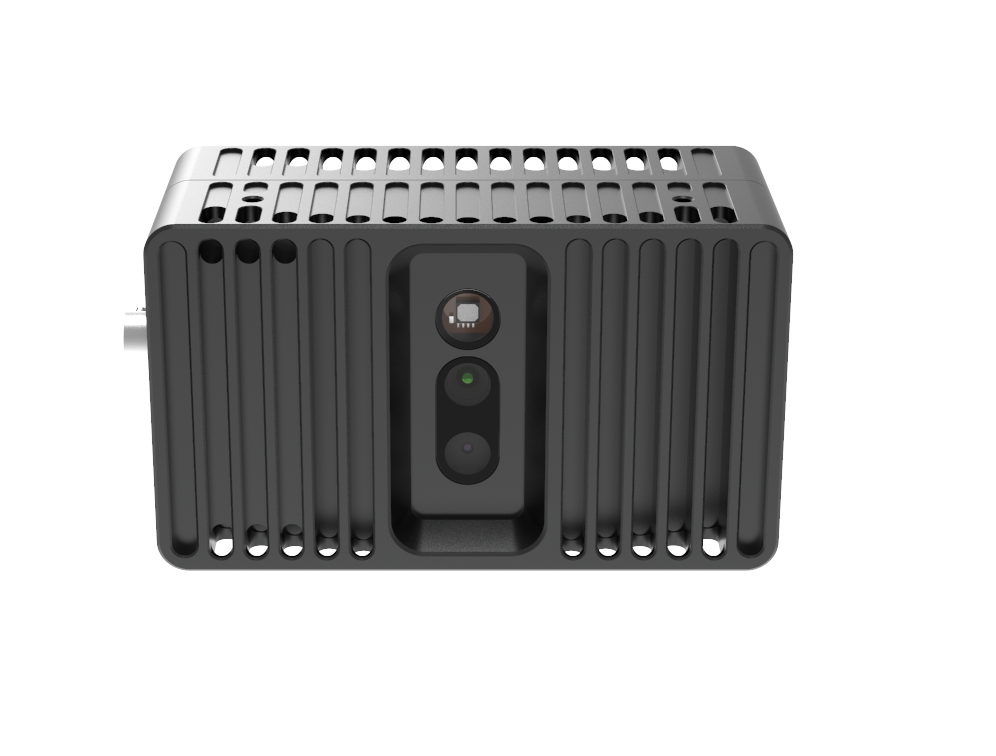
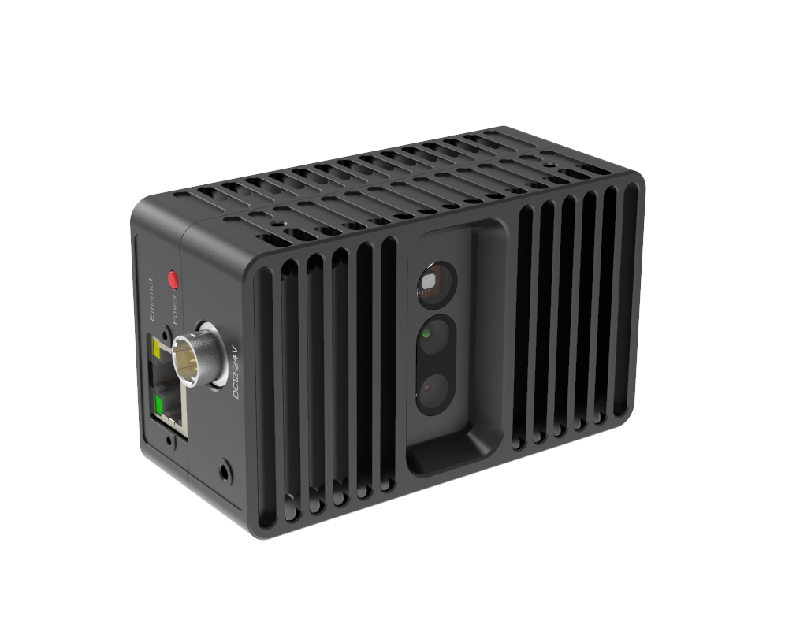
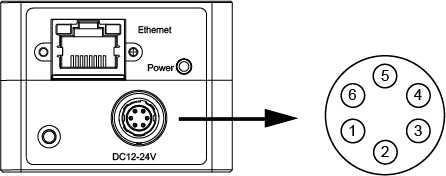
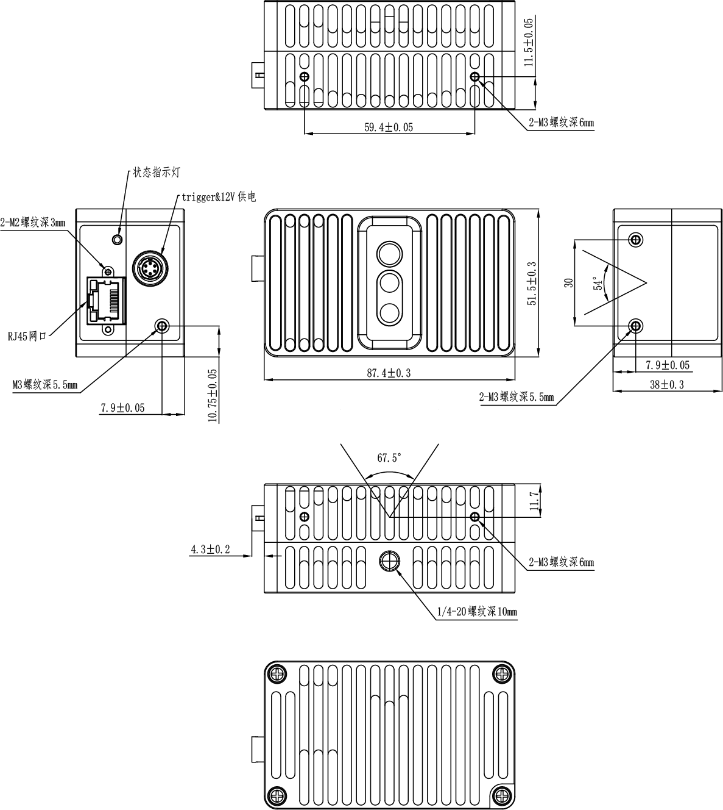

.. _TM460-E2-label:

TM460-E2
============

    TM460-E2 外观

    TM460-E2 外观

测量指标
------------

.. list-table::
   :header-rows: 1

   * - 项目
     - 单位
     - 范围
     - 备注
   * - 测量距离
     - mm
     - 100 ~ 2400
     - 与补光亮度和环境光相关
   * - 深度视场
     - mm
     - 125 x 95 @ 100；  2730 x 2035 @ 2400
     - —
   * - 精度误差 Z
     - mm
     - 5 ~ 20
     - 与距离呈非线性关系

图像参数
------------

+---------------+------------+---------------+-----------+
|  项目         |    分辨率  |    帧率       |  曝光模式 |
+===============+============+===============+===========+
|               |  640*480   |  7/15/29fps   |           |
+               +------------+---------------+           +
|    深度图     |   320*240  |  7/15/29fps   |   全局    |
+               +------------+---------------+           +
|               |  160*120   | 7/15/29fps    |           |
+---------------+------------+---------------+-----------+
|               |  1920*1080 |   29fps       |           |
+               +------------+---------------+           +
|    彩色图     |   1280*720 |   29fps       |   全局    |
+               +------------+---------------+           +
|               |   640*480  |  29fps        |           |
+---------------+------------+---------------+-----------+

.. important ::

   彩色图可以与深度图实现点对点对齐，详情请查看 API 指南或者参考示例程序 SimpleView_Registration 。
  

接口说明
--------

**网络接口**

TM460-E2 的网络接口采用 RJ45 接口。为确保网络连接稳定，请使用接头带固定螺丝的千兆网线。

**电源接口**

TM460-E2 电源接口型号为 HR10A-7R-6P，引脚定义如下图所示。

    电源接口和引脚说明

.. list-table::
   :header-rows: 1

   * - 序号
     - 名称
     - 功能描述
     - 配套线芯颜色
   * - 1
     - P_24V
     - DC 供电电源正
     - 红色
   * - 2
     - NC
     - 空
     - 黄色
   * - 3
     - NC
     - 空
     - 蓝色
   * - 4
     - NC
     - 空
     - 绿色
   * - 5
     - NC
     - 空
     - 白色
   * - 6
     - P_GND
     - DC 供电电源地
     - 黑色

**指示灯**

.. list-table:: 指示灯说明
   :header-rows: 1

   * - 颜色
     - 名称
     - 功能描述
   * - 红色
     - 相机状态指示灯
     - 1Hz 缓慢闪烁表示工作正常

电源参数
----------

TM460-E2 采用外部直流供电。将外部直流电源，通过工业航插线缆连接到电源接口，即可为相机供电。推荐线缆型号为 HR10A-7P-6S。相机工作电源电压范围是直流 +12V~+24V。

.. list-table:: 电源电气指标
   :header-rows: 1

   * - 项目
     - 单位
     - 最小值
     - 典型值
     - 最大值
     - 备注
   * - VCC for Power
     - V
     - 11.4
     - 12/24
     - 25.2
     - —
   * - P\ :sub:`idle`\
     - W
     - —
     - 1.5
     - —
     - 空闲模式下功耗
   * - P\ :sub:`work`\
     - W
     - —
     - 6.3
     - —
     - 连续工作模式下功耗

物理指标
---------

.. list-table::
   :header-rows: 1

   * - 项目
     - 单位
     - 最小值
     - 典型值
     - 最大值
   * - 尺寸（宽 x 高 x 深）
     - mm
     - —
     - 87.4 x 51.5 x 38.0 （不含接口）
     - —
   * - 重量
     - g
     - —
     - 257
     - —
   * - 工作温度
     - ℃
     - 0
     - —
     - 45
   * - 存储温度
     - ℃
     - -10
     - —
     - 55
   * - 防水防尘
     - IEC 60529
     - 
     - IP40
     - 

.. note::

    防溅、抗水、防尘功能并非永久有效，防护性能可能会因日常磨损而下降。因浸入液体而导致的损坏不在保修范围之内。

    
机械尺寸
---------

    机械安装尺寸图

