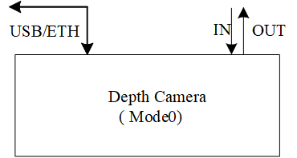
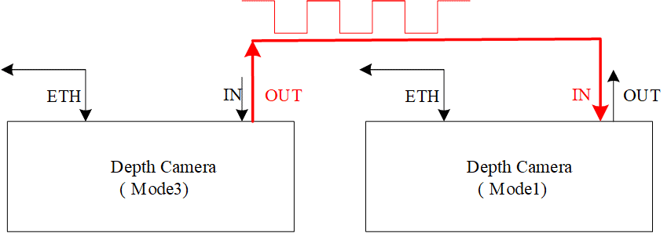
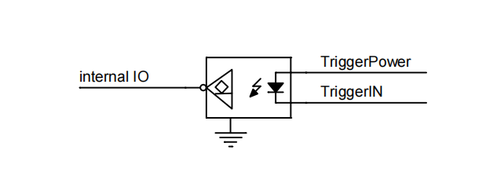
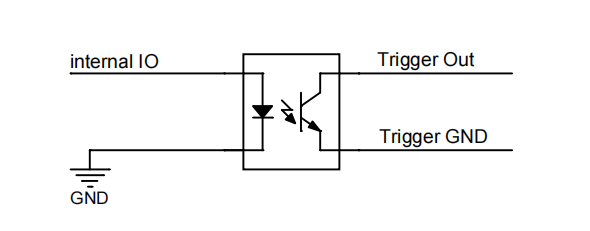
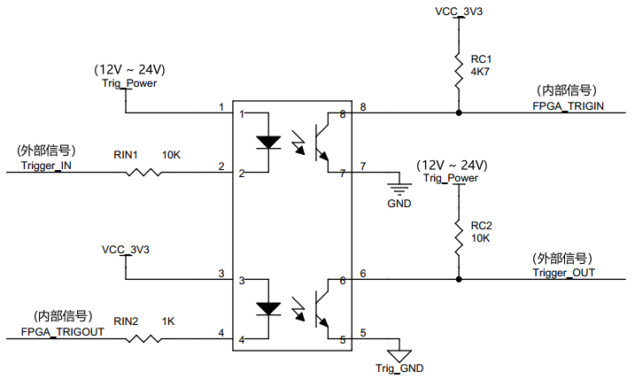
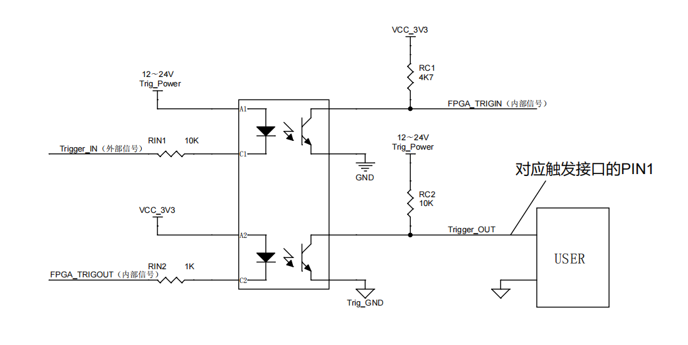
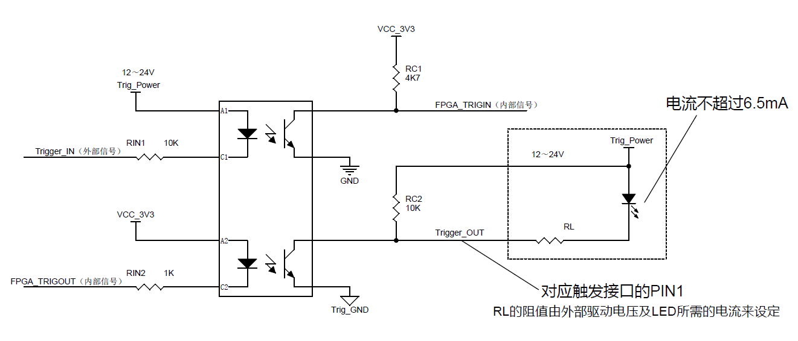
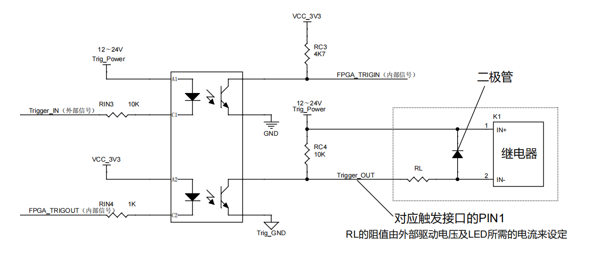

硬件参考
===========

硬件原理
---------

该部分主要介绍 Percipio 深度相机工作模式和外部触发的原理，帮助用户选择相机的工作模式和给相机外接触发信号。

.. _work-mode-label:

工作模式
++++++++++

**模式0：连续集成模式**

深度相机按照上位机软件设定的配置，持续抓取图像传感器数据，进行深度视差计算并输出有效深度数据。

    模式0：连续集成模式

**模式1：从设备触发模式**

深度相机经 USB 接口或者以太网接口接收到软件触发指令，或者从外部触发电路接口接收到硬件触发信号后，进行一次图像传感器数据抓取，进行深度视差计算并输出有效深度数据。完成一次图像集成并输出深度数据后，相机自动进入待机状态，等待下一次触发信息。

* 软件触发模式
  
   .. figure:: ../image/workmode1a.png
      :width: 240px
      :align: center
      :alt: 从设备触发模式
      :figclass: align-center
  
      模式1：软件触发模式

  在该模式下，相机通过 USB 接口或者以太网接口每接收到一个触发指令，则启动一次图像抓取动作并输出深度图。

* 硬件触发模式
  
   .. figure:: ../image/workmode1b.png
      :width: 480px
      :align: center
      :alt: 从设备触发模式
      :figclass: align-center
  
      模式1：硬件触发模式

  在该模式下，多个相机的触发信号输入电路同时连接同一个外部硬件触发信号源，外部硬件触发信号源每发出一次下降沿触发信号，即可实现一次多设备同步集成功能。

**模式2：主设备单次触发模式**

深度相机经 USB 接口或者以太网接口接收到一次软件触发指令后，通过触发输出硬件接口对外输出一次硬件触发信号。把该相机的硬件触发信号接入其它处于模式1的相机触发输入接口，可实现多台相机同步图像集成，并输出同步的深度图像。

 .. figure:: ../image/workmode2.png
    :width: 480px
    :align: center
    :alt: 主设备单次触发模式
    :figclass: align-center

    模式2：主设备单次触发模式

**模式3：主设备多次触发模式**

深度相机工作在该模式下，可按照上位机通过软件 API 设定的频率，通过 Trigger Out 硬件接口连续输出触发信号。把该相机的硬件触发信号接入其他处于模式1的相机 Trigger In 接口，即可实现多台相机按照指定的频率进行同步图像集成，输出同步的深度图像。

    模式3：主设备多次触发模式

.. note::

  #. 鉴于深度相机的触发接口驱动能力有限，多设备串接时，建议购买 Percipio 开发的 Trigger HUB设备，以确保触发信号有效驱动。
  #. 工作模式和触发功能的详细配置方式请参考 :ref:`触发设置 <trigger-config-label>` 。  

.. _external-trigger-label:

外部触发
+++++++++++

Percipio 深度相机可以接收触发接口输入的外部硬件触发信号，按照硬件触发信号的频率进行深度图集成，同时也可以作为触发信号的发生器，作为主设备同时驱动多台相机同步集成图像。上位机也可以通过 USB 接口或者以太网接口发送软件触发指令，Percipio 深度相机接收后，可按照上位机的要求进行深度图集成。

**输入信号**
  
输入信号通过光耦转换电平，从 12V/24V 转换到 3.3V 的内部逻辑电压。同时光耦隔离了外面工业环境的干扰，保证 PCB 板内部的 CPU 工作安全。

输入信号的光电隔离电路示意图如下所示。触发信号接口使用光电隔离电路，默认为下降沿触发，信号应保持低电平至少 5 毫秒。触发频率不能超过设备处理能力 (即连续模式的帧率)，否则相机会丢弃触发信号，不做处理。
  

    触发输入隔离示意图

**输出信号**

CPU 输出 3.3V 数字电压，通过内部光耦转换到 12V/24V 工业电压，驱动下一级的 3D 相机或其他电压兼容的设备。

    触发输出隔离示意图

**触发电路原理**

    触发电路示意图

.. note::

    相机触发电路（包括触发电路电源）与相机内部主电路之间采用光电隔离，使用触发信号输入或者触发信号输出功能时，需要确保触发电路供电正常，Trig_Power 和 Trig_GND 分别接入直流电源的正负极。

**触发输出信号典型应用**

触发输出信号作为逻辑判断信号使用时，推荐应用电路如下图所示：

    触发信号应用图1

触发输出信号作为驱动信号，且目标负载驱动电流小于 6 毫安时，如驱动一个 LED 灯，推荐应用电路如下图所示：

    触发信号应用图2

触发输出信号作为驱动信号，且目标负载驱动电流大于 6 毫安时，建议使用放大电路或者继电器（如 DELIXI CDG1-1DD/10A）进行信号隔离放大，推荐应用电路如下图所示。

    触发信号应用图3

.. _camera-param-label:

产品规格
--------

Percipio 深度相机提供多种外壳结构、硬件接口、测量精度和参数配置，以满足不同场景的需求。相机计算分辨率主要为 1280*960 和 640*480 两个等级，同时提供 USB 接口和网络接口两种数据输出形态作为选择。

该部分主要介绍 USB 深度相机和网络深度相机的部分规格。点击型号链接即可阅读各款深度相机的图像传感器配置、接口配置、整机功耗、机械尺寸等详细数据。

.. list-table:: USB 深度相机型号列表
   :header-rows: 1

   * - 型号
     - Depth图像
     - Color图像
     - 曝光模式
     - 基线
     - 硬件触发
   * - :ref:`DM460-U2-label`
     - 30fps @ 640*480
     - NONE
     - RS
     - 55
     - YES
   * - :ref:`DS462-U2-label`
     - 29fps @ 640*480
     - NONE
     - RS
     - 25
     - NO
   * - :ref:`FM830-RI-U2-label`
     - 13fps @ 1280*960
     - 1280*960
     - RS
     - 55
     - YES   
   * - :ref:`FM831-RI-U2-label`
     - 13fps @ 1280*960
     - 1280*960
     - RS
     - 79
     - YES
   * - :ref:`FM860-GI-U3-label`
     - 29fps @ 1280*960
     - 1280*960
     - GS
     - 79
     - YES
   * - :ref:`FM810-TIX-U2-label` 
     - 5fps @ 1280*960
     - 1280*960
     - RS
     - 55
     - YES
   * - :ref:`FM811-TIX-U2-label`
     - 5fps @1280*960
     - 1280*960
     - RS
     - 79
     - YES

.. list-table:: 网络深度相机型号列表
   :header-rows: 1

   * - 型号
     - Depth图像
     - Color图像
     - 曝光模式
     - 基线
     - 硬件触发
   * - :ref:`FM850-E1-label`
     - 13fps @1280*960
     - 1280*960
     - GS
     - 55
     - YES
   * - :ref:`FM850-E2-label`
     - 13fps @1280*960
     - 1280*960
     - GS
     - 55
     - YES
   * - :ref:`FM850-WH-E2-label`
     - 13fps @1280*960
     - 1280*960
     - GS
     - 55
     - YES
   * - :ref:`FM851-E1-label`
     - 16fps @1280*960
     - 1280*960
     - GS
     - 79
     - YES
   * - :ref:`FM851-E2-label`
     - 16fps @1280*960
     - 1280*960
     - GS
     - 79
     - YES
   * - :ref:`FM811-IX-E1-label`
     - 5fps @1280*960
     - 1280*960
     - GS
     - 79
     - YES
   * - :ref:`FS820-E1-label`
     - 7fps @1280*800
     - 1920*1080
     - GS
     - 50
     - YES
   * - :ref:`PM801-E1-label`
     - 1fps @1280*960
     - 2592*1944
     - GS
     - 300
     - YES
   * - :ref:`PM802-E1-label`
     - 1fps @1280*960
     - 2592*1944
     - GS
     - 450
     - YES
   * - :ref:`FM813-L2-E1-label`
     - 3fps @1280*960
     - 2592*1944
     - GS
     - 150
     - YES
   * - :ref:`FM813-IX-E1-label`
     - 5fps @1280*960
     - 2592*1944
     - GS
     - 150
     - YES
   * - :ref:`FM853-E1-label`
     - 16fps @1280*960
     - 2592*1944
     - GS
     - 150
     - YES
   * - :ref:`TM460-E2-label`
     - 29fps @640*480
     - 1920*1080
     - GS
     - ——
     - NO 
   * - :ref:`PS801-E1-label`
     - 1fps @1280*960
     - 2592*1944
     - GS
     - 100
     - YES

本文档仅提供主要产品的信息介绍，部分相机型号不在该列表中，如需了解更多产品信息或者需要依据具体场景定制相机，请邮件咨询 support@percipio.xyz。

**相关链接**

.. toctree::
   :maxdepth: 1
 
   DM460-U2
   DS462-U2
   FM830-RI-U2
   FM831-RI-U2
   FM810-TIX-U2
   FM811-TIX-U2
   FM860-GI-U3
   FM850-E1
   FM850-E2
   FM850-WH-E2
   FM851-E1
   FM851-E2
   FM811-IX-E1
   FS820-E1
   PM801-E1
   PM802-E1
   FM813-L2-E1
   FM813-IX-E1
   FM853-E1
   TM460-E2
   PS801-E1

