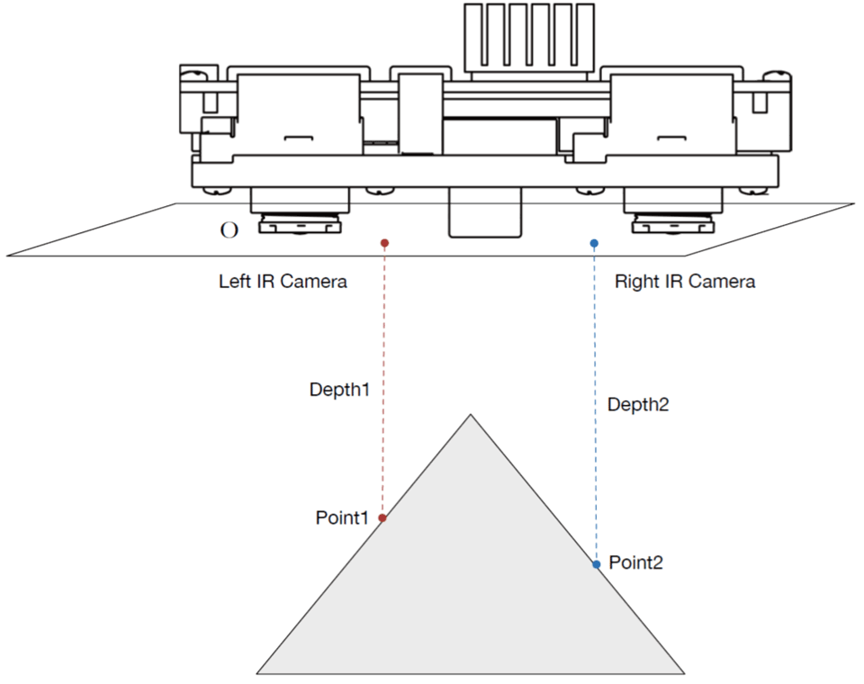
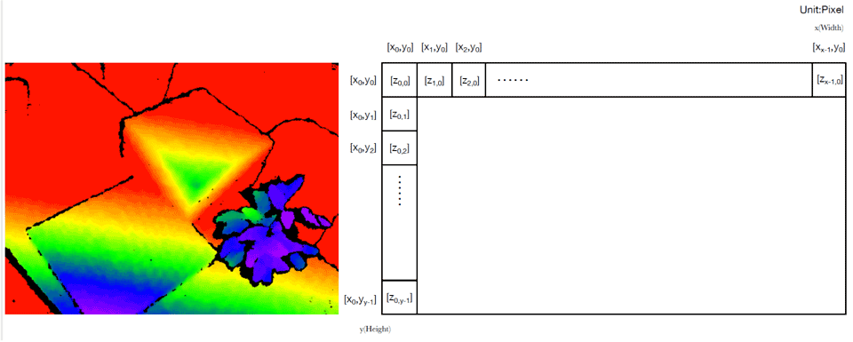
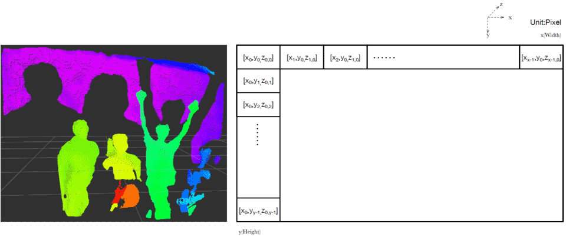

概述
=========

工作原理
-----------

基础概念
----------

该部分主要介绍深度图、点云图、红外图和彩色图的基础概念。

深度图
+++++++

深度图（Depth 图）中的单个像素值是空间中物体的某个点到垂直于左红外镜头光轴并通过镜头光心（深度相机光学零点）平面的垂直距离。

深度图是深度相机视野内所有点的深度数据构成的矩阵。深度图是一个 16bit 位深的单通道矩阵，单位为毫米。没有深度数据的点值为 0。为直观的体现不同距离数值，在 SDK 示例程序中，输出的深度图均被映射到了 RGB 色彩空间，所以显示出来的结果为 RGB 三通道 8bit 位深的位图，深度数据无外参，无畸变，只提供用于转换点云数据的内参。

**深度图定义**

**深度图数据格式**

点云图
+++++++

通过深度相机得到的物体外观表面的点数据集合是点云。使用深度相机得到的点云信息为三维坐标（X，Y，Z）。点云图是深度相机捕捉到的所有点的点云信息构成的数据矩阵。每点为 3 个 float 型 x，y，z 值。没有三维空间信息的点为（x，y，0）。

**点云图数据格式**

红外图
+++++++

红外图（IR 图）为红外图像传感器输出的图像。在输出深度图的时候，部分型号的 Percipio 深度相机输出的红外图是被系统处理过的图像，如果需要看原始的红外图，需要关闭深度图输出。红外图分为左红外图和右红外图，二者均包含内参和畸变参数，但是因为左红外图和深度图是同一个空间坐标系，所以左红外图无外参。

彩色图
+++++++

不同型号的 Percipio 深度相机会输出不同数据类型的彩色图（RGB 图）。其中一类 RGB 图像传感器含有硬件 ISP 模块，输出为正常的 YUV422/JPG 图像，经 OpenCV 处理即可显示为彩色图。另一类彩色图像传感器没有硬件 ISP 模块，输出的 raw bayer 图像数据显示为图像时，画面颜色"偏绿"，经过 SDK 的软件 ISP 处理（如白平衡），才可以显示为正常色彩空间的彩色图；没有硬件 ISP 模块的彩色图像传感器可以确保输出的图像数据与红外图像数据同步。彩色图像传感器组件提供了内参，外参，畸变参数。

特性描述
---------

**主动双目技术**

Percipio 深度相机包括双目红外摄像头、彩色摄像头和光学增强系统，采用自主知识产权的主动双目技术，能够获得比传统双目视觉更多的景深细节，具有比单目结构光更强的环境光抗干扰能力，并能够在主动双目和被动双目模式下自动切换。

**多设备同步**

在触发模式下，Percipio 深度相机可由硬件信号触发控制进行单帧拍摄，级联多台设备的触发信号可以实现多设备同步拍摄功能。

.. note::

    更多关于触发模式的介绍，请参考 :ref:`工作模式 <work-mode-label>` 。

**嵌入式计算**

部分型号的 Percipio 深度相机集成了嵌入式计算视觉处理器，输出计算后的深度数据，无需上位机参与计算。

**室内外自适应**

Percipio 深度相机采用主动双目方案，对光照可以实现自适应，在室内外均能呈现很好的物体识别能力，并能够获得比传统立体视觉更多的景深细节。

部分 Percipio 深度相机可以根据工作环境光线（λ=830nm）亮度，动态调整光学增强系统亮度或者图像传感器的曝光参数，以优化在室内外的成像效果。

用户可以根据 Percipio 深度相机输出的亮度直方图数据信息，使用软件 API 动态调整深度模组激光器亮度或者图像传感器的曝光参数，以获取更好的三维图像数据。

.. 注意::

    关于曝光设置，请参考 :ref:`曝光设置 <exposure-config-label>` 。

**彩色图和深度图对齐**

由 SDK 数据接口获取的彩色图可以与深度图逐点对齐。

**工业三防**

Percipio 工业级深度相机可防溅、抗水、防尘，在受控实验室条件下测试，其防护性能达到 IEC 60529 标准 IP65 级别。

.. note::

    防溅、抗水、防尘功能并非永久有效，防护性能可能会因日常磨损而下降。因浸入液体而导致的损坏不在保修范围之内。

